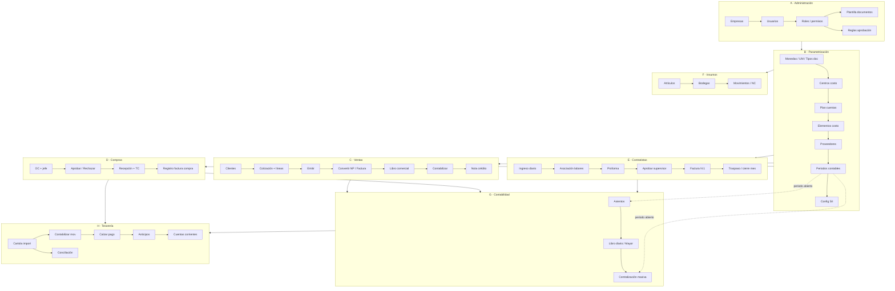

# Diagrama de flujo de negocio — Almahue ERP (entrega)

**Fecha:** 2026-07-30  
**Alcance:** circuitos operativos Demo OFF (sin GoSocket productivo).

## Vista general

## Decisiones críticas (ramas)

| Nodo | Rama feliz | Excepción esperada |
|---|---|---|
| OC | Aprobar → recepción | Rechazar; solo jefe; sin aprobador |
| Cotización | Emitir → convertir | Anular; no editar FACTURADO |
| Proforma | Definitiva + nombre aprobador | Pendiente aprobación |
| Periodo | Contabilizar si ABIERTO | Bloquear si CERRADO |
| Cartola | Contabilizar → calzar ACTIVO | No duplicar calce; cerrar cartola |
| Centralización | Preview → confirmar | Omitir ya centralizado |

## Cobertura QA previa (TC01–41)

Suite `qa-pruebas-flujo-completo-2026-07-29`: **41/41 PASS** en happy paths principales.  
**No cubre de forma explícita** muchas excepciones (rechazo OC, NC, cartola cierre, anular asiento, etc.) — ver matriz EX del subagente excepciones.
