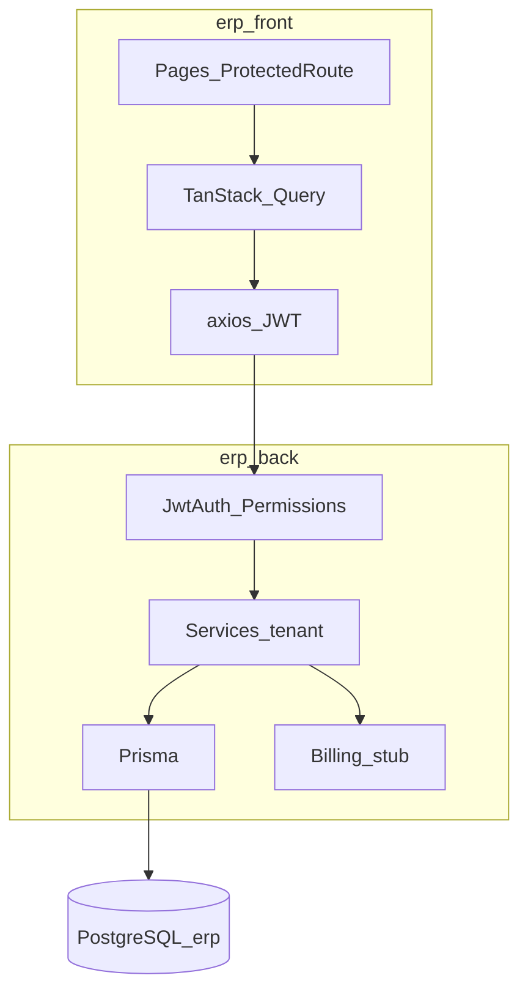

# Arquitectura de alto nivel

**Fecha:** 2026-08-16 · ERP Almahue.

## 1. Stack

| Capa | Tecnología |
|---|---|
| API | NestJS 10, TypeScript, Prisma 7, PostgreSQL 16 (schema `erp`) |
| Auth | JWT + refresh rotativo, RBAC `modulo:read/write`, PIN hash, SSO Microsoft opcional |
| Front | React 19, Vite 8, TanStack Query, React Router, Tailwind 4 |
| Local | Front `5174`, API `3001`, Postgres a menudo `5433` |
| Prod | nginx + Docker en `45.7.229.46/almahue-erp/` |

Código: `ERP/erp_back`, `ERP/erp_front` (git anidados). Tenant: `empresaId` en modelos y queries.

## 2. Patrones

- **Módulo Nest:** schema → migrate → DTO class-validator → service (filtro tenant) → controller + `@RequirePermissions` / `@RequireAprobacionesConfig` → `app.module`.  
- **Módulo React:** `types/domain.ts` → `services/real/api.ts` → `permissions.ts` → `features/<mod>` → `ProtectedRoute`.  
- **Aprobaciones:** Grupo → NodoEscala → cadena calculada (no mezclar `workflows-admin` legacy).  
- **Documentos comerciales:** un modelo `DocumentoComercial` discriminado por `tipo` (`COTIZACION`, `ORDEN_VENTA`, `FACTURA`, …).  
- **Inventario:** saldo canónico `StockInsumoBodega`; `Insumo.stock` legado.  
- **Billing:** módulo `billing/` + `canonical-builder`; stub inline. GoSocket no está en el camino crítico del piloto.

## 3. Design system (UI)

- Tokens CSS (`--color-surface`, `--color-border`, `--color-muted`) + Tailwind 4.  
- Componentes recurrentes: `PageHeader`, `DataTable`, `Modal`, `Badges` de estado, `RowActions`, `MockListPage` (CRUD de catálogos contra **API real**).  
- Formularios: campos tipados (`kind: rut`), selectores de catálogo, toasts `sonner`.  
- i18n: `es.json` cuando hay copy de producto.  
- Listas: preferencias de columnas `UiTablePreference`.  
- No clonar pantallas AgroSoft “engorrosas”; Contratistas se inspira en ingreso diario más simple (DEC-11).

## 4. Estrategia DTE

Piloto: stub. Partner: proyecto aparte. El ERP debe emitir un documento canónico estable (líneas, flete, receptor) **antes** de cablear HTTP real.
