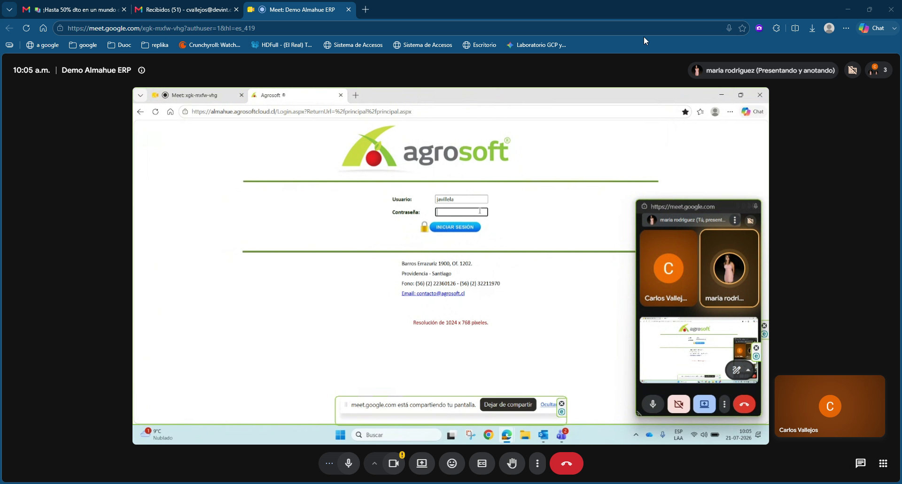

# 00 — Decisiones estratégicas (DEC)

## Meta

Construir el nuevo ERP como **Agrosoft 3.0**: mismos módulos operativos que usan hoy, con validaciones y UX corregidas.

## Decisiones confirmadas en reunión

| ID | Decisión | Evidencia |
|---|---|---|
| DEC-01 | **NO** implementar módulo Mano de Obra (usan Book). Actividad/Labor se parametriza en **Contratistas**. | Transcript |
| DEC-02 | **Eliminar** flujo de Solicitud de Compra. Ir directo a Orden de Compra. | ~35:56 |
| DEC-03 | Aislamiento estricto por **empresa activa** (CC, bodegas, datos). | 11:29, bodegas |
| DEC-04 | Perfil **intermedio** (entre Digitador y Admin) es requisito; cambiar un perfil no debe alterar permisos de otros usuarios. | 13:11–14:22 |
| DEC-05 | Monedas foco reportería: **peso, dólar, yuan, euro**. UF/UTM/IPC no se usan. | 01:52 |
| DEC-06 | Indicadores financieros desde **Banco Central** (~09:00); rellenar domingos/feriados. | 01:51–01:54 |
| DEC-07 | Compras administrativas = **servicios**; materiales/agroquímicos = **Insumos/Bodega**. Maestro preferido en Insumos. | Transcript |
| DEC-08 | Contexto usuarios: **15 usuarios**; a veces 2 personas comparten login → riesgo de empresa activa incorrecta. | 01:39–02:45 |
| DEC-09 | Existe **AlmaWeb** + Power BI (Mario / control de gestión). Gestión Agrosoft no se usa. | 01:46–01:48 |
| DEC-10 | Maquinaria: mencionada (mantenciones/desgaste/prorrateo) pero **no se usa en ningún rubro** y sin demo de pantalla → **OUT v1** hasta validar. | 01:25 |

## Decisiones pendientes de cliente

| ID | Tema |
|---|---|
| PEND-01 | Afecto/Exento en OC: ¿quitarlo (solo neto) o rigidizar matching con factura? Casos mixtos + impuesto específico combustible. |
| PEND-02 | ¿Múltiples facturas parciales por contrato de contratista? (hoy 1:1 + bloqueo de cierre) |
| PEND-03 | Niveles de almacenamiento: validar con persona de materiales |
| PEND-04 | Alcance Maquinaria / AlmaWeb / dashboards (Mario vuelve en agosto) |

## Core técnico propio (no levantado en demo)

El CRUD de **Usuarios** en `feature/backend-core` es infraestructura del ERP nuevo (no apareció en la demo). Se mantiene. No confundir con la tarjeta #49 del resumen (eliminada del backlog de reunión).

## Captura de contexto

