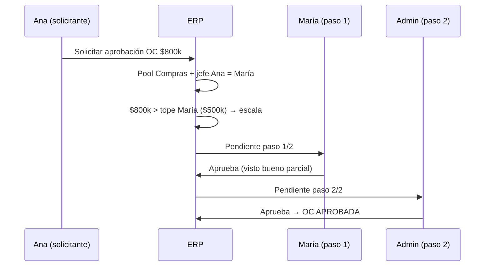

> **{deprecado}** — 2026-08-18. Conservar como archivo. No usar como fuente de verdad.
> Sustituye: [`03-DISENO-GRUPOS-Y-ESCALAS-APROBACION.md`](03-DISENO-GRUPOS-Y-ESCALAS-APROBACION.md). Motivo: Fase 1 `jefeId`; el modelo vigente es grupos + escalas.

# Propuesta visual — Aprobaciones por organigrama (Reu6)

**Audiencia:** María Jesús, Agustín  
**Estado implementación:** fase 1 en ERP (organigrama + cadena secuencial + suplencia). **Fase 2 propuesta:** [grupos configurables y escalas](03-DISENO-GRUPOS-Y-ESCALAS-APROBACION.md)  
**Referencias:** [minuta Reu6](reunion6-minuta-2026-08-06.md) · [transcripción](fuentes/transcripcion-reunion6.md)

---

## 1. Resumen ejecutivo

| Concepto | Qué hace el ERP |
|---|---|
| **Pool de aprobadores** | Admin › Reglas de aprobación: usuarios elegibles por módulo (Compras, Contratistas) y rango de monto |
| **Organigrama** | Admin › Usuarios: jefe directo + tope individual de monto por persona |
| **Asignación automática** | Al solicitar aprobación, el sistema sube la línea de mando; el solicitante **no elige** aprobador |
| **Escalamiento** | Si el monto supera el tope del jefe, pasa al siguiente nivel hasta cubrir el monto |
| **Suplencia / vacaciones** | Admin › Reglas › Suplencias: suplente temporal aprueba en lugar del titular |

### Evolución D4 — de «1 firma» a cadena secuencial

En la minuta Reu6, **D4** decía «**1 firma** al solicitar» (modelo Reu4: el solicitante elegía un jefe del pool).

En la misma reunión, Agustín y MJ pidieron explícitamente **cadena por organigrama y montos** (transcripción ~12:28–14:52): Mario aprueba parcialmente y escala al gerente si el monto lo exige.

**Decisión actual (implementada):**

- D4 queda **evolucionado**: sigue existiendo el pool por módulo/monto, pero la resolución es **cadena secuencial automática**, no una sola firma elegida a mano.
- El campo `aprobadores: 1` en BD es legado; no limita pasos de la cadena.

---

## 2. Mock visual — Admin › Usuarios (organigrama)

Ejemplo ilustrativo con datos demo del seed:

```
                    ┌─────────────────────────┐
                    │  Admin Master (U-1)     │
                    │  Tope: sin límite       │
                    └───────────┬─────────────┘
                                │ jefe
                    ┌───────────▼─────────────┐
                    │  María Supervisor (U-6) │
                    │  Tope: $500.000         │
                    └───────────┬─────────────┘
              ┌─────────────────┼─────────────────┐
              │ jefe            │ jefe            │ jefe
    ┌─────────▼────────┐ ┌──────▼───────┐ ┌───────▼────────┐
    │ Ana Compras U-2  │ │ José Cont.   │ │ Luis Bodega    │
    │ (sin tope)       │ │ U-3          │ │ U-4            │
    └──────────────────┘ └──────────────┘ └────────────────┘
```

**Pantalla Admin › Usuarios** (campos nuevos):

| Usuario | Jefe directo | Tope aprobación |
|---|---|---|
| Ana Compras | María Supervisor | — |
| María Supervisor | Admin Master | $500.000 |
| Admin Master | — | — |

---

## 3. Mock visual — Regla de aprobación (pool)

**Admin › Reglas de aprobación › Compras**

| Campo | Valor ejemplo |
|---|---|
| Nombre | OC estándar |
| Módulo | Compras |
| Rango | $0 – $999.999.999 |
| Jefes elegibles (pool) | María Supervisor, Admin Master |

El pool define **quién puede aparecer** en la cadena. No define el orden: el orden lo da el organigrama.

---

## 4. Flujo ejemplo — OC $800.000 (Ana solicita)



**Cadena calculada:** `[María, Admin]` — 2 pasos secuenciales.

Si el monto fuera **$300.000**, la cadena sería solo `[María]` (1 paso).

---

## 5. Anti-«trampa» entre áreas

Si el jefe directo de Ana **no está en el pool**, el motor **salta** ese nodo y sigue subiendo hasta encontrar alguien del pool (o agota la línea).

Ejemplo: pool = solo Admin; jefe Ana = Pedro (fuera del pool); jefe Pedro = María (fuera); jefe María = Admin → cadena `[Admin]`.

---

## 6. Suplencia / vacaciones (D6)

### Regla de negocio

| Campo | Descripción |
|---|---|
| Titular | Usuario que normalmente aprueba en su nivel |
| Suplente | Quien aprueba en su lugar durante el periodo |
| Vigencia | Desde / hasta (hasta opcional = indefinido) |
| Módulo | Compras, Contratistas o todos |
| Motivo | Texto libre (ej. «Vacaciones febrero») |

### Mock — suplencia activa

```
María Supervisor  ──vacaciones──►  Carlos Suplente
  (titular U-6)      01–15 ago       (U-7, en pool)
```

OC pendiente para María → **llega a Carlos** mientras la delegación esté vigente.

### Preguntas para validar con MJ / Agustín

1. ¿Un suplente puede cubrir **varios titulares** a la vez?
2. ¿El suplente debe estar **obligatoriamente en el pool** o basta con la delegación?
3. ¿Notificación al suplente al crear la delegación?
4. ¿Quién puede crear suplencias: solo Admin master o también el titular?

**Implementación v1:** Admin master crea delegaciones; suplente no requiere estar en pool; una delegación activa por titular+módulo.

---

## 7. PIN y permisos

- PIN en **Mi Perfil** para quien esté en el pool (no ligado al rol).
- Admin master puede aprobar cualquier pendiente (con advertencia si no es el asignado).
- Escalamiento: cada paso genera pendiente para el aprobador efectivo (titular o suplente).

---

## 8. Estado vs minuta §3

| Ítem minuta | Estado |
|---|---|
| Cadena multi-nivel + organigrama | ✅ Implementado |
| Escalamiento por montos | ✅ Implementado |
| Anti-selección arbitraria de aprobador | ✅ Implementado |
| Suplencia vacaciones | ✅ Implementado (Admin › Suplencias) |
| Propuesta visual para MJ/Agustín | ✅ Este documento |

---

## 9. Próximos pasos sugeridos (Almahue)

1. Enviar borrador de organigrama real (nombres, jefes, topes por persona).
2. Validar reglas de suplencia (preguntas §6).
3. Probar en ambiente publicado: OC $300k (1 paso) y OC $800k (2 pasos).
