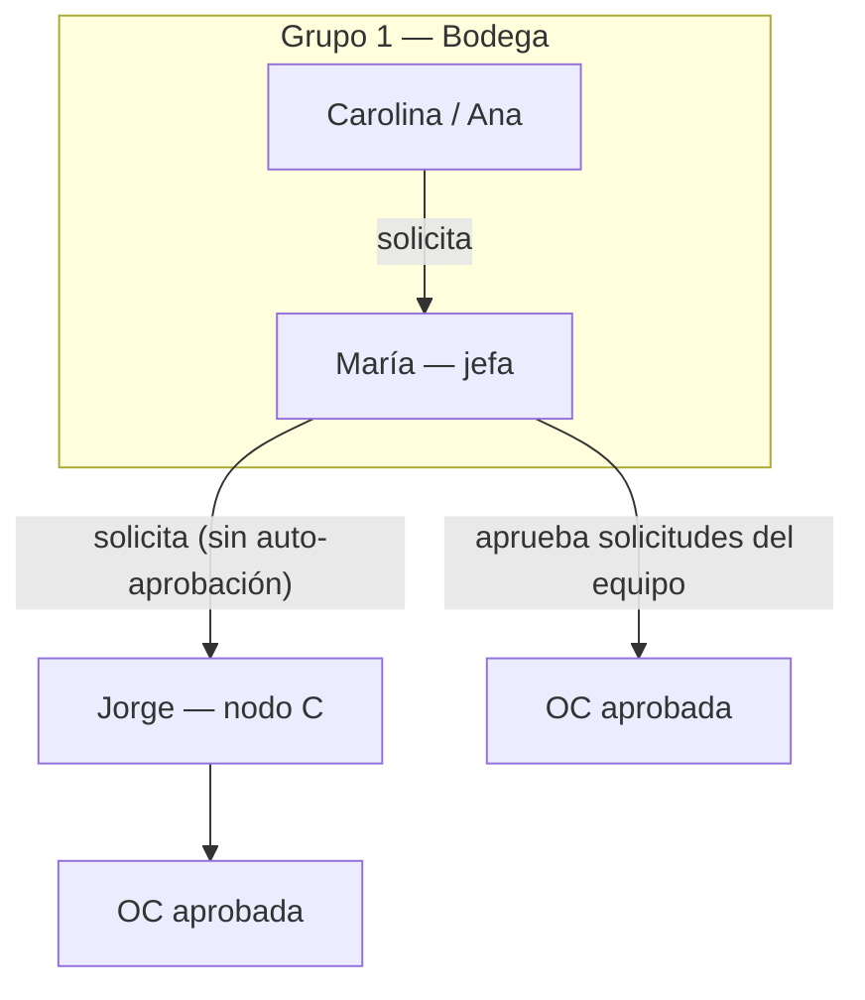
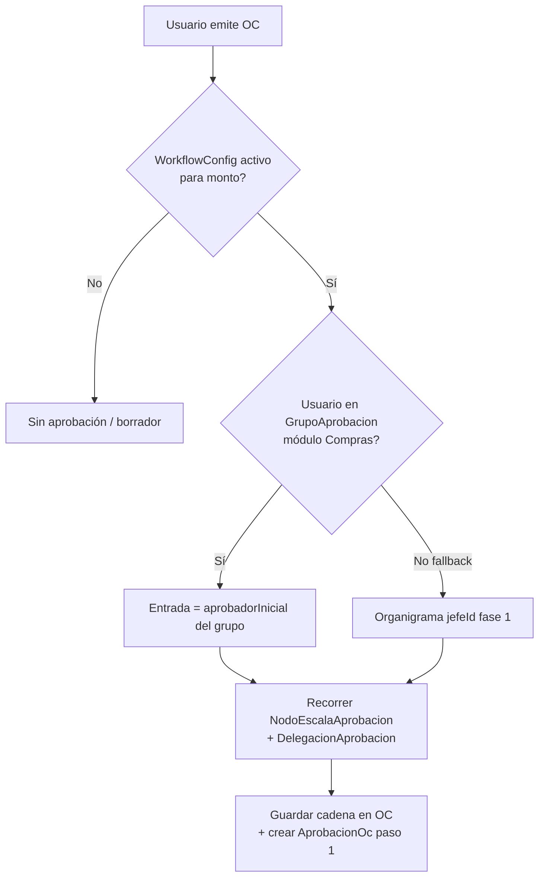

# Diseño propuesto — Grupos de trabajo y escalas de aprobación (fase 2)

**Audiencia:** MJ, Agustín, Admin ERP  
**Estado:** Implementado (fase 2) — evolución de [fase 1 organigrama](02-PROPUESTA-APROBACIONES-ORGANIGRAMA.md)  
**Canvas interactivo:** abrir `grupos-escalas-aprobacion.canvas.tsx` en Cursor (simulador de cadenas)

---

## 1. Problema que resuelve

La **fase 1** (implementada) enruta aprobaciones por **jefe directo** en Admin › Usuarios. Funciona para organigrama fijo, pero **no** cubre bien:

| Necesidad Almahue | Limitación fase 1 |
|---|---|
| Grupos de trabajo / áreas **configurables** (no fijos en RRHH) | Solo `jefeId` por persona |
| Distintos equipos → distintos aprobadores iniciales (A vs B) | Misma regla de pool; diferencia solo por árbol de jefes |
| Escalas distintas por aprobador (A→C, B→D, C→D) | Tope por persona + subir jefe en organigrama |
| Configuración **visual y comprensible** | Repartida entre Usuarios + Reglas |

**Objetivo fase 2:** pantalla única donde Admin define **grupos**, **escalas** y ve una **línea de aprobación de ejemplo** antes de guardar.

---

## 2. Tres conceptos (modelo mental)

```
┌─────────────────┐     ┌──────────────────┐     ┌─────────────────────┐
│ GRUPO           │     │ ESCALA           │     │ CADENA (automática) │
│ ¿Quién solicita?│ ──► │ ¿Quién aprueba   │ ──► │ Paso 1 → 2 → … → OK │
│ → entrada A o B │     │ y hasta cuánto?  │     │ según monto OC      │
└─────────────────┘     └──────────────────┘     └─────────────────────┘
```

| Concepto | Pregunta que responde | Configura Admin |
|---|---|---|
| **Grupo solicitante** | ¿Este usuario a qué área/equipo pertenece para Compras? | Nombre grupo + miembros + **aprobador inicial** |
| **Nodo de escala** | ¿Hasta qué monto puede aprobar X y a quién escala? | Tope CLP + **escala a** (siguiente nodo) |
| **Cadena** | ¿Qué pasos tendrá esta OC? | **No se configura a mano** — se calcula |

El solicitante **nunca elige** aprobador (anti-amistad, Reu6).

---

## 3. Ejemplo de referencia (A / B / C / D)

### 3.1 Grupos

| Grupo | Miembros (ejemplo) | Aprobador inicial |
|---|---|---|
| **Grupo 1 — Bodega / insumos** | Ana, Luis | **Usuario A** |
| **Grupo 2 — Compras administrativas** | Pedro, Carla | **Usuario B** |

Un usuario pertenece a **un grupo por módulo** (Compras). Si mañana Ana cambia de área, Admin la mueve de grupo — sin tocar organigrama RRHH.

### 3.2 Escalas de aprobación

| Aprobador | Tope (CLP) | Si el monto supera el tope → escala a |
|---|---|---|
| **A** | $1.000.000 | **C** |
| **B** | $2.000.000 | **D** |
| **C** | $2.000.000 | **D** |
| **D** | Sin tope | — (cierre) |

### 3.3 Líneas de aprobación calculadas (ejemplos)

| Solicitante | Grupo | Monto OC | Cadena | Interpretación |
|---|---|---|---|---|
| Ana | Grupo 1 | $800.000 | **A** | A cubre (≤ $1M) |
| Ana | Grupo 1 | $1.500.000 | **A → C** | A no cubre; C sí (≤ $2M) |
| Ana | Grupo 1 | $2.500.000 | **A → C → D** | C no cubre; D cierra |
| Pedro | Grupo 2 | $1.500.000 | **B** | B cubre (≤ $2M) |
| Pedro | Grupo 2 | $3.000.000 | **B → D** | B no cubre; D cierra |
| **A (jefa de área)** | Grupo 1 | $800.000 | **C** | A solicita por su área → **sin auto-aprobación**; escala directo a C |
| **A (jefa de área)** | Grupo 1 | $1.500.000 | **C** | Idem; C cubre el monto |
| **A (jefa de área)** | Grupo 1 | $2.500.000 | **C → D** | C no cubre; D cierra |

### 3.4 Jefa de área que también solicita

En el organigrama real, la **jefa de área** (aprobador inicial del grupo) también pertenece al equipo: su gente solicita a ella, y **ella puede emitir OC por su área** dentro de las restricciones del módulo.

| Rol en el grupo | Puede solicitar OC | Aparece en cadena cuando solicita |
|---|---|---|
| Miembro operativo (Ana, Carolina) | Sí | Aprobador inicial del grupo (A) |
| **Jefa de área (A)** — miembro + aprobador inicial | Sí | **No** — la cadena escala al siguiente nodo (C) |
| Usuario sin grupo | No | Error `sin_grupo` |

**Regla implementada** (`buildCadenaDesdeGrupo`): si el solicitante coincide con el aprobador efectivo del paso inicial (titular o suplente vigente), ese paso se **omite** y continúa por `escalaA` del nodo. Así se evita auto-aprobación sin impedir que la jefa emita.

**Demo seed (EMP-1):** María González (U-6) es miembro y aprobador inicial del Grupo 1 — Bodega (Compras). Carolina solicita → María aprueba; María solicita → Jorge (U-3, nodo C) aprueba.



flowchart LR
  subgraph G1["Grupo 1"]
    Ana[Ana / Luis]
  end
  subgraph G2["Grupo 2"]
    Pedro[Pedro / Carla]
  end
  Ana --> A
  Pedro --> B
  A -->|"monto > $1M"| C
  B -->|"monto > $2M"| D
  C -->|"monto > $2M"| D
  D --> OK[OC aprobada]
  A -->|"monto ≤ $1M"| OK
  B -->|"monto ≤ $2M"| OK
  C -->|"monto ≤ $2M"| OK
```

---

## 4. Propuesta de pantalla Admin (UX)

**Ruta existente (sin ítem nuevo en menú):** [`/admin/aprobaciones`](ERP/erp_front/src/App.tsx) — misma entrada **Administración › Reglas de aprobación** del [`Sidebar`](ERP/erp_front/src/app/Sidebar.tsx).

**Evolución de [`WorkflowAprobacionesPage`](ERP/erp_front/src/features/admin/WorkflowAprobacionesPage.tsx)** — pestañas dentro de la pantalla actual (no módulo aparte):

| Pestaña | Contenido hoy | Fase 2 |
|---|---|---|
| **Reglas** | Pool por módulo/monto (`WorkflowConfig`) | Se mantiene — define *si* aplica aprobación |
| **Grupos** | — | Miembros + aprobador inicial por módulo |
| **Escalas** | — | Matriz tope + escala a |
| **Suplencias** | Ya implementado (`DelegacionAprobacion`) | Sin cambio |
| **Simulador** | — | Preview cadena (misma UI que OC) |

Componentes reutilizados del ERP: `PageHeader`, `DataTable`, `Modal`, `Field`, `Select`, `useQueryScope` / `listQueryKey` (convención [`convenciones-almaue-erp.md`](../convenciones-almaue-erp.md)).

### Pestaña A — Grupos de solicitud

```
┌──────────────────────────────────────────────────────────────────────┐
│  Compras (OC)                                    [+ Nuevo grupo]    │
├──────────────────────────────────────────────────────────────────────┤
│  Grupo 1 — Bodega          Aprobador inicial: [Usuario A ▼]          │
│  Miembros: Ana · Luis · (+ agregar)                    [Editar]     │
├──────────────────────────────────────────────────────────────────────┤
│  Grupo 2 — Admin compras   Aprobador inicial: [Usuario B ▼]          │
│  Miembros: Pedro · Carla · (+ agregar)                 [Editar]     │
├──────────────────────────────────────────────────────────────────────┤
│  ⚠ Usuarios sin grupo: María (asignar…)                             │
└──────────────────────────────────────────────────────────────────────┘
```

**Reglas UX:**

- Lista de usuarios activos → checkbox o drag a un grupo.
- Cada grupo: nombre, módulo, **un** aprobador inicial (A o B).
- La **jefa de área** debe figurar como **miembro** del grupo si también emite OC por su área (ver §3.4).
- Usuario sin grupo → no puede emitir OC (o warning claro).

### Pestaña B — Escalas (matriz legible)

```
┌────────────────────────────────────────────────────────────────────┐
│  Escalas de aprobación · Compras                    [+ Nodo]       │
├──────────────┬───────────────┬─────────────────────────────────────┤
│ Aprobador    │ Tope CLP      │ Escala a                            │
├──────────────┼───────────────┼─────────────────────────────────────┤
│ Usuario A    │ 1.000.000     │ Usuario C                           │
│ Usuario B    │ 2.000.000     │ Usuario D                           │
│ Usuario C    │ 2.000.000     │ Usuario D                           │
│ Usuario D    │ (sin tope)    │ —                                   │
└──────────────┴───────────────┴─────────────────────────────────────┘
```

Validaciones al guardar:

- No ciclos (A→C→D→A).
- Todo nodo referenciado en «escala a» debe existir.
- Al menos un nodo sin tope (cierre).

### Pestaña C — Simulador (línea de ejemplo)

Antes de publicar la config, Admin prueba:

```
Grupo: [Grupo 1 ▼]   Monto OC: [1.500.000]   [Simular]

  Línea de aprobación sugerida:
  ┌──────┐    ┌──────┐
  │  A   │ ─► │  C   │   ✓ C cubre $1.500.000
  │ paso1│    │ paso2│
  └──────┘    └──────┘
  Motivo: monto supera tope de A ($1.000.000)
```

Misma vista que verá el digitador al crear OC (solo lectura).

**Implementado (fase 2):** componente [`ApprovalChainFlow`](ERP/erp_front/src/components/aprobaciones/ApprovalChainVisual.tsx):

- **Flujo horizontal** — Solicitante → Paso 1 → Paso 2 → … → Aprobada (simulador Admin + preview al emitir OC).
- **Mapa de escalamiento** (`EscalasTopologyPanel`) — pestaña Escalas: árbol por grupo con ramas A→C→D y topes CLP.

---

## 5. Modelo de datos propuesto

Alineado a convenciones ERP: `empresaId` en todo modelo, schema `erp`, migración versionada, DTOs con class-validator, endpoints bajo módulo **Admin** (mismo patrón que `workflows-admin` y `delegaciones-aprobacion`).

```prisma
/// Equipo / área configurable (no organigrama RRHH).
model GrupoAprobacion {
  id                   String   @id @default(cuid())
  empresaId            String
  empresa              Empresa  @relation(fields: [empresaId], references: [id], onDelete: Cascade)
  modulo               String   // Compras | Contratistas — mismo catálogo WORKFLOW_MODULOS_UI
  nombre               String
  aprobadorInicialId   String
  aprobadorInicial     Usuario  @relation("GrupoAprobacionEntrada", fields: [aprobadorInicialId], references: [id])
  activo               Boolean  @default(true)
  miembros             UsuarioGrupoAprobacion[]
  createdAt            DateTime @default(now())
  updatedAt            DateTime @updatedAt
  @@index([empresaId, modulo])
  @@schema("erp")
}

/// M:N usuario ↔ grupo (un grupo activo por usuario+módulo).
model UsuarioGrupoAprobacion {
  usuarioId String
  grupoId   String
  usuario   Usuario         @relation(fields: [usuarioId], references: [id], onDelete: Cascade)
  grupo     GrupoAprobacion @relation(fields: [grupoId], references: [id], onDelete: Cascade)
  @@id([usuarioId, grupoId])
  @@unique([usuarioId, grupoId])
  @@schema("erp")
}

/// Tope + escalamiento explícito por aprobador y módulo.
model NodoEscalaAprobacion {
  id                 String   @id @default(cuid())
  empresaId          String
  empresa            Empresa  @relation(fields: [empresaId], references: [id], onDelete: Cascade)
  modulo             String
  usuarioId          String
  usuario            Usuario  @relation("NodoEscalaUsuario", fields: [usuarioId], references: [id])
  montoMax           Decimal? @db.Decimal(18, 2) // null = sin tope
  escalaAUsuarioId   String?
  escalaA            Usuario? @relation("NodoEscalaSiguiente", fields: [escalaAUsuarioId], references: [id], onDelete: SetNull)
  activo             Boolean  @default(true)
  createdAt          DateTime @default(now())
  updatedAt          DateTime @updatedAt
  @@unique([empresaId, modulo, usuarioId])
  @@schema("erp")
}
```

**Qué NO se duplica**

| Artefacto existente | Rol en fase 2 |
|---|---|
| `WorkflowConfig` | Puerta de entrada: módulo + rango monto (`matchWorkflow` en front / `findMany` en back) |
| `DelegacionAprobacion` | Suplencia por paso (ya en motor fase 1) |
| `OrdenCompra.aprobacionCadenaIds` / `pasoOrden` | Sin cambio — persisten la cadena calculada |
| `AprobacionOc` | Bandeja Compras › Aprobaciones — sin cambio de contrato |
| `Notificacion` | Mismo `refKey` / `href` hacia `/compras/aprobaciones` |
| `pin-aprobacion.ts` | Pool = usuarios en `NodoEscalaAprobacion` del módulo |
| `Usuario.jefeId` | Opcional RRHH; **no** usado para routing si hay grupo |

**Motor:** extender [`approval-engine.ts`](ERP/erp_back/src/modules/aprobaciones/approval-engine.ts) (no nuevo servicio paralelo):

```
function cadena(solicitanteId, monto, modulo, empresaId):
  grupo = miembroGrupo(solicitanteId, modulo)
  if !grupo → error claro (como hoy sin jefe)
  nodo = grupo.aprobadorInicial
  cadena = []
  while nodo:
    nodo = resolveAprobadorEfectivo(nodo, delegaciones)  // suplencia fase 1
    if nodo == solicitanteId:                             // jefa solicitando
      nodo = escalaA(nodo, modulo)                         // skip auto-aprobación
      continue
    cadena.push(nodo)
    escala = nodoEscala(nodo, modulo)
    if escala.montoMax == null or monto <= escala.montoMax: break
    nodo = escala.escalaA
  return cadena
```

Integración en [`compras.service.ts`](ERP/erp_back/src/modules/compras/compras.service.ts) y [`contratistas.service.ts`](ERP/erp_back/src/modules/contratistas/contratistas.service.ts): reemplazar `buildCadenaAprobacion(jefeId…)` por `buildCadenaDesdeGrupo(…)` cuando exista config de grupos para la empresa+módulo; fallback a organigrama fase 1 si no hay grupos (migración gradual).

**API (mismo controller Admin):**

| Método | Ruta | Permiso |
|---|---|---|
| GET/POST/PUT/DELETE | `grupos-aprobacion` | `admin:read` / `admin:write` |
| GET/POST/PUT/DELETE | `escalas-aprobacion` | idem |
| POST | `aprobaciones/simular` | `admin:read` — body `{ modulo, grupoId\|usuarioId, monto }` |

Front: [`domain.ts`](ERP/erp_front/src/types/domain.ts) → [`real/api.ts`](ERP/erp_front/src/services/real/api.ts) → [`api.ts`](ERP/erp_front/src/services/api.ts) `pickApi` (convención obligatoria).

**Preview en OC:** [`ComprasPages.tsx`](ERP/erp_front/src/features/compras/ComprasPages.tsx) ya muestra «Aprobación (automática)» vía [`approvalEngine.ts`](ERP/erp_front/src/lib/approvalEngine.ts) — misma función que el simulador Admin (una sola fuente de verdad).

---

## 6. Roles vs grupos vs escalas

| Pregunta | Respuesta |
|---|---|
| ¿Quién **solicita**? | Usuario en un **grupo** + rol con `compras:write` |
| ¿Quién **aprueba**? | Nodos en la **cadena calculada** + PIN + estar autorizado |
| ¿Rol «Aprobador A»? | **No hace falta** — A aprueba porque es nodo en escala y le toca el paso |
| ¿Admin master? | Sigue pudiendo resolver cualquier pendiente (Reu6 D2) |

---

## 7. Migración desde fase 1

| Fase 1 (hoy) | Fase 2 (propuesta) |
|---|---|
| `Usuario.jefeId` | Opcional RRHH; routing vía **grupo** si existe config |
| `Usuario.montoMaxAprobacion` | Migrar a `NodoEscalaAprobacion` |
| `WorkflowConfig.aprobadorIds` (pool) | Derivado automático de nodos en escala (o validación cruzada) |
| Reglas por rango monto | **Se mantienen** — primero `matchWorkflow`, luego grupo+escala |
| Organigrama sin grupos | **Fallback** hasta que Admin configure grupos |

Script de migración sugerido:

1. Crear nodos de escala desde topes actuales en Usuarios.
2. Crear un grupo por cada jefe directo único con sus subordinados.
3. `aprobadorInicialId` = jefe del grupo.
4. Validar simulador vs OC históricas de prueba.
5. Seed demo A/B/C/D en [`prisma/seed.ts`](ERP/erp_back/prisma/seed.ts) (mismo patrón que organigrama U-2/U-6/U-1).

---

## 10. Alineación con el resto del ERP

Esta fase **no es un módulo nuevo**: extiende la columna vertebral ya existente.

### 10.1 Flujo operativo (sin cambios visibles al usuario final)

```
Digitador (compras:write)
  → Compras › Órdenes › Emitir
  → matchWorkflow(monto)           ← WorkflowConfig (ya existe)
  → buildCadena(grupo + escala)    ← motor ampliado
  → OrdenCompra + AprobacionOc     ← schema ya existe
  → Notificación al paso 1         ← NotificacionesService
Aprobador (pool + PIN Mi Perfil)
  → Compras › Aprobaciones
  → assertPinAprobacion            ← pin-aprobacion.ts
  → escalamiento paso 2…N          ← siguienteAprobadorEnCadena
```

Contratistas: mismo patrón en `/contratistas/proformas` → `/contratistas/aprobaciones`.

### 10.2 Capas técnicas (convención monorepo)

| Capa | Ubicación fase 2 | Referencia existente |
|---|---|---|
| Schema | `erp_back/prisma/schema.prisma` | `WorkflowConfig`, `DelegacionAprobacion` |
| Migración | `prisma/migrations/2026…/` | `20260810140000_delegacion_aprobacion` |
| Motor | `modules/aprobaciones/approval-engine.ts` | Ya usado por compras + contratistas |
| Admin API | `modules/admin/admin.{controller,service}.dto` | `workflows-admin`, `delegaciones-aprobacion` |
| Permisos | `admin:read`, `admin:write` | Sin permiso nuevo |
| Tenant | `resolveOperationalEmpresa` + `X-Empresa-Id` | Igual que workflows |
| Front types | `types/domain.ts` | `WorkflowConfig`, `DelegacionAprobacion` |
| Front API | `services/real/api.ts` + `pickApi` | `getWorkflowsAdmin`, etc. |
| UI Admin | `WorkflowAprobacionesPage.tsx` | Pestañas, no ruta nueva |
| UI preview OC | `ComprasPages.tsx` + `approvalEngine.ts` | Bloque «Aprobación (automática)» |
| RBAC menú | `pantallas-permisos.ts` | Sigue «Reglas de aprobación» |
| Tests | `approval-engine.spec.ts` | Casos A/B/C/D + grupos |

### 10.3 Qué deliberately NO hacer (evitar desalineación)

| Anti-patrón | Por qué |
|---|---|
| Nuevo ítem menú «Grupos aprobación» | Duplica Admin; confunde con Roles |
| Rol «Aprobador A» en RBAC | Reu6: aprobador = pool/escala, no rol |
| Solicitante elige aprobador | Anti-requisito Reu6 |
| Módulo Nest `grupos-aprobacion/` separado | La config es Admin; la lógica es `aprobaciones/` |
| Mock-only en prod | Convención: API real en [`real/api.ts`](ERP/erp_front/src/services/real/api.ts) |
| Duplicar motor en front distinto al back | Un algoritmo en `approval-engine.ts`; espejo mínimo en front |

### 10.4 Convivencia Reglas + Grupos + Escalas

Diagrama de decisión al emitir OC:



### 10.5 Benchmark mercado → decisión Almahue

Patrones tomados de SAP/Coupa/NetSuite (ver hilo anterior), **implementados con stack Almahue**:

| Idea mercado | Equivalente Almahue |
|---|---|
| Approval groups | `GrupoAprobacion` + miembros |
| Spending limit por usuario | `NodoEscalaAprobacion.montoMax` |
| Escalation chain | `escalaAUsuarioId` |
| Delegation OOO | `DelegacionAprobacion` (ya hecho) |
| Approval inbox | Compras/Contratistas › Aprobaciones |
| Simulador | Pestaña Admin + preview OC |

---

## 8. Criterios de aceptación (para validar con MJ / Agustín)

1. Admin crea 2 grupos Compras con aprobadores iniciales A y B **sin tocar organigrama**.
2. Admin configura escalas A→C, B→D, C→D con topes indicados.
3. Simulador muestra las 5 filas de la tabla §3.3 correctamente **y** los 3 casos de jefa de área (§3.4).
4. Digitador de Grupo 1 **no puede** enviar OC a B (solo cadena desde A).
5. Vista al crear OC muestra cadena en solo lectura.
6. Configurable por Admin master; cambio de grupo efectivo en **próximas** solicitudes.

---

## 9. Próximo paso

1. **Validar** alineación + diseño con MJ/Agustín (doc §10 + canvas).
2. **Implementar** siguiendo cadena Back→Front de [`convenciones-almaue-erp.md`](../convenciones-almaue-erp.md).
3. Mantener suplencias, PIN, bandejas y notificaciones sin regresión.

**Ver también:** canvas `grupos-escalas-aprobacion.canvas.tsx` · fase 1 [`02-PROPUESTA-APROBACIONES-ORGANIGRAMA.md`](02-PROPUESTA-APROBACIONES-ORGANIGRAMA.md)
