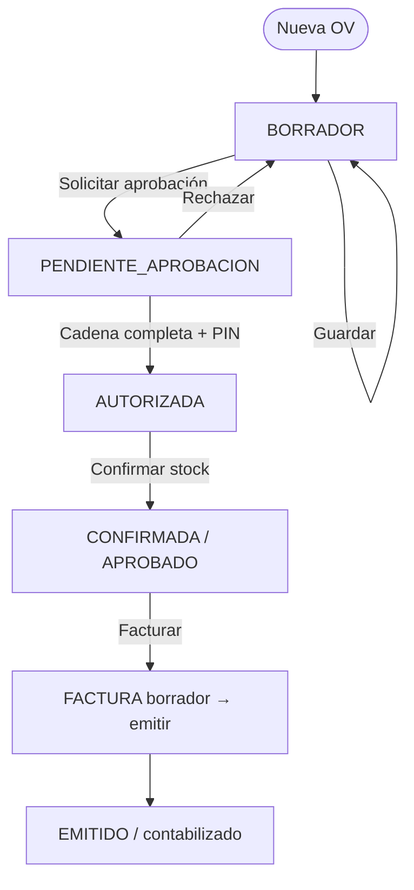
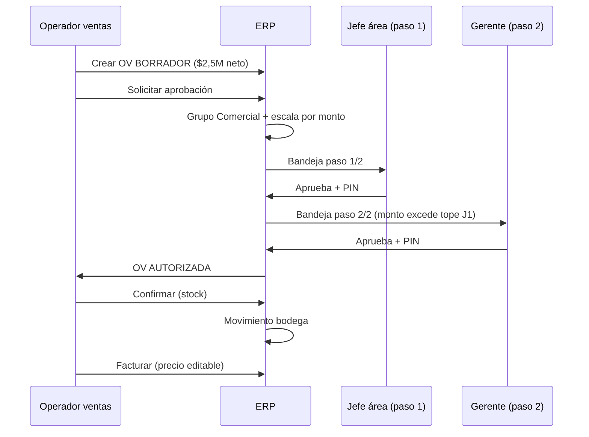

# Propuesta — Aprobaciones módulo Comercial (órdenes de venta)

**Audiencia:** María Jesús, Agustín, equipo Almahue  
**Elaborado por:** Devint (para próxima reunión)  
**Fecha:** 2026-08-14  
**Estado:** **Implementado** (backend + front, 2026-08-14) — pendiente validación reunión Almahue para activar `comercialRequiereAprobacion` en prod  
**Referencias:** [Reu6 minuta](reunion6-minuta-2026-08-06.md) · [transcripción Reu6](fuentes/transcripcion-reunion6.md) · [Grupos y escalas (fase 2)](03-DISENO-GRUPOS-Y-ESCALAS-APROBACION.md) · [Organigrama (fase 1)](02-PROPUESTA-APROBACIONES-ORGANIGRAMA.md)

---

## 1. Resumen ejecutivo

En Reu6 quedó **cerrado el flujo operativo** de ventas (OV → stock → factura), pero el módulo **Comercial** en reglas de aprobación figura como **reservado** (D4). Esta propuesta asume un modelo **sin inventar otro motor**: reutiliza grupos, escalas, cadena automática, suplencias y PIN que ya operan en **Compras** y **Contratistas**.

**Decisión propuesta (v1 piloto):**

| Documento | ¿Requiere cadena de aprobación? | Momento del gate |
|---|---|---|
| **Orden de venta (OV)** | **Sí** — antes de comprometer stock | Tras guardar borrador, **antes** de «Confirmar (stock)» |
| **Factura desde OV aprobada** | **No** (segunda cadena) | Solo si OV ya pasó la cadena; precio editable según Reu6 |
| **Emisión directa** (servicios / sin OV) | **Opcional** — solo si monto ≥ umbral configurable | Al «Grabar y contabilizar» |

El solicitante **nunca elige** aprobador (anti-amistad, Reu6). El monto que dispara escalamiento es el **neto de la OV** (suma de líneas).

---

## 2. Qué ya está definido en Reu6 (no se reabre)

Estos puntos **no dependen** de esta propuesta; ya son acuerdo de negocio:

| ID | Acuerdo | Implicancia |
|---|---|---|
| D11 | Cotización = Compras; ventas = **Orden de venta** | La aprobación comercial aplica a **OV**, no a cotizaciones de compra |
| D12–D15 | Producto con maestro + bodega; servicio sin stock; multi-bodega; stock positivo | La OV se aprueba **con el detalle ya cargado** |
| D13 | Movimiento de stock en OV; factura copia qty/desc, precio editable | El gate de aprobación va **antes** del movimiento de bodega |
| D16 | No vender **bajo costo** (precio mínimo = costo producto) | **Bloqueo** en OV; sin concepto «merma» (no aplica a fruta) |
| D5–D6 | PIN en designados; cadena por montos + línea de mando + suplencia | Mismo patrón que OC/proformas |

**Nota sobre «proforma de venta»:** Agustín mencionó proformas (transcripción L363); MJ aclaró que el documento previo a facturar es la **orden de venta**, no una cotización (L369–373). Esta propuesta usa **OV** como documento de compromiso comercial previo a factura.

---

## 3. Principios de diseño

1. **Un solo motor** — `approval-engine` + grupos/escalas; módulo `Comercial` como tercer eje junto a Compras y Contratistas.
2. **Cadena automática** — el sistema calcula pasos; el usuario no asigna aprobador manualmente.
3. **Línea de mando** — la analista de ventas no envía la OV al jefe de otra área «por amistad» (Reu6 Agustín L105–111, MJ L123–127).
4. **PIN** — solo usuarios designados en reglas o escalas; no checkbox en rol (D5).
5. **Piloto gradual** — parámetro empresa `comercialRequiereAprobacion` (default **off** en demo; **on** cuando Almahue cargue organigrama).
6. **Sin duplicar stock** — aprobar OV **no** mueve inventario; solo autoriza el botón «Confirmar (stock)».

---

## 4. Modelo propuesto — máquina de estados OV

### 4.1 Estados (evolución del AS-IS)

| Estado actual (código) | Estado propuesto | Significado |
|---|---|---|
| `BORRADOR` | `BORRADOR` | Editable; sin aprobación ni stock |
| — | `PENDIENTE_APROBACION` | En bandeja; cadena en curso |
| — | `AUTORIZADA` | Cadena completa; **habilita** «Confirmar (stock)» |
| `APROBADO` (post-confirmar) | `CONFIRMADA` * | Stock descontado; lista para facturar |
| `EMITIDO` | `FACTURADA` / `EMITIDO` | Vinculada a factura tributaria |

\* *En implementación se puede mantener el literal `APROBADO` para no romper integraciones; la semántica pasa a ser «stock confirmado». La propuesta usa `AUTORIZADA` vs `CONFIRMADA` para claridad en reunión.*

### 4.2 Diagrama de flujo

### 4.3 Secuencia con actores

---

## 5. ¿Por qué aprobar la OV y no la factura?

| Criterio | Aprobar OV | Aprobar factura |
|---|---|---|
| Alineación Reu6 D13 | **Sí** — el compromiso de bodega es en OV | La factura es tributaria/contable posterior |
| Riesgo operativo | Evita salida de stock no autorizada | El stock ya salió si se aprueba solo al facturar |
| Doble trabajo | Una sola cadena | Dos cadenas si OV y factura se aprueban por separado |
| Precio editable en factura | La gerencia autoriza **cantidades y productos**; el margen se ajusta al facturar | — |

**Excepción v1:** factura **sin OV** (servicios, exportación rápida, NC/ND) → regla aparte (§7).

---

## 6. Reglas de negocio propuestas

### 6.1 Monto para escalamiento

- **Base:** neto OV (suma líneas: producto + servicio + flete, antes de IVA).
- **Moneda:** CLP; si en el futuro hay OV en USD, convertir con TC del día del documento.
- **Umbral mínimo:** parámetro empresa `comercialAprobacionDesde` (default **$0** = siempre cadena si módulo activo; o **$500.000** para piloto).

### 6.2 Tipos de línea

| Tipo línea | ¿Cuenta para monto? | ¿Exige bodega al aprobar? |
|---|---|---|
| PRODUCTO | Sí | Sí — splits válidos |
| SERVICIO | Sí | No |
| FLETE | Sí | No |

### 6.3 Venta bajo costo (D16) — **implementado**

| Regla | Comportamiento |
|---|---|
| Línea **PRODUCTO** con precio &lt; `costoPromedio` | **Rechazada** al guardar OV (default `ventaBajoCosto = BLOQUEAR`) |
| Excepción «merma» | **No aplica** — fue comentario en demo, no regla de negocio fruta |

Parámetro empresa `ventaBajoCosto` en API (sin UI admin aún); piloto con **BLOQUEAR**.

### 6.4 Edición y rechazo — **implementado**

| Situación | Regla |
|---|---|
| OV `PENDIENTE_APROBACION` | **No editable** (igual proforma aprobada, Reu4) |
| Rechazo en cualquier paso | Vuelve a `BORRADOR`; **motivo obligatorio** (API + bandeja) |
| Anular OV autorizada sin confirmar stock | Solo rol supervisor + PIN; sin movimiento bodega |
| OV `CONFIRMADA` | No editable; solo facturar o reversar según política contable |

### 6.5 Super admin (D2)

- Puede aprobar cualquier paso pendiente con **advertencia** si no es el asignado.
- Queda trazabilidad en historial de aprobación (igual OC).

---

## 7. Emisión directa y otros documentos

| Caso | Propuesta v1 |
|---|---|
| Factura desde **OV autorizada y confirmada** | Sin segunda aprobación |
| Factura / NC / ND **sin OV** (servicios, ajustes) | Si neto ≥ `comercialAprobacionDesde` → misma cadena módulo Comercial |
| OV solo **SERVICIO** (sin stock) | Misma cadena OV (compromiso comercial, no bodega) |
| Exportación COMEX | Igual regla por monto; campos COMEX no cambian la cadena |
| Guía de despacho | Fuera de alcance v1; no libro ventas (Reu4 D5) |

---

## 8. Configuración Admin (misma pantalla existente)

**Ruta:** Administración › Reglas de aprobación (`/admin/aprobaciones`)

Se habilita el módulo **Comercial** (hoy reservado en UI pero presente en DTO/backend):

### 8.1 Pestaña Reglas (pool)

Ejemplo ilustrativo Almahue:

| Regla | Módulo | Rango neto | Activa |
|---|---|---|---|
| OV estándar | Comercial | $0 – $9.999.999.999 | Sí |

### 8.2 Pestaña Grupos

| Grupo | Miembros (ejemplo) | Aprobador inicial |
|---|---|---|
| Ventas — AlmaWeb / export | Analistas comerciales AW | Jefe comercial AW |
| Ventas — Insumos / packing | Analistas LM | Jefe bodega comercial |

Un usuario: **un grupo Comercial** (misma regla que Compras).

### 8.3 Pestaña Escalas

| Nodo | Tope CLP | Escala a |
|---|---|---|
| Jefe comercial área | $1.500.000 | Gerente ventas |
| Gerente ventas | $5.000.000 | Gerencia general |
| Gerencia general | sin tope | — |

Los montos son **placeholders** para la reunión; Almahue los reemplaza con datos reales.

### 8.4 Simulador

Antes de guardar, preview:

> «Ana solicita OV $2.200.000 → Cadena: [Jefe AW] → [Gerente ventas]»

(Reutiliza componente simulador existente con `modulo: 'Comercial'`.)

---

## 9. UI operativa (Ventas)

| Pantalla | Cambio propuesto |
|---|---|
| **Órdenes de venta** | Botones: «Guardar borrador» · «Solicitar aprobación» · «Confirmar (stock)» (solo si `AUTORIZADA`) |
| **Ventas › Aprobaciones** | Nueva entrada en menú (bandeja módulo Comercial), análoga a Compras/Contratistas |
| **Emitir documento** | Sin cambio de cadena si factura viene de OV confirmada |
| **Panel operativo** | KPI `ovPorAprobar` (mis pendientes) |

---

## 10. Ejemplos para validar en reunión

### Caso A — OV pequeña, un paso

| Campo | Valor |
|---|---|
| Solicitante | Carolina (grupo Ventas AW) |
| Neto | $800.000 |
| Cadena | Jefe AW (tope $1,5M) → **fin** |
| Tras aprobar | Confirmar stock → facturar con precio mayor |

### Caso B — OV grande, dos pasos

| Campo | Valor |
|---|---|
| Neto | $3.800.000 |
| Cadena | Jefe AW → Gerente ventas |
| PIN | Cada paso |

### Caso C — Jefa de área solicita (sin auto-aprobación)

| Campo | Valor |
|---|---|
| Solicitante | Jefe AW (también aprobador inicial del grupo) |
| Regla | Igual OC: **omite** paso propio; escala al siguiente nodo (Gerente) |

### Caso D — Venta bajo costo (D16)

| Campo | Valor |
|---|---|
| Línea | Producto con precio &lt; costo promedio |
| Resultado | Error 400 al crear/editar OV |

### Caso E — Piloto sin aprobación

| Campo | Valor |
|---|---|
| Parámetro | `comercialRequiereAprobacion = false` |
| Flujo | Igual hoy: BORRADOR → Confirmar → Facturar |

---

## 11. Plan de implementación (Devint)

| Fase | Entregable | Esfuerzo estimado | Dependencia |
|---|---|---|---|
| **0** | Validar esta propuesta con MJ/Agustín | Reunión | — |
| **1** | Estados OV + `solicitarAprobacionOv` + bandeja Comercial | 3–5 días | Fase 0 |
| **2** | Grupos/escalas módulo Comercial en UI + simulador | 1–2 días | Motor ya existe |
| **3** | Umbral / flag empresa; D16 bloqueo bajo costo | 1 día | D16 UI `ventaBajoCosto` (opcional) |
| **4** | QA: escenarios A–E + regresión OV→factura | 2 días | `almahue-qa-runner` |
| **5** | Emisión directa con cadena (opcional v1.1) | 2 días | Si Almahue lo pide |

**Reutilización técnica:** `resolveCadenaCompleta({ modulo: 'Comercial' })`, tablas `SolicitudAprobacion` / historial (mismo patrón que `OrdenCompra` y proformas).

---

## 12. Alternativas consideradas y descartadas

| Alternativa | Por qué se descarta |
|---|---|
| Aprobar solo la **factura** | El stock ya salió; contradice D13 y el control de bodega |
| **Doble** cadena (OV + factura) | Fricción operativa; MJ prioriza margen en factura, no re-aprobación |
| Picker de aprobador (Reu5) | Anulado explícitamente en Reu6 |
| PIN en rol | Anulado en Reu6 D5 |
| Sin aprobación comercial nunca | Deja hueco D4 «reservado»; no cierra cabo suelto |
| Cotización ventas con aprobación | Anulado — D11 |

---

## 13. Preguntas para la próxima reunión (checklist)

**Plantilla operativa:** [qa/REUNION-CHECKLIST-APROBACION-COMERCIAL.md](qa/REUNION-CHECKLIST-APROBACION-COMERCIAL.md) (marcar en vivo + gate pre-migración).

Marquen **Sí / No / Ajustar** en vivo:

| # | Pregunta | Propuesta default |
|---|---|---|
| 1 | ¿Aprueban la **OV antes de descontar stock**? | **Sí** |
| 2 | ¿La **factura** desde OV confirmada necesita segunda aprobación? | **No** |
| 3 | ¿Umbral mínimo para exigir cadena? (ej. $500.000) | A definir |
| 4 | ¿OV solo **servicio** pasa por la misma cadena? | **Sí** |
| 5 | ¿**Bloquear** venta bajo costo (D16)? | **Sí** — sin excepción merma |
| 6 | ¿Montos de escala Comercial = mismos que Compras u **otra matriz**? | Matriz aparte (recomendado) |
| 7 | ¿Quiénes son los **grupos** comerciales (nombres y miembros)? | Almahue entrega borrador |
| 8 | ¿En **piloto** activamos aprobación desde día 1 o flag off hasta cargar organigrama? | Off hasta organigrama cargado |
| 9 | ¿Emisión directa sin OV requiere cadena por monto? | **Sí** si ≥ umbral (v1.1) |
| 10 | ¿Algún tipo de cliente/producto **exento** de aprobación? | Listar excepciones |

---

## 14. Material que Almahue puede enviar antes de implementar

1. Borrador **grupos comerciales** (nombres + miembros + jefe inicial).  
2. Tabla **topes CLP** por aprobador (puede copiar formato escalas Compras).  
3. Decisión **umbral** y si piloto arranca con aprobación on/off.  
4. Confirmación escrita de preguntas §13 (aunque sea por correo).

**Checklist operativo (gate pre-migración):** [qa/REUNION-CHECKLIST-APROBACION-COMERCIAL.md](qa/REUNION-CHECKLIST-APROBACION-COMERCIAL.md)

---

## 15. Relación con otros documentos

| Documento | Relación |
|---|---|
| [03-DISENO-GRUPOS-Y-ESCALAS-APROBACION.md](03-DISENO-GRUPOS-Y-ESCALAS-APROBACION.md) | Esta propuesta extiende el mismo modelo al módulo `Comercial` |
| [reunion6-minuta-2026-08-06.md](reunion6-minuta-2026-08-06.md) D4 | Deja de estar «reservado» una vez validada esta propuesta |
| [qa/resultados/2026-08-14-fase1-as-is-to-be.md](qa/resultados/2026-08-14-fase1-as-is-to-be.md) | H3 (aprobación comercial) pasa a **propuesta cerrada** tras validación |
| [qa/REUNION-CHECKLIST-APROBACION-COMERCIAL.md](qa/REUNION-CHECKLIST-APROBACION-COMERCIAL.md) | Checklist §13, material A–E, casos demo y **gate pre-migración** |
| `AGENTS.md` | D4: implementado; activar flag tras reunión |

---

## 16. Resumen en una frase para la reunión

> **«La orden de venta se aprueba con la misma cadena automática que la OC, antes de tocar el stock; la factura hereda el detalle y solo ajusta precios, sin segunda vuelta de firmas.»**
