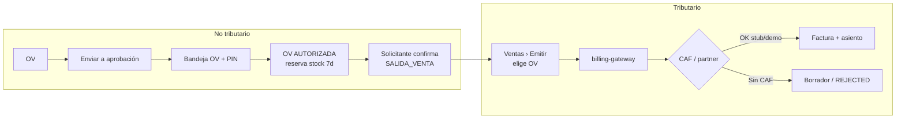
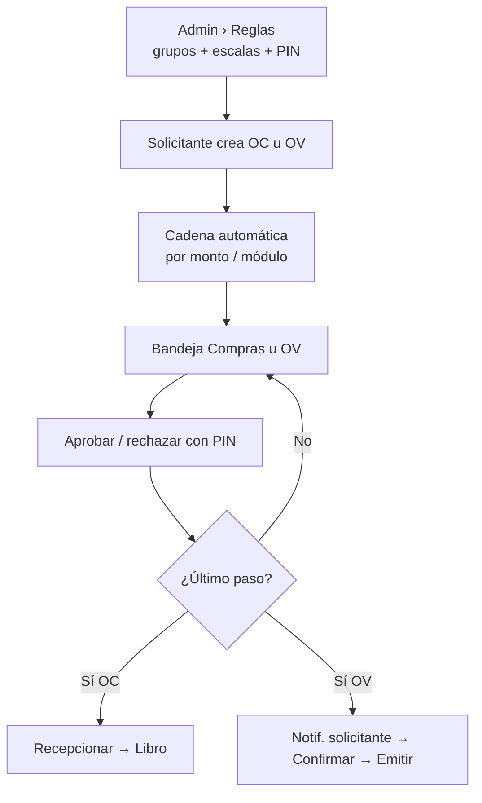

# Brief reunión cliente — Aprobaciones + Emisión (20/08/2026)

**Contexto:** reunión interna Carlos–Sergio hoy AM → reunión con cliente en ~1 h.  
**Fuentes:** `reunion-2026-08-20-contraste-sergio.md` + código local.  
**Regla:** Sergio/Carlos = hipótesis. Cerrar con MJ/Agustín. D11 compras **no** reabrir en demo.

---

## A. Acuerdos de hoy con Sergio (Devint)

### Aprobaciones

1. Cadena OV/OC: el **aprobador solo aprueba**; **no** factura ni “hace la pega”.
2. Tras aprobar: **notificar al solicitante** → él **confirma** (stock) y luego **emite**.
3. OV = control + aprobaciones (también **servicios**, no solo stock).
4. Emitir **sin OV** salta la cadena → debe ser **restrictivo / configurable** (hoy en código: FACTURA exige OV).

### Emisión (lo que Sergio pidió diagramar)

5. Flujo demo: OV → aprobación (PIN) → confirmar → **Emitir** → DTE.
6. Sin CAF: queda **borrador** / fail-closed (no vender SII real).
7. Pipe: ERP → `billing-gateway` → partner; útil mostrar error CAF o stub con leyenda.
8. Compras: **dibujito** cotiz↔OC↔factura recibida para Almahue; **no** cambiar código a ciegas (choca D11).

---

## B. Diagrama Emisión (ventas) — para pantalla

**Mensaje de 20 s:** “La OV no es la factura. Primero control y firma; después Emitir genera el DTE. Sin CAF no hay folio SII.”

---

## C. Diagrama Aprobaciones (aspectos a mostrar)

**Aspectos a recorrer en vivo (checklist demo):**

| # | Aspecto | Dónde | Estado local |
|---|---|---|---|
| 1 | Config grupos / escalas | `/admin/aprobaciones` | ✅ |
| 2 | Simulador cadena | Admin aprobaciones | ✅ |
| 3 | OC: enviar → bandeja → PIN | Compras | ✅ (probado hoy PM) |
| 4 | Progreso de cadena en detalle OC | Órdenes / bandeja | ✅ (UI hoy) |
| 5 | OV: enviar → bandeja → PIN | Ventas aprobaciones | ✅ código; retest demo |
| 6 | Notif. “OV aprobada” al solicitante | Campana / dashboard | ✅ backend; verificar UI |
| 7 | CTA post-aprobación (continuar / confirmar / emitir) | OV | ⚠️ parcial (hubo bugs superadmin) |
| 8 | Admin override sin estar en escala | Admin | ✅ implícito |
| 9 | PIN ligado a designación | Mi perfil + bandeja | ✅ demo `4821` |

---

## D. Listo vs falta (solo lo que importa en 1 h)

### Listo para mostrar

| Tema | Evidencia |
|---|---|
| Aprobaciones Compras end-to-end | Cotiz→OC→PIN→Recepcionar→Asociar factura→Contabilizar (sesión PM) |
| Separación OV ≠ Emitir | Rutas distintas; FACTURA exige OV |
| Fail-closed sin CAF | Borrador / no asiento partner |
| Reserva stock al autorizar OV | Código + migración local `ReservaStock` |
| PIN + cadena | Pilotos Compras y Comercial ON |

### Falta / no vender / preguntar

| Tema | Qué hacer en la reunión |
|---|---|
| Compras sin OC (hipótesis Sergio) | Mostrar **diagrama con pregunta**; no decir “ya lo cambiamos” |
| Reserva TTL 10d + liberar súper | Código tiene 7d; TTL/liberación fina = propuesta |
| UX superadmin bandeja OV | Mencionar si sale; no bloquear demo con Admin operativo |
| CAF / SII live | “Pendiente credenciales Almahue”; mostrar stub o error |
| Merma / devolución fruta | No abrir; preguntar solo si preguntan |
| Emitir sin OV configurable | Hoy bloqueado; preguntar si quieren umbral |

---

## E. Guion sugerido (15–20 min)

1. **Aprobaciones (8 min):** Admin reglas → crear OC o OV → bandeja + PIN → mostrar cadena en detalle.  
2. **Emisión (8 min):** OV autorizada → confirmar → Emitir → resultado stub/CAF. Frase: “aprobación ≠ DTE”.  
3. **Compras (3 min):** diagrama cotiz→OC→factura **recibida** (no emitir SII de compra) + 1 pregunta abierta a Almahue.

Credenciales demo: `admin@almahue.local` / `Admin123!` · PIN `4821`.
