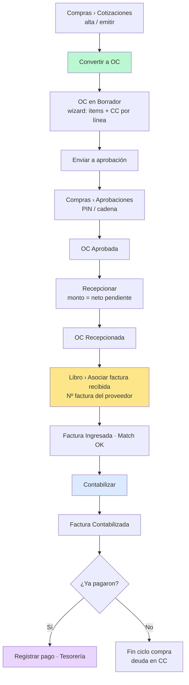
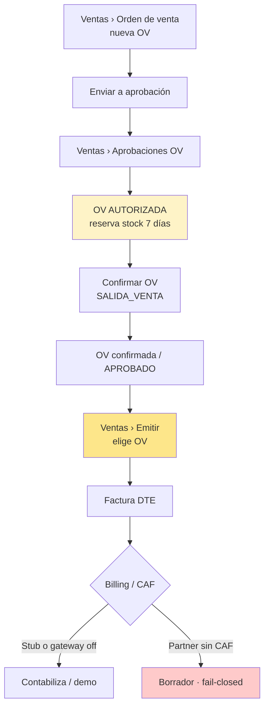

# Diagramas — flujos Ventas y Compras (2026-08-20)

**Actualizado:** prueba manual guiada (sesión QA UI).  
**Regla:** Carlos/Sergio = hipótesis. Gana minuta MJ/Agustín + código.  
**Modo testing:** un paso por mensaje; el usuario responde dudas del paso o «continuar».

---

## 1. Compras — ciclo probado en local (D11 + UI 20/08)

Lo que validamos paso a paso en el ERP:

### Notas de la prueba

| Paso | Pantalla | Qué NO es |
|---|---|---|
| Cotización APROBADO | Abrir OC existente (no 2ª OC) | Emitir DTE |
| Recepción | Confirma ingreso operativo | No mueve stock bodega |
| Asociar factura | Ingresa factura **del proveedor** | Emitir factura SII |
| Contabilizar | Asiento / deuda | Pago banco |
| Registrar pago | Tesorería | Contabilidad |

Stock de compra: entrada por **Insumos › Movimientos** (`ENTRADA_PROVEEDOR`), no por la recepción.

---

## 2. Ventas — guía de prueba (mismo estilo)

**Importante:** en Ventas **no** hay cotización de cliente → factura. El documento es **Orden de venta (OV)**. Cotizaciones viven en Compras.

### Checklist pasos (testing guiado)

| # | Paso | Pantalla |
|---|---|---|
| V1 | Crear OV (cliente + ítems + bodega) | `/comercial/ordenes-venta/nueva` |
| V2 | Enviar a aprobación | misma OV |
| V3 | Aprobar en bandeja OV (PIN si aplica) | `/comercial/aprobaciones-ov` |
| V4 | Confirmar OV (sale stock) | detalle OV |
| V5 | Emitir factura desde OV | `/comercial/emitir` |
| V6 | Ver resultado DTE / libro ventas | Emitir + Libro ventas |

Demo: `admin@almahue.local` / `Admin123!` · PIN `4821`.

---

## 3. Mensaje corto demo

1. **Compras:** cotiz → OC → aprueba → recepciona → **asocia factura recibida** → contabiliza → (opcional) paga.  
2. **Ventas:** OV ≠ factura SII. Aprueba → confirma stock → Emitir desde OV.  
3. **Emitir** no es Libro ventas; sin CAF el partner puede dejar borrador.
