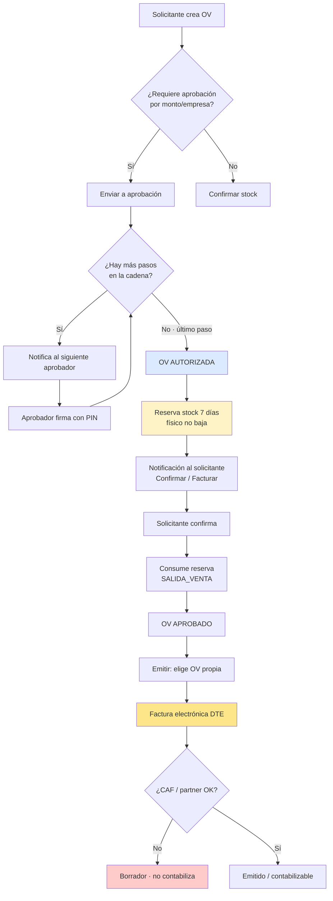
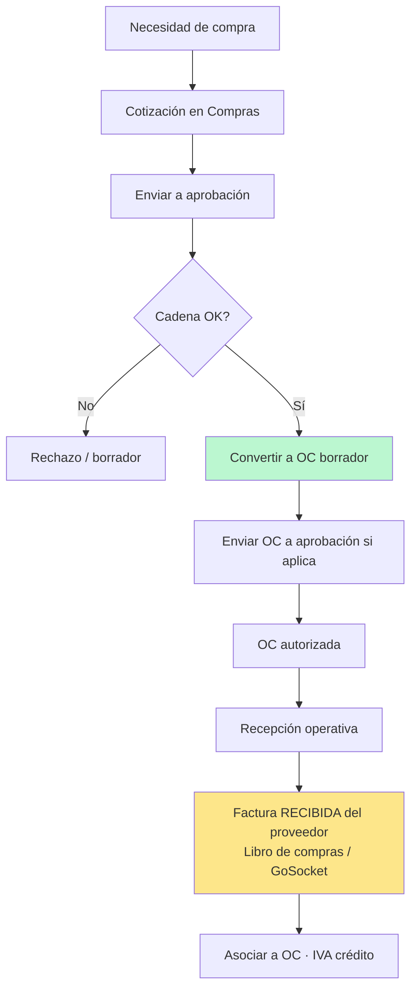
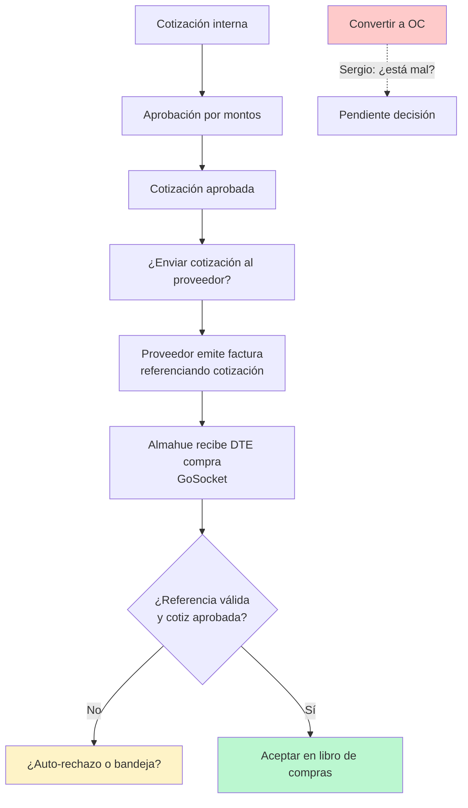

# Diagramas para reunión Almahue — flujos Ventas y Compras (preguntas)

**Fecha:** 2026-08-20  
**Origen:** reunión interna Carlos + Sergio; **no** son requisitos cerrados.  
**Uso:** editar en vivo con MJ/Agustín. Compras **congelada** en código hasta su OK.

---

## 1. Ventas (implementado en local — validar con cliente)

### Preguntas Ventas (marcar en la reunión)

| # | Pregunta | Opción A | Opción B |
|---|---|---|---|
| V1 | ¿Toda venta (también solo servicio) debe pasar por OV? | Sí, siempre | Emitir directo bajo umbral / flag |
| V2 | Stock: ¿reserva al autorizar (7 días) está bien? | Sí | Solo descontar al confirmar / al facturar |
| V3 | ¿Quién puede facturar una OV? | Solo el solicitante | Cualquiera con permiso Ventas |
| V4 | Al vencer la reserva (7 días) ¿qué pasa? | Liberar y avisar | Bloquear OV hasta re-autorizar |

---

## 2. Compras (hipótesis Sergio vs D11 — **decidir con Almahue**)

### A) Lo que pide Reu6 / código actual (D11)

### B) Lo que Sergio planteó el 20/08 (a validar)

### Preguntas Compras (marcar en la reunión)

| # | Pregunta | Opción A (D11) | Opción B (Sergio) |
|---|---|---|---|
| C1 | Documento previo a la factura del proveedor | Cotización → **OC** → factura recibida | Cotización aprobada → factura recibida **sin OC** |
| C2 | Si la factura llega sin referencia / cotiz no aprobada | Bandeja / aviso | Auto-rechazo |
| C3 | ¿Hay que subir PDF o basta el DTE del partner? | Partner + carga manual opcional | Solo referencia de folio |
| C4 | ¿La cotización se “envía” al proveedor desde el ERP? | No (interno → OC) | Sí, tras aprobar |

---

## 3. Mensaje corto para la demo

1. **Ventas:** pedido interno (OV) ≠ factura SII. Quien aprueba no factura; el solicitante confirma y emite desde su OV.  
2. **Stock:** al autorizar se **reserva** 7 días; al confirmar sale de bodega. Ver Insumos › Stock.  
3. **Emitir:** ya no hay factura libre; elige OV. Sin CAF queda borrador.  
4. **Compras:** traemos el dibujo; **no cambiamos código** hasta que Almahue elija A o B.
