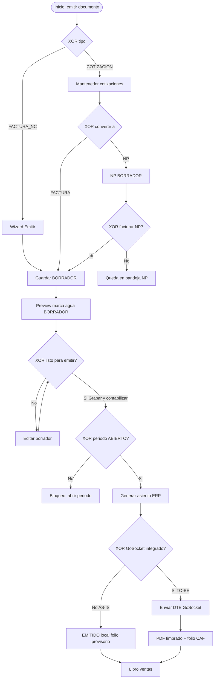
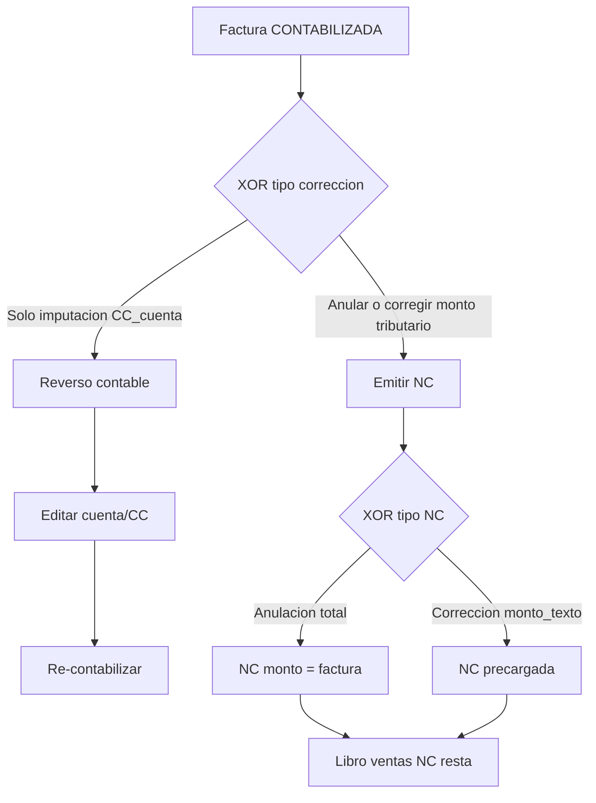
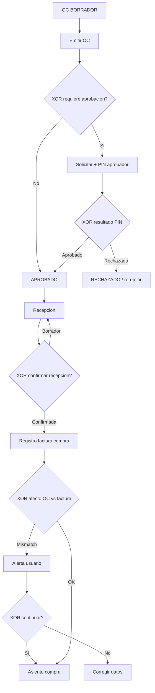
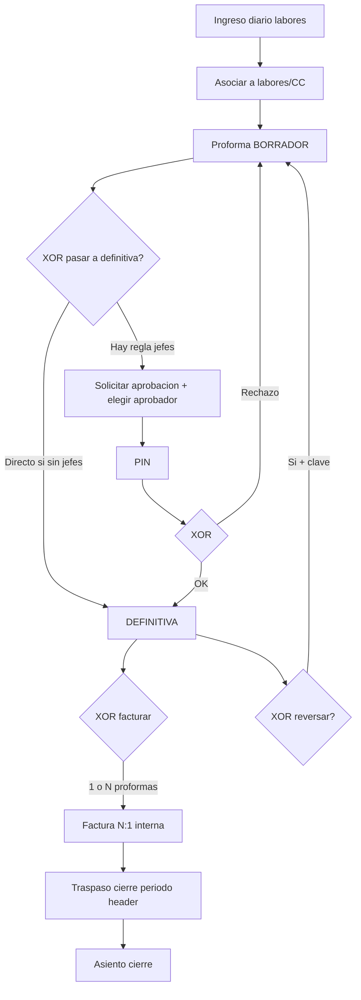
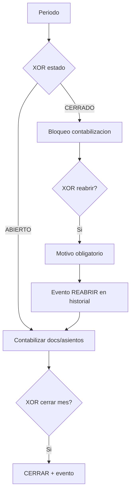
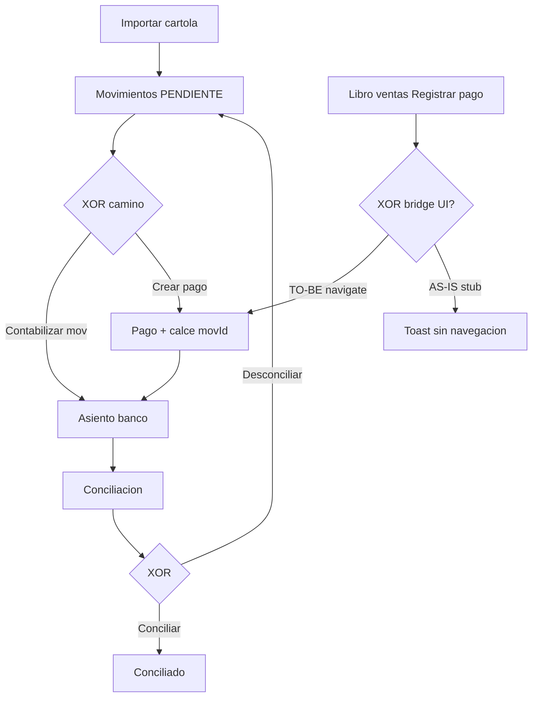

# BPMN — Flujos de negocio con gateways (Reu4 → Reu5)

**Fecha:** 2026-08-06  
**Notación:** Mermaid estilo BPMN. Diamantes = **XOR** (una rama) o **AND** (paralelo).  
**Cobertura AS-IS:** Sí · Parcial · No · Diferido

---

## 1. Emisión de ventas (ancla GoSocket)

| Gateway | Ramas | Cobertura AS-IS |
|---|---|---|
| XOR tipo | Factura/NC vs Cotización | Sí |
| XOR listo | Seguir editando vs Grabar+contabilizar | Sí |
| XOR periodo | Abierto vs cerrado | Sí |
| XOR GoSocket | Local vs DTE | **Diferido** / rama local Sí |
| XOR convertir | NP vs Factura | Parcial (pierde campos) |
| XOR facturar NP | Sí vs No | **Parcial** (API Sí, UI No) |

---

## 2. Corrección de venta: reverso vs NC

| Gateway | Cobertura |
|---|---|
| XOR reverso vs NC | Sí (flujos separados) |
| XOR NC total vs parcial | Parcial |

---

## 3. Compras: OC → PIN → recepción → factura

| Gateway | Cobertura |
|---|---|
| XOR aprobación / PIN | Sí |
| XOR recepción | Sí |
| XOR afecto/exento | Sí (alerta, no bloqueo duro) |

---

## 4. Contratistas: ingreso → proforma → factura N:1 → traspaso

| Gateway | Cobertura |
|---|---|
| XOR definitiva / cola PIN | Sí |
| XOR factura N:1 | Sí |
| XOR reverso | Sí |
| GoSocket factura proveedor | Diferido |

---

## 5. Contabilidad: periodos

| Gateway | Cobertura |
|---|---|
| XOR abierto/cerrado | Sí |
| XOR reabrir + motivo | Sí |
| Historial quién/cuándo | Sí |

---

## 6. Tesorería: cartola → pago → conciliación

| Gateway | Cobertura |
|---|---|
| XOR cartola/pago | Sí |
| XOR conciliar | Sí |
| XOR bridge libro→pago | **Parcial / No** (stub) |

---

## 7. Resumen de cobertura de casuísticas

| Flujo | Gateways cubiertos | Huecos |
|---|---|---|
| Emisión ventas | Borrador, periodo, reverso/NC | GoSocket DTE; NP→Factura UI |
| Compras | PIN, recepción, afecto | Ingestión compras GoSocket |
| Contratistas | PIN, N:1, traspaso | Factura proveedor electrónica |
| Periodos | Cerrar/reabrir+motivo | — |
| Tesorería | Cartola/pago/conciliación | Bridge desde libros; Excel finas |

**Conclusión BPMN:** la lógica piloto cubre las casuísticas **operativas sin SII**. Las ramas TO-BE de GoSocket y los dead-ends UI (NP, bridge pago, stubs mail) son los gaps de cobertura real pendientes de cierre de código / integración.
