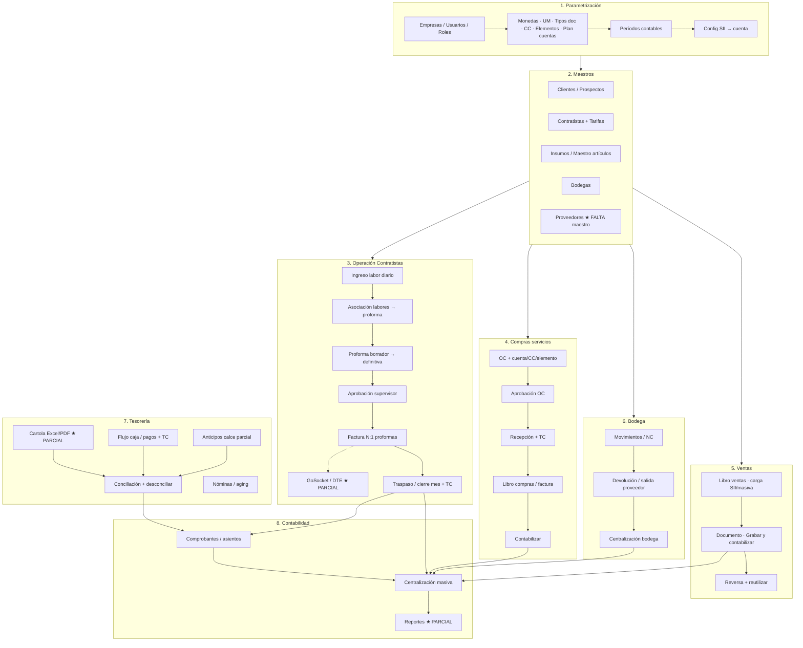
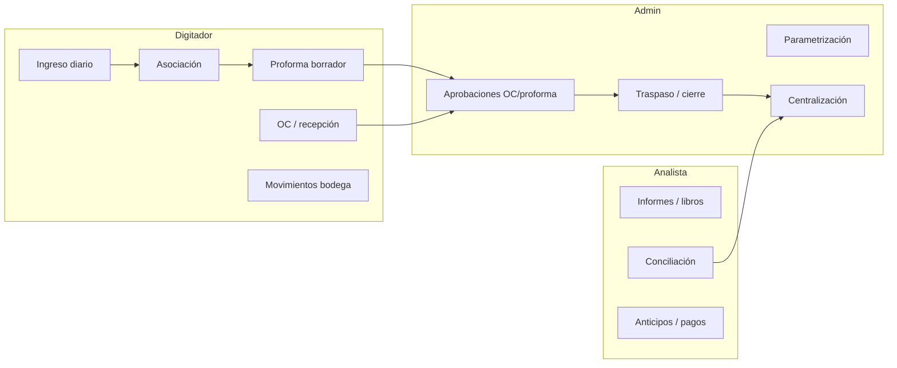

# Flujo de negocio completo — validación vs ERP (28/07/2026)

**Foco:** lo dicho en reuniones con **cliente** (Almahue / Agrosoft).  
**Contexto técnico (no cliente):** Sergio/DTEMITE solo como referencia de menús contables.  
**Modo de evaluación:** Demo Mode OFF = Nest → Prisma; Demo Mode ON = fixtures. No marcar OK lo que es toast/stub.

| Fuente | Path / ref |
|---|---|
| Reu 1 | `00-decisiones.md`, `modulos/*.md`, `validacion-reunion1-trello-2026-07-22.md` |
| Reu 2 | `reunion2-analisis-2026-07-23.md`, `fuentes/reunion2-minuta-tldv-2026-07-23.md`, `validacion-capturas-reu1-reu2-2026-07-23.md` |
| Reu 3 | `reunion3-minuta-2026-07-28.md` |
| Checklist local | `ERP/CHECKLIST_CIERRE_100.md` |
| UI | `ERP/erp_front/src/app/Sidebar.tsx`, `App.tsx` |
| Canvas | `C:\Users\c\.cursor\projects\e-source-repos-Almahue\canvases\flujo-negocio-almahue.canvas.tsx` |

---

## 1. Resumen ejecutivo

**¿El flujo cierra end-to-end (local Demo OFF)?** **Sí, en el circuito factible sin credenciales externas.**  
Cerrado en implementación local (2026-07-28/29): **maestro proveedores**, **centralización usable** (SII + periodo abierto + marca docs), **libro diario/mayor exportable**, **cartola Excel/CSV/PDF** (preview+import heurístico), **NC↔factura**, **bodega salida proveedor**, **carga masiva libros**, **contabilizar con plan/CC/SII**, **plantilla cotización/OC** (logo/sello/columnas + print), **redeploy** `http://45.7.229.46/almahue-erp/`.

Sigue **DEFERRED** (no bloquea circuito local):

1. **GoSocket/DTE productivo** — sin API keys.
2. **Parser cartola banco-específico** — PDF genérico OK; falta muestra oficial Agustín para calibrar banco.
3. **Datos maestros oficiales cliente** (Excel Mario / estados bodega) — seed demo usable.

Checklist smoke: `ERP/CHECKLIST_FLUJO_NEGOCIO.md`.

---

## 2. Diagrama Mermaid — flujo completo de negocio

### Swimlanes (vista por actor)

---

## 3. Matriz por etapa

Leyenda estado: **OK** = UI + API real usable · **parcial** = existe pero incompleto / demo-grade · **falta** = no hay o solo stub/toast · **OUT** = fuera de alcance acordado.

| Paso | Dicho en reu (cita/ref) | Estado ERP | Evidencia (ruta / API) | Gap |
|---|---|---|---|---|
| Login + empresa activa | Reu1 DEC-03/08; `01-contratistas` | OK | `/login`, header empresa; auth JWT | Sesiones concurrentes / warning: no profundo |
| Roles Digitador / Analista / Admin + R/W pantalla | Reu2 DEC-13; Reu3 D1–D3 | OK / parcial | `/admin/roles`; `Rol.permisosPantalla`; API admin | Credibilidad demo depende redeploy; un rol/usuario OK |
| Usuarios multi-empresa | Reu3 D4 | OK | `/admin/usuarios`; `UsuarioEmpresa` N:M | — |
| Monedas + sync BC 9am/manual | Reu1 DEC-05/06; Reu2 K01; Reu3 D13 | OK / parcial | `/catalogos/monedas`, sync BC API | Cron 9am: meta configurada; prod schedule no validado en deploy |
| CC transversales + encargado | Reu1 C-04; Reu2 R2-K02; Reu3 D5 | OK / parcial | `/catalogos/centros-costo` | Datos reales Mario pendientes (Excel) |
| Plan cuentas + elementos en Parametrización | Reu1 K-01; Reu3 D11/R3-06; Sergio | OK | `/catalogos/plan-cuentas`, `/catalogos/elementos-costo` | Import Excel cliente no validado vs producción |
| Períodos contables | Sergio + ops | OK | `/contabilidad/periodos` + selector | Preferencia UI aún localStorage parcial |
| Config SII → cuenta | Sergio | OK | `/contabilidad/config-sii` | Usada en centralización y grabar documento |
| Clientes (+ auditoría creador) | Reu3 D6 | parcial | `/comercial/clientes` | Campo “quién crea” / área contable: verificar profundidad |
| Prospectos | Reu3 gap histórico | OK / parcial | `/comercial/prospectos` | Menú existe; valor negocio bajo |
| Contratistas + tarifas multi-línea | Reu1 C-03; Reu2 C01–C03 | OK | `/contratistas`, `/contratistas/tarifas` | — |
| Ingreso diario precio editable | Reu2 DEC-11 / AgroSmart | OK | `/contratistas/ingreso-diario` API labores | — |
| Asociación masiva labores | Reu2 R2-C04 | OK | `/contratistas/asociacion` `POST .../asociar` | — |
| Proforma → definitiva → N:1 factura | Reu2 PEND-02→REQ; Reu3 R3-08 | OK | `/contratistas/proformas` multi-select + factura | Emisión DTE real **no** |
| Aprobación supervisor + nombre | Reu3 R3-10/R3-16 | OK | API aprobar + `aprobadorNombre`; rol seed | — |
| Traspaso cierre mes + TC | Reu1 C-07; Reu3 D9 | OK | `/contratistas/traspaso` PeriodoCierre | Validar en servidor publicado |
| GoSocket DTE | Reu2 DEC-14; Reu3 D7 | parcial | `/integraciones/gosocket`; `POST dtes/sync` | Sin `GOSOCKET_API_URL` = adaptador local; **rompe cierre factura electrónica** |
| OC sin solicitud + dist. CC | Reu1 DEC-02; Reu3 R3-04 | OK | `/compras/ordenes` cuenta/CC/elemento | Informe OC por proveedor histórico (P-05) débil |
| Aprobación OC + badge | Reu1 P-06; Reu3 R3-12 | OK | `/compras/aprobaciones` `?estado=PENDIENTE` | Redeploy si no publicado |
| Recepción + TC editable | Reu1 P-07; Reu3 R3-13 | OK | `/compras/recepciones` | Política TC productores: documentada, no exhaustiva |
| Libro compras + anti-cruzado + preview | Reu1 P-08; Reu3 R3-14/15 | OK / parcial | `/compras/registro` | Preview/OCs por RUT: cableado local; validar datos reales |
| Carga masiva libros + dupes | Reu3 R3-03 | OK | comercial/compras carga masiva API | Happy-path; formatos SII oficiales cliente por validar |
| Libro ventas + reversa + solo grabar | Reu2 V01–V03 | OK | `/comercial/libro` | — |
| Maestro artículos + cuenta (sin stock en form) | Reu1; Reu3 D11 | OK | `/insumos/maestro` | Unicidad familia/subfamilia: revisar edge cases |
| Bodegas por empresa | Reu1 I-01 | OK | `/insumos/bodegas` | — |
| Movimientos / NC precio factura | Reu1 I-05 | OK / parcial | `/insumos/movimientos`; ventas NC↔factura | Catálogo estados bodega oficial cliente DEFERRED |
| Devolución / salida proveedor + estados | Reu3 R3-05 | OK | estados + `SALIDA_PROVEEDOR` par UI/API | Catálogo estados oficial cliente DEFERRED |
| Param. cuentas por tipo mov. bodega | Reu1 I-03 | parcial | centralización bodega mínima | No hay matriz familia→cuentas completa |
| Niveles almacenamiento | Reu2 DEC-12 | OUT | — | Correcto no implementar |
| Cartola Excel/PDF | Reu2 T01; PEND-05 Agustín | OK / parcial | preview+import CSV/Excel/**PDF texto** | PDF escaneado / banco-específico: falta muestra Agustín |
| Conciliación + reversa selectiva | Reu2 T02–T04 | OK / parcial | `/tesoreria/conciliacion` | Usable; no validado vs cartolas banco reales |
| Pagos TC bidireccional | Reu2 T06 | OK | `/tesoreria/pagos` | — |
| Anticipos calce parcial | Reu2 T05 | OK | `/tesoreria/anticipos` | — |
| Nóminas / aging >90 | Reu2 T07 | OK | `/tesoreria/nominas` | — |
| Comprobantes + carga masiva | Reu1 K-04; Reu3 R3-17 | OK | `/contabilidad/asientos` | — |
| Centralización masiva | Sergio; orígenes ops | OK | preview por origen · SII · periodo abierto · marca docs/bodega | — |
| Reportes contables | Reu3 D12; Sergio | OK | `/contabilidad/libro-diario` · `/mayor` · Excel | Suficiente demo cierre |
| Maestro proveedores | implícito en OC Reu1 | OK | `/catalogos/proveedores` + FK OC/registro | Seed desde OC demo |
| Formatos cotización/OC PDF logo | Reu3 deferred | OK | Admin plantilla + print browser cotización/OC | Assets oficiales cliente opcionales (hay default SVG) |
| Maquinaria / Power BI Gestión | DEC-10 / G-01 | OUT | — | — |
| Servidor publicado demo jueves | Reu3 R3-18 | OK | `http://45.7.229.46/almahue-erp/` | Redeploy 2026-07-28/29 |

---

## 4. Roturas priorizadas del flujo (impiden “negocio completo”)

Ordenadas por impacto en circuito end-to-end (no solo UI):

| # | Rotura | Estado post-cierre |
|---|---|---|
| 1 | **Deploy / servidor publicado (R3-18)** | **CERRADO** — `http://45.7.229.46/almahue-erp/` |
| 2 | **Datos maestros cliente** | Pendiente Excel cliente (seed usable) |
| 3 | **GoSocket/DTE productivo** | **DEFERRED** — sin API keys |
| 4 | **Cartola PDF banco-específico** | CSV/Excel **OK**; PDF genérico **OK** (mejor esfuerzo); banco-específico pendiente muestra |
| 5 | **Centralización contable** | **CERRADO** (SII + periodo + marca docs) |
| 6 | **Reportes diario/mayor** | **CERRADO** (lista + Excel) |
| 7 | **Maestro proveedores** | **CERRADO** |
| 8 | **Bodega salida + NC↔factura** | **CERRADO** (estados oficiales cliente DEFERRED) |

Honorable mención DEFERRED: **GoSocket prod**; cron BC en prod.

---

## 5. Dependencias del cliente

| Entregable cliente | Bloquea | Estado doc |
|---|---|---|
| Excel plan de cuentas + elementos + CC actualizados (Mario) | Seed/reglas reales; R3-06 meaningful | Pendiente Reu2/Reu3 |
| Catálogo **estados** movimiento bodega (oficial) | R3-05 fine-tune | Pendiente Reu3 |
| Muestras **cartola** Excel + PDF (Agustín) | Parser + conciliación real | Pendiente Reu2 PEND-05 |
| Feedback Trello **En Kua al Mawe** (aprobado/rechazado) | Cierre scope UI | Pendiente Reu3 |
| Lista pantallas con **export Excel/PDF** prioritario | R3-11 reportería por módulo | Pendiente Reu3 D12 |
| Assets logo/sello formatos cotización/OC | PDF dinámico | Deferred |
| Credenciales / kickoff **GoSocket** (Sergio coordina; go-live ~01/09 indep. ERP) | Sync DTE prod | DEC-14 — no bloquear ERP básico |
| Ejemplos proforma/factura agrícola (histórico Reu1) | Calibrar estados | Compromiso temprano |

Sin (1)–(3) se puede demoear seed; **no** validar negocio completo.

---

## 6. Orden recomendado para cerrar circuito antes de demo jueves

Prioridad: **demo publicada creíble** del slice operativo, no “ERP 100% producción”.

1. **Ops:** confirmar URL + redeploy (password admin, OC aprobar/rechazar, traspaso mes+TC).
2. Smoke E2E **modo real** (Demo OFF): login → empresa → roles → OC aprueba → ingreso diario → asociación → proforma → aprobación → factura interna → traspaso.
3. Guion contable visible: plan cuentas árbol → período → comprobante → centralización preview (aunque sea mínima).
4. Libros: rename ventas/compras + carga masiva + 1 dupes warning.
5. Compras: OC con cuenta/CC/elemento + click warning dashboard → pendientes.
6. **No prometer** en demo: GoSocket prod, parser cartola **banco-específico** (sí hay PDF genérico).
7. Pedir en vivo al cliente: fecha de envío Excel maestros + cartolas + estados bodega (desbloquear post-jueves).

Post-jueves (circuito real): parsers cartola → centralización fina → reportes → proveedores → GoSocket env.

---

## 7. Nota honestidad Demo vs Real

| Capa | Qué significa “OK” aquí |
|---|---|
| **Demo Mode ON** | Fixtures; recorrido visual Reu1+2 capturado | 
| **Real local (CHECKLIST ~100% factible)** | Front+back Prisma cableado; builds/tests OK |
| **Negocio completo cliente** | Datos reales + DTE + banco + cierre contable auditable → **aún no** |

`CHECKLIST_CIERRE_100.md` cierra el backlog **factible de implementación local**; este documento valida el **flujo de negocio cliente**, que es más exigente.
