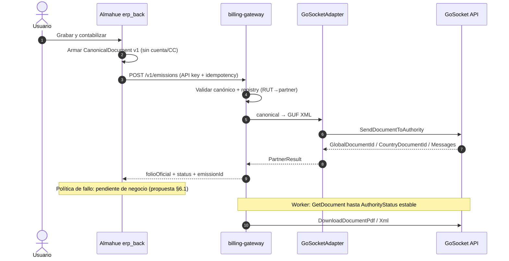

# Plan de implementación — billing-gateway + integración Almahue / GoSocket

**Fecha:** 2026-08-06 (actualizado)  
**Estado:** **Propuesta** — para presentar a María Jesús / Sergio; no hay acuerdo de política operativa ni ApiKeys sandbox aún.  
**Nombre temporal del servicio:** `billing-gateway`  
**Repo:** **git separado** (no carpeta hermana dentro del monorepo Almahue como código fuente)  
**Fuentes GoSocket:** [`../fuentes/gosocket-2026-08-05/`](../fuentes/gosocket-2026-08-05/)  
**Ancla negocio:** Reu4 L250–266 — ERP = única UI; partner transparente bajo “Grabar y contabilizar”.

---

## 0. Decisiones cerradas (2026-08-06)

| Tema | Decisión |
|---|---|
| Nombre | **`billing-gateway`** (temporal) |
| Repositorio | **Git separado** (ciclo de vida / deploys / secretos independientes del monorepo Almahue) |
| ApiKeys sandbox GoSocket | **Esperar** reunión SII / onboarding (no asumir disponibles) |
| Fail-closed | **No aceptado aún** — va como **opción recomendada en la propuesta**; negocio decide |

### Aún abierto

- Alcance MVP: solo 33/34/61 vs incluir **110 export** desde día 1.  
  **Update 2026-08-06:** llegó el manual COMEX de MJ (`fuentes/mj-compartidos-2026-07-30/`) — hay reglas concretas (RUT 55.555.555-5, bulto 22, TC, FOB/CIF, 6 decimales). Recomendación: **diseñar 110/112 en paralelo** al MVP nacional aunque la emisión sandbox empiece por 33.
- Política ante partner caído (ver §6.1 — alternativas a presentar).
- Archivo Excel Comex de un embarque real (citado en el manual; no vino en el pack Trello).
- ApiKeys sandbox post-reunión SII.

---

## 1. Objetivo

Crear el servicio **`billing-gateway`** reutilizable por muchos ERPs, que:

1. Recibe un **JSON canónico** del ERP (independiente del partner).
2. Valida, enruta y transforma al formato del partner.
3. Para **GoSocket Chile**: arma **XML GUF** embebido en el JSON de su API (no HTML; ver §2).
4. Envía a GoSocket, persiste resultado y **devuelve** folio/estado/artefactos al ERP.
5. Permite agregar **más partners** y **más ERPs** sin reescribir el núcleo.

Almahue (`erp_back` / `erp_front`) sigue siendo el sistema de negocio; `billing-gateway` es infraestructura de facturación electrónica multi-cliente.

La documentación de diseño puede vivir en el monorepo Almahue (`docs/.../partners-hub/` o renombrable); el **código** vive en el repo `billing-gateway`.

---

## 2. Corrección de contrato vs idea inicial

| Idea inicial | Contrato real (Manual API + Example_integracion.json) |
|---|---|
| ERP JSON → Hub → **HTML** → GoSocket | ERP JSON canónico → Gateway → **XML GUF** en `FileContent` → `SendDocumentToAuthority` |
| PDF de entrada | PDF **de salida** vía `DownloadDocumentPdf` |
| Respuesta inmediata SII | Chile: respuesta sync del XML + **polling** `GetDocument` para acuse autoridad |

El diseño **no depende de HTML**; el adapter GoSocket produce GUF XML. Si otro partner pide HTML/PDF, se agrega otro adapter sin tocar el canónico.

---

## 3. Ubicación y stack

```
Repos separados:
  billing-gateway/          # NUEVO — git propio (NestJS multi-ERP / multi-partner)
  Almahue/ERP/erp_back/     # cliente HTTP del gateway (feature flag)
  Almahue/ERP/erp_front/    # sin panel GoSocket
  Almahue/docs/.../         # plan + fuentes GoSocket (este paquete)
```

| Capa | Tecnología |
|---|---|
| API | NestJS + TypeScript |
| DB | PostgreSQL + Prisma (schema propio) |
| Colas | BullMQ + Redis (retry, polling SII, DLQ) |
| Validación canónica | Zod (`schemaVersion` 1.0) |
| Observabilidad | logs estructurados + métricas emit |

Sandbox GoSocket: **no conectar** hasta tener ApiKeys post-reunión SII. Hasta entonces: mocks WireMock / fixtures del Manual.

---

## 4. Arquitectura



### Módulos

| Módulo | Rol |
|---|---|
| `api` | `POST /v1/emissions`, `GET /v1/emissions/:id`, webhooks |
| `canonical` | Schema Zod + errores estables |
| `registry` | `erpId + rutEmisor → partner + Mapping + credenciales` |
| `adapters/gosocket` | Mapper canónico→GUF + cliente HTTP Basic Auth |
| `jobs` | Polling SII, retry 5xx, DLQ |
| `audit` | Request/response (secretos redactados) |

```ts
interface IBillingPartnerAdapter {
  emit(doc: CanonicalDocument, ctx: PartnerContext): Promise<PartnerEmitResult>;
  getStatus(refs: PartnerRefs): Promise<PartnerStatus>;
  getArtifact(refs: PartnerRefs, kind: 'pdf' | 'xml'): Promise<Buffer>;
}
```

---

## 5. JSON canónico v1 (ERP → gateway)

Ver [01-CANONICAL-DOCUMENT-V1.md](01-CANONICAL-DOCUMENT-V1.md).  
**Prohibido** enviar `cuentaContableId` / `centroCostoId`.

Mapeo Almahue → DTE (propuesta MVP):

| ERP | tipoDte |
|---|---|
| FACTURA + indicador VENTA | 33 |
| FACTURA + EXENTO | 34 |
| FACTURA + EXPORTACION | **110** (Gap; prioridad de diseño; alcance MVP por confirmar) |
| NC | 61 (112 si export) |
| Guía (futuro UI) | 52 |

---

## 6. Enganche Almahue (propuesta técnica)

**Punto:** `ComercialService.grabarDocumentoContabilizar` — **antes** del asiento.

1. Feature flag por empresa: `dte.enabled` + `dte.partnerId=gosocket`.
2. Flag OFF → comportamiento actual (folio local).
3. Flag ON → build canónico → `billing-gateway.emit` → folio oficial + contabilizar según política acordada.
4. Credenciales GoSocket **solo en billing-gateway**.
5. Sin pantalla admin GoSocket (INT-GOSOCKET-008).
6. Preview watermark local sin cambio; PDF timbrado = artifact post-emisión.

Multi-RUT (ticket 14213): dos entradas registry (mismo `erpId=almahue`, distinto RUT / Mapping / cert).

### 6.1 Política ante partner caído — **para decisión de negocio**

No hay aceptación formal. Presentar tres opciones:

| Opción | Comportamiento | Pros | Contras |
|---|---|---|---|
| **A — Fail-closed** (recomendada técnicamente) | Si gateway/partner falla → **no** asiento; doc en `BORRADOR`; reintento | Folio oficial siempre alineado a SII/GoSocket; evita descuadre legal | Usuario no cierra contabilidad si GoSocket/SII cae |
| **B — Fail-open con folio provisorio** | Contabiliza con folio local; cola de emisión posterior | Operación no se detiene | Riesgo folio/asiento ≠ DTE; reconciliación compleja |
| **C — Subestado EMITIENDO** | Bloquea asiento hasta AuthorityStatus OK (async) | Honesto con Chile async | UX más larga; hace falta pantalla de pendientes |

La propuesta de proyecto llega con **A como default técnico**, dejando B/C documentadas para que María Jesús / Sergio elijan.

---

## 7. Extensibilidad

| Cambio | Se toca | No se toca |
|---|---|---|
| Nuevo partner | `adapters/partner-x` + registry | Canónico v1, ERPs |
| Nuevo ERP | Cliente HTTP + alta tenant + mapeo → canónico | Adapters |
| Breaking schema | `schemaVersion: 2.0` dual | Migración forzosa día 0 |

---

## 8. Fases (propuesta)

### Fase 0 — Bloqueada / externa

- [ ] Reunión SII / onboarding → ApiKeys sandbox
- [ ] Presentar propuesta (este doc) + decisión política §6.1
- [ ] Crear repo git `billing-gateway`

### Fase A — Fundaciones (días 1–3, puede empezar sin ApiKeys)

- [ ] Scaffold NestJS + Prisma + Redis + docker-compose
- [ ] Auth API key por ERP + allowlist RUTs
- [ ] Canónico v1 + tests golden
- [ ] Audit + idempotency
- [ ] Mock GoSocket (fixtures Manual / Example_integracion.json)

### Fase B — Adapter GoSocket (días 4–8; sandbox real post-ApiKeys)

- [ ] Mapper 33/34/61 (+ diseño 110)
- [ ] `SendDocumentToAuthority` (mock → sandbox)
- [ ] Persist emission + worker `GetDocument`
- [ ] Descarga PDF/XML

### Fase C — Cliente Almahue (días 7–12)

- [ ] Builder canónico + hook contabilizar + feature flag
- [ ] UX según política acordada (§6.1)
- [ ] Campos trackId / folio oficial en Prisma
- [ ] Tests flag OFF/ON

### Fase D — Full / export

- [ ] 110/112, guía 52, recibidos, 2º ERP, marcha blanca 2 RUTs

---

## 9. Seguridad

- Secretos partner solo en `billing-gateway`
- TLS + API key ERP→gateway; allowlist RUT
- Logs sin password ApiKey; XML con TTL

---

## 10. Criterios MVP (ajustables tras §6.1)

1. Con mock o sandbox: emitir 33 y obtener ids/folio de partner.
2. Rechazo mandatorio → mensaje usable en ERP.
3. Idempotencia: no duplicar DTE.
4. Flag OFF: cero llamadas al gateway.
5. Cuenta/CC nunca en payload.
6. Docs fuentes versionadas en monorepo Almahue.

---

## 11. Cómo presentar la propuesta (checklist reunión)

1. Diagrama §4 (ERP única UI; gateway transparente).
2. Contrato real GoSocket = XML GUF (no HTML).
3. Repo separado `billing-gateway` multi-ERP.
4. Tabla §6.1 — pedir decisión A/B/C.
5. Bloqueo sandbox hasta ApiKeys post-reunión SII.
6. Preguntar si MVP incluye export **110** desde el inicio.

---

## 12. Referencias

- [01-CANONICAL-DOCUMENT-V1.md](01-CANONICAL-DOCUMENT-V1.md)
- [INT-GOSOCKET](../entrega-reu4-reu5-as-is/01-TOMA-REQUERIMIENTOS.md)
- [BPMN](../entrega-reu4-reu5-as-is/02-BPMN-FLUJOS.md)
- [AS-IS ERP](../entrega-reu4-reu5-as-is/03-AS-IS-ERP-ACTUAL.md)
- Mail Pablo Rodríguez → María Jesús, 5 ago 2026 (ticket 14213)
