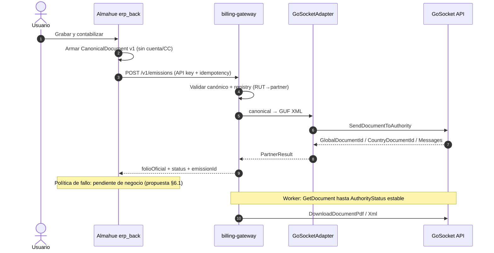

# Plan de implementación — billing-gateway + integración Almahue / GoSocket

**Fecha:** 2026-08-19 (actualizado)  
**Estado:** **Propuesta técnica en ejecución parcial** — ApiKeys sandbox QA recibidas y guardadas solo en `.env` local del `billing-gateway` (gitignored; no versionar valores). Falta acuerdo de política operativa y contrato comercial / IOFactura.  
**Nombre temporal del servicio:** `billing-gateway`  
**Repo:** **git separado** (no carpeta hermana dentro del monorepo Almahue como código fuente)  
**Fuentes GoSocket:** [`../fuentes/gosocket-2026-08-05/`](../fuentes/gosocket-2026-08-05/)  
**Minuta GoSocket QA:** [`../reunion-gosocket-minuta-2026-08.md`](../reunion-gosocket-minuta-2026-08.md)  
**Ancla negocio:** Reu4 L250–266 — ERP = única UI; partner transparente bajo “Grabar y contabilizar”.

---

## 0. Decisiones cerradas (2026-08-06)

| Tema | Decisión |
|---|---|
| Nombre | **`billing-gateway`** (temporal) |
| Repositorio | **Git separado** (ciclo de vida / deploys / secretos independientes del monorepo Almahue) |
| ApiKeys sandbox GoSocket | **Recibidas para QA** post reunión GoSocket; valores solo en `.env` local gitignored del `billing-gateway` |
| Ambiente GoSocket (URL base) | QA vigente: `https://developers-sbx.gosocket.net/api/v1/` (el path `/sandbox/` de `developers.gosocket.net` está bloqueado 19/08). Live: `https://developers.gosocket.net/api/v1/`. El modo efectivo es **por cliente**, no un switch global |
| Modo partner | **Por cliente** en registry: `partner` (`stub` \| `gosocket` \| …) + `connectionMode` — ver §3.1. **`stub` es un facturador más** (mismo contrato); se reemplaza por GoSocket cambiando registry |
| Demo / visualización (2026-08) | **Sin GoSocket real**: todo dato ingresado en demo = stub local. Si hay conexión partner, **solo ambiente QA** (sandbox). **Antes de marcha blanca: reinicio de BD** (datos demo no migran a prod fiscal) |
| Fail-closed | **Aceptado en ERP local 19/08:** HTTP/REJECTED → no asiento, documento `BORRADOR`. CAF/cert MJ pendiente para `ACCEPTED`. |
| Contrato comercial / IOFactura | **Pendiente**. QA/API no requiere contrato; IOFactura se habilita después de firma |

### Aún abierto

- Alcance MVP: solo 33/34/61 vs incluir **110 export** desde día 1.  
  **Update 2026-08-06:** llegó el manual COMEX de MJ (`fuentes/mj-compartidos-2026-07-30/`) — hay reglas concretas (RUT 55.555.555-5, bulto 22, TC, FOB/CIF, 6 decimales). Recomendación: **diseñar 110/112 en paralelo** al MVP nacional aunque la emisión sandbox empiece por 33.
- Política ante partner caído (ver §6.1 — alternativas a presentar).
- Archivo Excel Comex de un embarque real (citado en el manual; no vino en el pack Trello).
- Contrato comercial / IOFactura post-firma.

---

## 1. Objetivo

Crear el servicio **`billing-gateway`** reutilizable por muchos ERPs, que:

1. Recibe un **JSON canónico** del ERP (independiente del partner).
2. Valida, enruta y transforma al formato del partner.
3. Para **GoSocket Chile**: arma **XML GUF** embebido en el JSON de su API (no HTML; ver §2).
4. Envía a GoSocket, persiste resultado y **devuelve** folio/estado/artefactos al ERP.
5. Permite agregar **más partners** y **más ERPs** sin reescribir el núcleo.

Almahue (`erp_back` / `erp_front`) sigue siendo el sistema de negocio; `billing-gateway` es infraestructura de facturación electrónica multi-cliente.

La documentación de diseño puede vivir en el monorepo Almahue (`docs/.../partners-hub/` o renombrable); el **código** vive en el repo `billing-gateway`.

---

## 2. Corrección de contrato vs idea inicial

| Idea inicial | Contrato real (Manual API + Example_integracion.json) |
|---|---|
| ERP JSON → Hub → **HTML** → GoSocket | ERP JSON canónico → Gateway → **XML GUF** en `FileContent` → `SendDocumentToAuthority` |
| PDF de entrada | PDF **de salida** vía `DownloadDocumentPdf` |
| Respuesta inmediata SII | Chile: respuesta sync del XML + **polling** `GetDocument` para acuse autoridad |

El diseño **no depende de HTML**; el adapter GoSocket produce GUF XML. Si otro partner pide HTML/PDF, se agrega otro adapter sin tocar el canónico.

---

## 3. Ubicación y stack

```
Repos separados:
  billing-gateway/          # NUEVO — git propio (NestJS multi-ERP / multi-partner)
  Almahue/ERP/erp_back/     # cliente HTTP del gateway (feature flag)
  Almahue/ERP/erp_front/    # sin panel GoSocket
  Almahue/docs/.../         # plan + fuentes GoSocket (este paquete)
```

| Capa | Tecnología |
|---|---|
| API | NestJS + TypeScript |
| DB | PostgreSQL + Prisma (schema propio) |
| Colas | BullMQ + Redis (retry, polling SII, DLQ) |
| Validación canónica | Zod (`schemaVersion` 1.0) |
| Observabilidad | logs estructurados + métricas emit |

Sandbox GoSocket: ApiKeys QA recibidas el 19/08/2026 y disponibles solo en `.env` local gitignored del `billing-gateway`; no versionar usuario/password/API key ni `Authorization`. Para clientes sin credenciales, seguir con mocks / fixtures del Manual **por cliente en `stub`**.

### 3.1 Modo de conexión **por cliente** (no solo env global)

El gateway atiende **varios ERPs / varios emisores**. No sirve un único `GOSOCKET_MODE=stub` para todo el proceso: Almahue puede pasar a `sandbox`/`live` mientras otro cliente sigue **en espera de credenciales** del facturador/partner.

#### Operación demo → QA → marcha blanca (acordado 2026-08-06)

| Etapa | Partner | Datos |
|---|---|---|
| **Demo / visualización** | Solo `stub` (sin red a GoSocket) | Datos de prueba / demo; **no** son DTE reales |
| **QA** | Único lugar donde puede haber `sandbox` (ApiKeys cuando existan) | BD de QA; no es producción fiscal |
| **Marcha blanca** | Tras **reinicio de BD**; promover registry a sandbox/live según acuerdo | Parte limpia; folios stub de demo **no** se reutilizan |

Consecuencia: el riesgo de “confundir stub con DTE” en demo se mitiga operativamente (sin GoSocket + wipe de BD). Aun así el UI debe llevar disclaimer, para que nadie use un PDF de demo como respaldo fiscal antes del wipe.

| Nivel | Qué controla |
|---|---|
| **Registry por cliente** (fuente de verdad) | `connectionMode` + partner + Mapping + credenciales (si aplica) |
| **Env del gateway** (default / safety) | URL sandbox, timeouts, y default solo si el tenant no tiene modo; **nunca** fuerza live a todos |

Estados sugeridos en registry (`TenantBillingConfig` / entrada `erpId + rutEmisor`):

| Campo | Valores | Uso |
|---|---|---|
| **`partner`** | `stub` \| `gosocket` \| … | **Facturador/seller**. `stub` es un partner completo de pruebas (emite doc + PDF/XML dummy). Se **reemplaza** por `gosocket` (u otro) sin cambiar el ERP. |
| **`connectionMode`** | `stub` \| `sandbox` \| `live` | Ambiente del partner. Con `partner=stub` → local. Con `partner=gosocket` → sandbox/live. |

| `partner` + mode | Comportamiento |
|---|---|
| **`stub` + stub** | Emite DUMMY (folio `STUB-*`, PDF/XML descargables, `artifacts.dummy=true`); disclaimer; sin red externa |
| **`gosocket` + sandbox** | Llama `developers-sbx.gosocket.net/api/v1/...` (ApiKeys QA del tenant) |
| **`gosocket` + live** | API producción GoSocket — solo con decisión explícita |

Ejemplo futuro concurrente:

| Cliente | partner | connectionMode | Nota |
|---|---|---|---|
| Almahue (preview) | `stub` | `stub` | Integra y prueba flujo completo |
| Almahue (post-ApiKeys) | `gosocket` | `sandbox` → `live` | Solo cambia registry |
| Otro ERP | `stub` | `stub` | Independiente |

El ERP **no** elige el facturador: solo llama al gateway. El gateway resuelve por `erpId` + RUT → adapter del `partner`.

Campos mínimos a persistir por emisión (evidencia):

- `tenantId` / `erpId` / `rutEmisor`
- `partner` (`stub` \| `gosocket` \| …)
- `connectionMode` usado
- `partnerDocumentId` / folio (`STUB-*` o folio oficial)
- `disclaimer` (visible si dummy)
- request/response audit (secretos redactados)

---

## 4. Arquitectura



### Módulos

| Módulo | Rol |
|---|---|
| `api` | `POST /v1/emissions`, `GET /v1/emissions/:id`, webhooks |
| `canonical` | Schema Zod + errores estables |
| `registry` | `erpId + rutEmisor → partner + **connectionMode** + Mapping + credenciales` |
| `adapters/gosocket` | Mapper canónico→GUF + cliente HTTP Basic Auth; rama `stub` sin red |
| `adapters/stub` | Respuesta simulada + disclaimer (reutilizable si partner ≠ GoSocket aún) |
| `jobs` | Polling SII, retry 5xx, DLQ |
| `audit` | Request/response (secretos redactados) |

```ts
interface IBillingPartnerAdapter {
  emit(doc: CanonicalDocument, ctx: PartnerContext): Promise<PartnerEmitResult>;
  getStatus(refs: PartnerRefs): Promise<PartnerStatus>;
  getArtifact(refs: PartnerRefs, kind: 'pdf' | 'xml'): Promise<Buffer>;
}
```

---

## 5. JSON canónico v1 (ERP → gateway)

Ver [01-CANONICAL-DOCUMENT-V1.md](01-CANONICAL-DOCUMENT-V1.md).  
**Prohibido** enviar `cuentaContableId` / `centroCostoId`.

Mapeo Almahue → DTE (propuesta MVP):

| ERP | tipoDte |
|---|---|
| FACTURA + indicador VENTA | 33 |
| FACTURA + EXENTO | 34 |
| FACTURA + EXPORTACION | **110** (Gap; prioridad de diseño; alcance MVP por confirmar) |
| NC | 61 (112 si export) |
| Guía (futuro UI) | 52 |

---

## 6. Enganche Almahue (propuesta técnica)

**Punto:** `ComercialService.grabarDocumentoContabilizar` — **antes** del asiento.

1. Feature flag por empresa ERP: `dte.enabled` (¿llamar al gateway?).
2. Flag OFF → comportamiento actual (folio local, sin gateway).
3. Flag ON → build canónico → `billing-gateway.emit` → el **gateway** aplica `connectionMode` del tenant (`stub`/`sandbox`/`live`) → ERP guarda resultado + contabiliza según política acordada.
4. Credenciales partner **solo en billing-gateway**, por entrada de registry (nunca en ERP).
5. Sin pantalla admin GoSocket (INT-GOSOCKET-008); sí badge/disclaimer en Libro/Emitir si `connectionMode=stub`.
6. Preview watermark local sin cambio; PDF/XML del partner = artifacts post-emisión (`stub`: dummy marcado; `gosocket`: timbrados reales).

Multi-RUT (ticket 14213): dos entradas registry (mismo `erpId=almahue`, distinto RUT / Mapping / cert / opcionalmente distinto `connectionMode` si un RUT aún no tiene ApiKeys).

### 6.1 Política ante partner caído — **para decisión de negocio**

No hay aceptación formal. Presentar tres opciones:

| Opción | Comportamiento | Pros | Contras |
|---|---|---|---|
| **A — Fail-closed** (recomendada técnicamente) | Si gateway/partner falla → **no** asiento; doc en `BORRADOR`; reintento | Folio oficial siempre alineado a SII/GoSocket; evita descuadre legal | Usuario no cierra contabilidad si GoSocket/SII cae |
| **B — Fail-open con folio provisorio** | Contabiliza con folio local; cola de emisión posterior | Operación no se detiene | Riesgo folio/asiento ≠ DTE; reconciliación compleja |
| **C — Subestado EMITIENDO** | Bloquea asiento hasta AuthorityStatus OK (async) | Honesto con Chile async | UX más larga; hace falta pantalla de pendientes |

La propuesta de proyecto llega con **A como default técnico**, dejando B/C documentadas para que María Jesús / Sergio elijan.

---

## 7. Extensibilidad

| Cambio | Se toca | No se toca |
|---|---|---|
| Nuevo partner | `adapters/partner-x` + registry | Canónico v1, ERPs |
| Nuevo ERP | Cliente HTTP + alta tenant + mapeo → canónico | Adapters |
| Breaking schema | `schemaVersion: 2.0` dual | Migración forzosa día 0 |

---

## 8. Fases (propuesta)

### Fase 0 — Onboarding externo

- [x] Reunión GoSocket QA / onboarding → ApiKeys sandbox QA recibidas (sin versionar valores)
- [ ] Contrato comercial / IOFactura post-firma
- [ ] Presentar propuesta (este doc) + decisión política §6.1
- [x] Crear repo git `billing-gateway` (scaffold en `E:/source/repos/billing-gateway`; init remoto pendiente)

### Fase A — Fundaciones (días 1–3, puede empezar sin ApiKeys)

- [ ] Scaffold NestJS + Prisma + Redis + docker-compose
- [x] Auth API key por ERP + allowlist RUTs
- [x] Registry con `connectionMode` por `erpId + rutEmisor` (§3.1)
- [x] Canónico v1 + tests golden
- [x] Audit + idempotency
- [x] Adapter `stub` + fixtures Manual / Example_integracion.json (sin red)

### Fase B — Adapter GoSocket (días 4–8; sandbox real con ApiKeys QA)

- [ ] Mapper 33/34/61 (+ diseño 110)
- [ ] `SendDocumentToAuthority` (mock → sandbox)
- [ ] Persist emission + worker `GetDocument`
- [ ] Descarga PDF/XML

### Fase C — Cliente Almahue (días 7–12)

- [ ] Builder canónico + hook contabilizar + feature flag
- [ ] UX según política acordada (§6.1)
- [ ] Campos trackId / folio oficial en Prisma
- [ ] Tests flag OFF/ON

### Fase D — Full / export

- [ ] 110/112, guía 52, recibidos, 2º ERP, marcha blanca 2 RUTs

---

## 9. Seguridad e integridad

### 9.1 Hallazgo AS-IS (2026-08-06)

Hoy el ERP **ya** completa folio local → asiento → `CONTABILIZADA` **sin** partner DTE. El peligro del stub no es inventar ese camino: es **legitimarlo** con respuestas “de partner” y UX de transmisión si faltan disclaimer, watermark PDF y campos de auditoría.

### 9.2 Controles

- Secretos partner **solo** en `billing-gateway` (por entrada registry); nunca en ERP ni front
- TLS + API key ERP→gateway; allowlist RUT por tenant
- Logs / audit: **nunca** password ApiKey ni `Authorization: Basic` en claro; XML con TTL
- `connectionMode` por cliente (§3.1): env global **no** puede forzar `live` a todos
- Canónico sin `cuentaContableId` / `centroCostoId`
- Demo Mode del front (`almahue-erp-demo-mode`) **≠** stub DTE — checklist operativo los distingue

### 9.3 Invariantes (gates de merge / demo)

1. `stub` **sí** emite documento DUMMY (flujo completo + PDF/XML descargables) pero **nunca** presentados como timbrados SII (`artifacts.dummy=true`, watermark / disclaimer)  
2. Folio stub (`STUB-*`) ≠ `folioOficial` live; no reutilizar sin remapeo  
3. ERP no elige `live`; solo el registry del gateway  
4. Credenciales solo en gateway  
5. Política ante fallo acordada (§6.1); stub siempre con disclaimer persistido  
6. `dte.enabled=OFF` → cero HTTP al gateway  
7. Disclaimer visible en Emitir, Libro y PDF (no solo JSON)  
8. Tenant en `stub` no puede alcanzar URL live por bug de env  

### 9.4 Matriz de validación (iterativa, con logs)

| Capa | Caso | Evidencia |
|---|---|---|
| Unit ERP | Flag OFF: 0 HTTP | test + log |
| Unit GW | stub: 0 salida a red | spy HTTP |
| Unit GW | A stub / B sandbox concurrentes | fixtures registry |
| Integration | misma idempotency key → 1 emission | count DB |
| Integration | partner 5xx + política A → BORRADOR, 0 asiento | assert estado |
| E2E UI | badge + disclaimer stub | screenshot |
| E2E PDF | watermark NO VÁLIDO SII / STUB | preview |
| Logs | grep CI sin Basic/ApiKey/password | pipeline |
| Folio | promover stub→live sin colisión unique | migración |

**Orden de implementación seguro:** G0 invariantes → G1 schema auditoría ERP → G2 gateway stub+registry+tests → G3 hook `dte.enabled` + UI/PDF → G4 matriz completa + revisión logs → recién entonces demo marcha blanca.

---

## 10. Criterios MVP (ajustables tras §6.1)

1. Con stub o sandbox: emitir 33 y obtener ids/folio de partner (stub: `STUB-*` + disclaimer).
2. Rechazo mandatorio → mensaje usable en ERP.
3. Idempotencia: no duplicar DTE.
4. Flag OFF: cero llamadas al gateway.
5. Cuenta/CC nunca en payload.
6. Docs fuentes versionadas en monorepo Almahue.
7. Matriz §9.4 en verde (incl. logs) antes de demo con datos reales.

---

## 11. Cómo presentar la propuesta (checklist reunión)

1. Diagrama §4 (ERP única UI; gateway transparente).
2. Contrato real GoSocket = XML GUF (no HTML).
3. Repo separado `billing-gateway` multi-ERP.
4. Tabla §6.1 — pedir decisión A/B/C.
5. ApiKeys sandbox QA ya recibidas; contrato comercial e IOFactura siguen pendientes.
6. Preguntar si MVP incluye export **110** desde el inicio.

---

## 12. Referencias

- [01-CANONICAL-DOCUMENT-V1.md](01-CANONICAL-DOCUMENT-V1.md)
- [INT-GOSOCKET](../entrega-reu4-reu5-as-is/01-TOMA-REQUERIMIENTOS.md)
- [BPMN](../entrega-reu4-reu5-as-is/02-BPMN-FLUJOS.md)
- [AS-IS ERP](../entrega-reu4-reu5-as-is/03-AS-IS-ERP-ACTUAL.md)
- Mail Pablo Rodríguez → María Jesús, 5 ago 2026 (ticket 14213)
