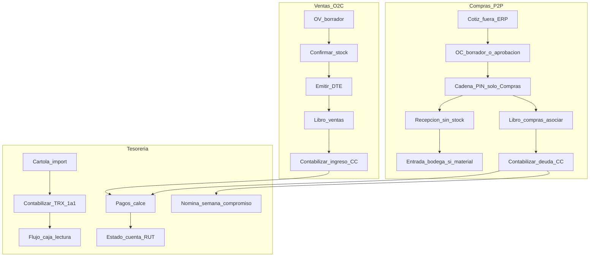

# PM — barco Almahue (arranque 31/08/2026)

**Rol:** Cursor = PM / recopilador. Carlos = desarrollo + tarjetas Trello + dudas a jefe.  
**Regla de peso:** reunión más nueva gana. Lo anterior se **registra**, no se implementa si fue pisado.  
**Master de ejecución ahora:** ToDo reunión tesorería **28/08** (MJ / Lupe / Fran / Mario + Devint).  
**Autoridad de requisitos:** MJ / Agustín / Lupe-Mario operativos (cuando no chocan Reu6). Carlos/Sergio en demo = hipótesis.

**No commitear** API keys tl;dv. Key solo en env `TLDV_API_KEY` sesión local; **rotar** si quedó expuesta en chat.

**Minuta canónica 28/08:** [`reunion-2026-08-28-tesoreria-mj-lupe.md`](reunion-2026-08-28-tesoreria-mj-lupe.md)  
**Transcript:** [`fuentes/transcripcion-2026-08-28-tesoreria-mj-lupe.md`](fuentes/transcripcion-2026-08-28-tesoreria-mj-lupe.md)

---

## 1. División de trabajo (esta semana)

| Quién | Qué |
|---|---|
| Carlos | 6 tarjetas Trello ya creadas (§3). Preguntar a jefe lo de §5. |
| PM (Cursor) | Recopilación hecha. Siguiente: implementar en orden 2→1→6→5→3→4 cuando Carlos diga. |

Orden de ataque producto: **1º las 6 tarjetas 28/08** → después §9 plan del resto.  
**Trello API:** no hay key en el repo ahora; si la regenerás (`TRELLO_API_KEY` + `TRELLO_TOKEN`), se puede sincronizar descripciones/checklists.

---

## 2. Inventario tl;dv (Almahue) — peso ↑ hacia abajo

Fuente API `GET /v1alpha1/meetings` (31/08, 21 meetings). Fuera de alcance: Banco Estado, VNDEV “princesita” salvo pedido explícito.

| # | Fecha | tl;dv id | Doc canónica local | Peso |
|---|---|---|---|---|
| A | 21–22/07 | `6a60394d4959970013159ad2` | Reu1 · `fuentes/transcripcion.md` | Bajo |
| B | 23/07 | `6a624d3ff324400013c736cb` | Reu2 · `fuentes/reunion2-minuta-tldv-*` | Bajo |
| C | 28/07 | `6a68f05340ebfe00135d54a8` | Reu3 · minuta tldv | Bajo |
| D | 30–31/07 | `6a6c199a423056001311d7a6` | Reu4 · `reunion4-minuta-2026-07-30.md` | Medio |
| E | 03/08 | `6a71065851275b0013b6f1d9` | Reu5 · `reunion5-minuta-2026-08-03.md` | Medio-alto |
| F | 06–07/08 | `6a75e41c9d442100137c8510` | **Reu6** · `reunion6-minuta-2026-08-06.md` | Alto (base MJ/Agustín comercial) |
| G | ago (varios) | `6a720c80…` `6a7de9fb…` `6a848174…` | GoSocket · skill billing | Paralelo DTE |
| H | 20/08 tarde | `6a877e1e644c1a00131f8046` | `reunion-2026-08-20-tarde-lupe-mario.md` | Alto operativo |
| I | 20/08 mañana | (interna; no tl;dv Almahue) | `reunion-2026-08-20-contraste-sergio.md` | Hipótesis |
| J | 25/08 | `6a8dbbd3a2c39d0013f19b08` | Kickoff GoSocket — contrastar CAF/H11 si hace falta | DTE |
| K | **28/08** | `6a91a445564eaa0013e057cd` | [`reunion-2026-08-28-tesoreria-mj-lupe.md`](reunion-2026-08-28-tesoreria-mj-lupe.md) | **Máximo — master ToDo** |

Docs de apoyo: `plan-tesoreria-ciclo-completo-2026-08-21.md`, `plan-aprobaciones-solo-compras-2026-08-21.md`, `qa/CHECKLIST-FLUJO-COMPLETO-ALMAHUE-2026-08-27.md`, `03-DISENO-GRUPOS-Y-ESCALAS-APROBACION.md`, AGENTS.md.

---

## 3. Master ToDo — reunión 28/08 (Trello Carlos, 6 tarjetas)

**Canónico desde 31/08:** las 6 tarjetas que creó Carlos. Cubren todo el pedido 28/08.  
**Sin tarjeta T7:** seguimiento (asiento ejemplo MJ, jueves, validación en línea) va en checklist operativo, no en board.

Etiquetas: `tesoreria` · `28/08` · `cliente-MJ-Lupe`.  
**Orden de implementación:** **2 → 1 → 6 → 5 → 3 → 4**.

| # | Tarjeta Trello (título) | Alias PM | Prioridad |
|---|---|---|---|
| 2 | Cartola → contabilizar | T2 | P0 |
| 1 | Anticipo productor y tipo de cambio | T1 | P0 |
| 6 | Estado de cuenta (RUT unificado) | T6 | P0 |
| 5 | Nómina semanal de pagos | T5 | P1 |
| 3 | Flujo de caja | T3 | P1 |
| 4 | Triple moneda y tipos de cambio | T4 | P2 (salvo jefe diga P0) |

### Alcance por tarjeta (texto Carlos = fuente)

**1 — Anticipo productor y tipo de cambio**  
TC editable al crear; corregir al calzar anticipo↔factura; contrato USD / a veces pagan CLP (se mueve TC, no banco); cartola inmutable; auditoría quién/cuándo (MJ: ojalá todo el sistema).

**2 — Cartola → contabilizar**  
Subir cartola y contabilizar 1:1 encima; modal contracuenta + destino (o cuenta+tipo doc+N° → calce; si no hay doc → anticipo); concilia banco + qué era el movimiento; pendientes ≠ lista/archivada; estados + filtro; modal más grande; progreso 15/20; demo Agrosoft = referencia, no copiar 1:1.

**3 — Flujo de caja**  
Solo visualización; filtro rápido moneda (CLP/USD/yuan); saldos nativos + TC histórico de la fecha (conversión “todo al día” con pinzas); código financiero en movimiento bancario; nutrir desde contabilizado.

**4 — Triple moneda y tipos de cambio**  
Tres conversiones en el sistema; default TC BC del día (~95%); excepción productores (negociado); histórico CLP/USD existe, yuan no; Excel Mario ~19k; yuan hoy Excel/BI → incluir en ERP.

**5 — Nómina semanal de pagos**  
Título exacto; aplazar año→mes→semana; totalizadores semana vs mes; mirar futuro; pendientes vs todos; export; *tabs calendario = diseño propuesto, no acuerdo cerrado*.

**6 — Estado de cuenta (RUT unificado)**  
Eje RUT (no mundos cliente|proveedor); mismo RUT dual; detalle + link folio→libro; pendiente/calzado; desplegable con qué se calzó; multi-select + total (compensar).

### Qué queda fuera de estas 6 (a propósito)

Match automático, maestro Productor, asiento `PAGO:{id}`, cadena OV, SII live — **no reabrir**.  
Seguimiento MJ/jueves — checklist, no tarjeta.

---

## 4. Estado de la recopilación (PM)

- [x] API tl;dv OK (21 meetings; transcript 28/08 = 224 segmentos).
- [x] Índice docs locales + Reu1…Reu6 + 20/08 + 28/08.
- [x] Minuta canónica 28/08 + fuente transcript.
- [x] Matriz “dijo X → pisado por Y” (§7).
- [x] Panorama flujo E2E + deltas 28/08 (§6).
- [x] Gap vs código / plan 21/08 (§8).
- [x] Plan post-T1…T7 (§9).

---

## 5. Preguntas abiertas (para jefe / MJ)

1. ¿Código financiero deja de estar diferido (R4-25) y pasa a P0 por pedido MJ 28/08?
2. ¿Triple moneda (yuan + BC) es P0 de esta sprint o fase 2 tras T2/T1/T6?
3. ¿La minuta 28/08 la nombramos “Reu7 operativa tesorería” o solo backlog bajo plan 21/08?  
   **Default PM hasta respuesta:** backlog operativo bajo plan 21/08 + minuta 28/08 (no renombrar Reu6).
4. GoSocket 25/08 (`6a8dbbd3…`): ¿hay decisiones nuevas de CAF/folios que pisen H11?  
   **Default PM:** no pisa H11 hasta contraste explícito; fail-closed sigue.

---

## 6. Panorama flujo E2E (vigente 31/08)

Base: [`qa/CHECKLIST-FLUJO-COMPLETO-ALMAHUE-2026-08-27.md`](qa/CHECKLIST-FLUJO-COMPLETO-ALMAHUE-2026-08-27.md) + planes 21/08. **Deltas 28/08** en cursiva.

| Cadena | Pasos vigentes | Delta 28/08 |
|---|---|---|
| Compras | Cotiz externa → OC → PIN → recepción (sin stock) → entrada bodega → libro → contabilizar → pagar | Sin cambio estructural |
| Ventas | OV → confirmar stock → Emitir DTE → libro → cobrar | Sin cadena OV (21/08) |
| DTE | ERP → billing-gateway → GoSocket sandbox; sin CAF = REJECTED | Kickoff 25/08 no pisa H11 por default |
| Tesorería | Deuda en libro; banco en cartola; pago = calce | *Contabilizar cartola con destino/doc; TC productor+log; EC por RUT; nómina UX; flujo moneda; triple moneda backlog* |
| Contabilidad | Asientos deuda + `CARTOLA:{id}`; no `PAGO:{id}` | *Contracuenta elegible desde cartola* |

**No reabrir:** cotiz CRUD, cadena OV, asiento pago, maestro Productor, SII live sin CAF, match automático cartola.

---

## 7. Matriz “dijo X → pisado por Y” (celda final = vigente)

| Tema | Reu4 | Reu5/Reu6 | 20/08 tarde | Plan/código 21/08 | **28/08 (vigente si aplica)** |
|---|---|---|---|---|---|
| Aprobaciones OV | Comercial en cadena | D4 comercial reservado | Lupe: **solo compras** | **Eliminada cadena OV** | Sin cambio (sigue solo OC) |
| Cotizaciones menú | Cotiz→OC | D11 OV ventas; cotiz compras | Cotiz fuera; OC al tiro | **Sin CRUD cotiz; ref en OC** | Sin cambio |
| D16 bajo costo | — | Parametrizable | — | **Regla fija; sin param Admin** | Sin cambio |
| Asiento banco | — | — | Cartola para conciliar | **`CARTOLA:{id}`** | **Confirma** + modal destino/doc |
| Asiento pago | — | — | — | **No `PAGO:{id}`** | Sin cambio |
| Match cartola auto | — | — | Sergio analiza | **Manual 1:1 diferido auto** | **Confirma manual 1:1** |
| Anticipo productor + TC | — | — | Unificar pagos + TC | Tipo + `tcManual` create | **Editable post-alta/calce + log** |
| Códigos financieros | R4-25 | — | — | **Diferido** | MJ lo trata como requisito flujo → **pregunta jefe** |
| Flujo caja | — | — | Por banco CLP/USD | Banco+moneda; apertura fija | **Eje moneda; solo lectura; yuan en backlog** |
| Nómina | — | — | Semana compromiso | `semanaCompromiso` | **UX año/mes/semana + título + export** |
| Estado cuenta | — | — | Anticipos visibles | Kardex por tercero | **RUT unificado cliente+proveedor + detalle calce** |
| GoSocket | Portal→ERP | Emisión en ERP | CAF operativo | H11 fail-closed | Kickoff 25/08: no asumir cambio hasta contraste |
| Triple moneda | — | — | — | CLP/USD | **CLP+USD+yuan + BC** (fase según jefe) |

---

## 8. Gap T1–T7 vs código / plan 21/08

Código revisado 31/08: `tesoreria.service.ts`, Prisma `Pago`/`Cartola`/`MovimientoCartola`, front `TesoreriaPages` / `NominasAgingPage` / `CuentasCorrientesPage`.

| ID | Pedido 28/08 | Ya hay | Falta |
|---|---|---|---|
| T2 | Contabilizar cartola 1:1 con destino | **Hecho (Fase 2, local+prod migrate).** Contracuenta + destino + código financiero; lookup; miss → Anticipo; progreso pendientes. | Cerrado. No reabrir match automático ni asiento `PAGO:{id}`. |
| T1 | TC productor editable + log | **Hecho local 02/09.** `PagoTcEvento` + calzar-productor + historial UI. PUT sigue sin editar calce/monto. | **QA 02/09 PASS** (T1-1…6 + TES-PAG-1 productor). Cerrado en local; sin merge. |
| T6 | EC por RUT dual + detalle calce | **Hecho local 02/09.** `GET /cuentas-corrientes/por-rut`; listado agrupado por RUT; UI sin eje cliente\|proveedor. | **QA 02/09 PASS.** Dual no ejercido (EMP-EXPORT sin mismo RUT en ambos maestros). Compensar = total, no asiento. |
| T5 | Nómina UX | **Hecho local 02/09.** Año→mes→semana (futuras); KPIs semana vs mes; pendientes/todos; CSV/Excel; título «Nómina semanal de pagos». Aplazar no toca DTE. Follow-ups UI ya en código. | **QA 02/09:** T5-1…3 PASS. T5-4 / TES-NOM-1 BLOCKED por P0-1 (cascada compras). Aplazar ya fue PASS el 21/08. Gaps a propósito: tabs calendario Carlos. |
| T3 | Flujo solo lectura + moneda | **Hecho local 02/09.** `GET /flujo-caja`: aperturas + cartola CONTABILIZADO; chips CLP/USD/Yuan nativos; código financiero T2. Warning UI: botón apertura ahora usa `tesoreria:write` (`hasPermission`). | **QA 02/09 PASS** (T3-1…4 + TES-CAJ-1). Gaps: infiere moneda de nombre/código de banco; R4-25 catálogo Agrosoft. |
| T4 | Triple moneda / BC / histórico | **Hecho local 02/09.** `tcDeFecha` (hábil anterior); default tipo de cambio Banco Central al crear pago no productor (no pisa anticipo productor); flujo equivalente CLP opt-in (fecha vs hoy, default OFF); import CSV/Excel + plantilla; yuan ≠ yen. | **QA 02/09 PASS** (T4-1…4). Excel Mario ~19k lo carga Almahue. No se convierte la contabilidad. |
| T7 | Seguimiento | — | Operativo (no código) |

**Tensión documentada:** skill dice códigos financieros **diferidos**; MJ 28/08 los necesita para flujo. No inventar catálogo Agrosoft completo hasta respuesta §5.1; sí anotar en tarjeta T3.

---

## 9. Plan post-T1…T7 (después del master)

Orden sugerido **cuando** T2/T1/T6 estén en buen camino:

1. Cerrar preguntas §5 con jefe (R4-25, yuan P0/P2, nombre Reu7, GoSocket 25/08).
2. T5 + T3 (UX nómina/flujo) si no entraron en la primera tanda.
3. T4 triple moneda / carga histórica (o fase 2).
4. Backlog no tesorería ya tipificado en AGENTS: H9 SMTP, R4-18 cobranza, H13 parsers banco, H14 deploy, drift Prisma local.
5. DTE: mantener fail-closed; contrastar kickoff 25/08 solo si MJ/Pablo aportan CAF.
6. Actualizar skill `almahue-tesoreria` + una línea en AGENTS **después** de mergear T2/T1 (no antes): “28/08 = cartola destino + TC audit + EC RUT; R4-25 pendiente jefe”.

**No** tocar skills de aprobaciones/comercial por esta reunión.

---

## 10. Bitácora

| Fecha | Nota |
|---|---|
| 31/08 | Arranque PM. Master = ToDo 28/08. Carlos → Trello. |
| 31/08 | PM: minuta canónica + transcript fuentes; matriz; panorama; gap; plan post. |
| 31/08 | Master = 6 tarjetas Trello de Carlos (sin T7). Orden 2→1→6→5→3→4. |
| 02/09 | GoSocket sandbox publicado en prod (fuera de estas 6). Sprint tesorería local: T2 cerrado en código; arranca **T1**. Siguiente: T6. |
| 02/09 | T1 implementada en local (migración `20260902120000_pago_tc_auditoria`). Review BD/seguridad OK. Arranca **T6**. |
| 02/09 | T6 estado de cuenta por RUT en local. Review seguridad OK; High de UI (cache/403/pantalla/folio) corregidos. Arranca **T5** nómina. |
| 02/09 | T5 nómina semanal hecha local (`NominasAgingPage` + `nomina-semana.ts`). Follow-up: error GET aging + pantalla. Arranca **T3** flujo de caja. |
| 02/09 | T3 flujo de caja hecha local (`FlujoCajaPage` + `GET /flujo-caja`). Read-only, eje moneda nativa, cartola contabilizada. Arranca **T4** (última de las 6). |
| 02/09 | Review seguridad T3: **sin Critical**. Warning: botón apertura por regex de rol (no `tesoreria:write`) — diferido a cierre T4 para no picar `FlujoCajaPage`. |
| 02/09 | T4 triple moneda hecha local (`tcDeFecha`, default pago, equivalente flujo, import indicadores). Las 6 tarjetas 28/08 quedan en código local (sin merge). Warning T3 aplicado (`hasPermission` tesorería write). |
| 02/09 | Review seguridad T4: **sin Critical**. Follow-up: tope 5 MB + extensión en import Excel; UI import/sync solo con write; `@Min/@Max` en tipo de cambio importado. Unique global y política holding quedan documentados, sin migración. |
| 02/09 | PM: las 6 tarjetas 28/08 están en código local. Arranca QA T1–T6 + retest ciclo 21/08 (`PLAN-PRUEBAS-TESORERIA-T1-T6-2026-09-02.md` → runner). No se abre T8. T7 = operativo. Follow-ups review T4/T5 (5 MB, `ProtectedRoute` nómina, error GET aging) ya están en código. Siguiente código **después** del reviewer: solo FAIL nuevo, o backlog §9 si el usuario elige tarjeta. |
| 02/09 | Runner T1–T6: `qa/resultados/2026-09-02-tesoreria-t1-t6.md` — 40 PASS · 0 FAIL · 3 BLOCKED (P0-1: TES-PRE-2, TES-NOM-1, T5-4) · 5 SKIP. Jest 67 PASS. Arranca reviewer. |
| 02/09 | Reviewer: **cerrar T1–T6 en local** (listo con salvedades). 0 FAIL / 0 BLOCKED nuevos. Anexo `2026-09-02-tesoreria-t1-t6-review.md`. Sin código tesorería. Próximo producto si se toca código: **P0-1 Libro de compras** (asiento `COMPRA` sin `cuentaId`). Skill tesorería / AGENTS: solo después de merge. |
| 02/09 | P0-1 en curso: asiento `COMPRA` resuelve `cuentaId` imputable (OC / SII COMPRAS / fallback; PROVEEDORES padre se ignora). Jest compras PASS. |
| 02/09 | P0-1 verificado local: `QA-PRE2-0902` → CONTABILIZADA, asiento `20260007` 2 líneas con `cuentaId`, aging POR_PAGAR $214.200 (neto+IVA). |
| 02/09 | Review seguridad P0-1: **sin Critical / High**. Warning integridad: fallback `primeraImputable` (orderBy código) puede imputar caja/capital si SII COMPRAS/PROVEEDORES falta o es padre. No se parchea ahora (AGENTS: solo Critical). Follow-up: mapear SII a hojas o filtrar por clase. |
| 02–03/09 | QA sistema completo (9 olas, report-only). Dump `ERP/backups/almahue-erp-20260902-224451.dump`. Reviewer: **490 PASS · 0 FAIL · 1 BLOCKED** (E2E-008 H14 prod). Anexo `qa/resultados/2026-09-02-sist-review.md`. T5-4 aplazar PASS. FAC-SIST5-01 PENDING folio 58. Restore: `ERP/backups/restore-almahue-erp.ps1`. |
