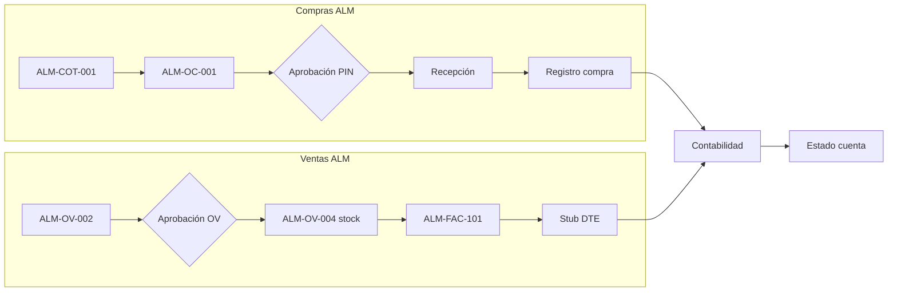

# Plan de pruebas integral — ERP Almahue (completo)

**Fecha:** 2026-08-15  
**Versión:** 1.0  
**Alcance:** Todo el software ERP (NestJS `erp_back` + React `erp_front`) según Reu6 > Reu5 > Reu4, código y planes QA previos.  
**No leer transcripciones.** Afirmaciones Carlos/Sergio en demo = hipótesis; validar con minuta y código.  
**Referencias consolidadas:** `AGENTS.md`, `PLAN-PRUEBAS-INTEGRAL-FASE4.md`, `PLAN-PRUEBAS-APROBACIONES.md`, `PLAN-PRUEBAS-E2E-MANUAL-SIN-SEED.md`, `HUERFANOS-H1-H14.md`, `DEMO-PROPUESTA-LOCAL.md`, `REUNION-CHECKLIST-APROBACION-COMERCIAL.md`, resultados `2026-08-14-*.md`, `reunion6-minuta-2026-08-06.md`.

**Convención de IDs:** prefijo de módulo + número de tres dígitos (`ADM-001`, `VEN-014`, …). Los IDs de planes anteriores (p. ej. `OV5`, `OC3`, `E1`) se mapean en el anexo §10.3.

---

## 1. Resumen ejecutivo y alcance

### 1.1 Objetivo

Validar de forma **exhaustiva y accionable** el ERP Almahue: smoke, API, UI, E2E, regresión, RBAC y aislamiento tenant, cubriendo los 10 dominios operativos y los flujos golden path `ALM-*` de demo.

### 1.2 Alcance por entorno

| Entorno | URL | Alcance recomendado | Restricciones |
|---|---|---|---|
| **Local** | Front `http://localhost:5174` · API `http://localhost:3001/api/v1` | **100 %** del plan (smoke → módulos → E2E → sin-seed opcional) | Postgres `:5433`; migrate + seed demo |
| **Prod piloto** | `http://45.7.229.46/almahue-erp/` | Smoke + recorridos A/B/C + casos P0 | **SKIP/BLOCKED** hasta `migrate deploy` explícito (H14, OV/stock, aprobación comercial) |

### 1.3 Decisiones Reu6 en foco (D1–D20)

| ID | Tema | Estado QA |
|---|---|---|
| D1–D3 | Admin usuarios/roles multi-empresa | Casos ADM + RBAC |
| D4 | Cadena aprobación Comercial OV | Implementado; flag `comercialRequiereAprobacion` — checklist reunión |
| D5–D6 | PIN en reglas; organigrama + suplencia | `PLAN-PRUEBAS-APROBACIONES` + ADM/CMP/CTR |
| D7–D8 | Lookup RUT + ficha única | FIC + VEN lookup |
| D9–D10 | Plan cuentas dimensiones; no borrar con movimiento | PAR + CNT |
| D11 | Cotización Compras → OC; Ventas OV → stock → factura | CMP + VEN (no restaurar cotiz→NP) |
| D12–D17 | OV producto/servicio/flete; stock; bajo costo | VEN + INV |
| D18 | Plantillas documento | ADM plantillas |
| D19 | SSO Microsoft | SMK + ADM (SKIP sin `.env`) |
| D20 | Piloto datos reales | E2E golden + prod smoke |

### 1.4 Fase 1 — OV unificada en wizard Emitir (commit `2035773`)

El wizard **Emitir documento** (`/comercial/emitir`) queda acotado a **FACTURA / NC / ND / GUIA**; producto inventariable debe salir de **OV confirmada** (`contexto=ov` o selección OV en paso 1). Casos **VEN-021–VEN-028** cubren esta unificación. No se prueba emisión de COTIZ/NP/OC desde Emitir.

### 1.5 Conteo total de casos

| Prefijo | Módulo | Casos |
|---|---|---|
| SMK | Smoke transversal | 8 |
| ADM | Administración | 22 |
| PAR | Parametrización / catálogos | 18 |
| CMP | Compras | 24 |
| VEN | Ventas / comercial | 32 |
| INV | Inventario / bodega | 18 |
| CTR | Contratistas | 22 |
| CNT | Contabilidad | 20 |
| TES | Tesorería | 18 |
| FIC | Ficha cliente/proveedor | 12 |
| BIL | Billing stub DTE | 8 |
| RBAC | Seguridad / tenant | 15 |
| E2E | Golden path ALM-* | 8 |
| **Total** | | **225** |

### 1.6 Tiempo estimado

| Oleada | Duración |
|---|---|
| Smoke (SMK) | 10 min |
| Jest `npm test` (erp_back) | 2 min |
| API por módulo (curl/scripts) | 90–120 min |
| UI módulos | 4–6 h |
| E2E golden + demo 15 min | 45 min |
| E2E sin seed (opcional) | 3–4 h |
| **Sesión completa** | **1–2 días** (1 QA) o **½ día** (2 QA en paralelo API/UI) |

---

## 2. Matriz módulo × tipo de prueba

Leyenda: **●** obligatorio · **○** recomendado · **—** no aplica · **S** SKIP documentado (gap conocido)

| Módulo | API | UI | E2E | Regresión Jest | RBAC | Tenant | Notas |
|---|---|---|---|---|---|---|---|
| Smoke | ● | ● | ○ | ● | ○ | ● | Bloquea todo si FAIL |
| Admin | ● | ● | ○ | ● | ● | ● | AdminConcepto re-login |
| Parametrización | ● | ● | ○ | ● | ● | ● | Plan cuentas import |
| Compras | ● | ● | ● | ● | ● | ● | Reutiliza OC1–OC4 |
| Ventas | ● | ● | ● | ● | ● | ● | OV + Emitir contexto=ov |
| Inventario | ● | ● | ● | ● | ○ | ● | Stock OV post-migrate |
| Contratistas | ● | ● | ○ | ● | ● | ● | Bandeja runtime |
| Contabilidad | ● | ● | ○ | ● | ● | ● | Centralización destructiva |
| Tesorería | ● | ● | ○ | ● | ● | ● | Excel fino = SKIP H13 |
| Ficha | ● | ● | ○ | — | ○ | ● | H1 productor listo |
| Billing | ● | ○ | ○ | ● | ○ | ● | Stub only (H11) |
| Seguridad | ● | ● | ○ | ○ | ● | ● | Cross-cutting RBAC |

---

## 3. Precondiciones

### 3.1 Infraestructura local

```bash
cd ERP/erp_back
npx prisma migrate deploy
npm run seed
npm run seed:aprobaciones-f2
# Demo ALM-* (opcional pero recomendado para E2E):
npm run seed:demo-propuesta
```

**Migraciones críticas:** `20260813230000_stock_ov_ficha`, `20260814180000_comercial_aprobacion_ov`, `20260814180000_tipo_doc_nd_guia`, `20260815200000_huerfanos_ficha_inventario`.

### 3.2 Variables `.env` API

```env
BILLING_GATEWAY_ENABLED=true
BILLING_STUB_INLINE=true
```

Sin esto → casos **BIL-*** y contabilizar factura con folio stub = **BLOCKED**.

### 3.3 Health y sesión

| Check | Comando / acción | Esperado |
|---|---|---|
| API | `GET /health` | `status: ok`, `db: ok` |
| Front | Abrir `/login` | Formulario carga |
| Sesión UI | `localStorage['erp.session']` | Tras login válido |
| Periodo | `GET /periodos-contables` | `2026-08` ABIERTO |
| Stock demo | `GET /insumos/INS-ALM-CEREZA/stock-bodegas` | `BOD-ALM-FRIG` cantidad > 0 |

### 3.4 Usuarios demo (resumen; detalle §10)

| Rol | Email | Password | Uso principal |
|---|---|---|---|
| Admin | `admin@almahue.local` | `Admin123!` | Smoke, simulador, E2E |
| Claudia | `cvargas@almahue.cl` | `demo123` | AdminConcepto Compras |
| Ricardo | `rmunoz@almahue.cl` | `demo123` | AdminConcepto Contratistas |
| Luis | `lherrera@almahue.cl` | `demo123` | Alta OC |
| Jorge | `jsanchez@almahue.cl` | `demo123` | Bandeja OC + PIN |
| María | `mgonzalez@almahue.cl` | `demo123` | Bandeja con `compras:read` |
| PIN aprobación | — | `4821` | Pool aprobadores |

**AdminConcepto:** re-login obligatorio tras cambiar `adminConceptoModulos` o reglas de aprobación.

### 3.5 Datos seed demo `ALM-*` (ver `DEMO-PROPUESTA-LOCAL.md`)

| Folio | Uso en plan |
|---|---|
| `ALM-COT-001` | CMP cotización → OC |
| `ALM-OC-001` | CMP aprobación pendiente |
| `ALM-OC-003` | CMP recepción + registro |
| `ALM-OV-002` | VEN aprobación OV |
| `ALM-OV-004` | VEN confirmar stock → factura |
| `ALM-FAC-101` | VEN Emitir stub DTE |

Empresa `EMP-1`: `comercialRequiereAprobacion=true`, umbral `$500.000`, `ventaBajoCosto=BLOQUEAR`.

### 3.6 Prod

No ejecutar seed demo ni activar flags stub en prod sin acuerdo. Casos OV/stock/aprobación comercial → **SKIP** con ref `DK-D20` / H14 hasta deploy.

---

## 4. Casos por módulo

Formato: **Given / When / Then**. Tipo: `API` | `UI` | `E2E` | `Jest`.

---

### 4.1 Smoke transversal (SMK)

| ID | Tipo | Given | When | Then |
|---|---|---|---|---|
| SMK-001 | API | API levantada | `GET /health` | 200, `db: ok` |
| SMK-002 | API | Credenciales admin | `POST /auth/login` | 200, `token`, permisos |
| SMK-003 | API | Token SMK-002 | `GET /auth/me` | `empresaId`, `permisos`, `bandejaModulos` |
| SMK-004 | API | Token + header tenant | `GET /clientes` + `X-Empresa-Id: EMP-1` | 200, solo tenant EMP-1 |
| SMK-005 | API | Seed agosto | `GET /periodos-contables` | Periodo `2026-08` ABIERTO |
| SMK-006 | API | Migrate stock OV | `GET /insumos/INS-ALM-CEREZA/stock-bodegas` | Al menos una bodega qty > 0 |
| SMK-007 | UI | Front up | Login admin → Dashboard | Panel carga sin 500 |
| SMK-008 | Jest | `erp_back` deps | `npm test` | Exit 0 (~120 tests) |

---

### 4.2 Administración (ADM)

| ID | Tipo | Given | When | Then |
|---|---|---|---|---|
| ADM-001 | UI | Admin logueado | Abrir `/admin/empresas` | Listado empresas seed |
| ADM-002 | UI/API | Admin | Editar `EMP-1` flags: `ventaBajoCosto`, `comercialRequiereAprobacion`, umbral | Guardado OK (restaurar post-test) |
| ADM-003 | API | Admin | `GET /empresas` | Solo empresas accesibles al usuario |
| ADM-004 | UI | Admin | Crear empresa prueba `EMP-QA` | Aparece en listado y selector header |
| ADM-005 | UI | Admin | `/admin/usuarios` — crear usuario con 2 empresas | Login usuario ve selector empresa |
| ADM-006 | API | Admin | `POST /usuarios` + asignar rol | 201, tenant correcto |
| ADM-007 | UI | Admin | `/admin/roles` — rol solo `comercial:read` | Guardado sin PIN en rol (D5) |
| ADM-008 | API | Usuario rol limitado | `GET /usuarios` | 403 si no `admin:read` |
| ADM-009 | UI | Claudia (AdminConcepto Compras) | `/admin/aprobaciones` | Ve reglas Compras; sidebar sin Usuarios |
| ADM-010 | API | Claudia token | `GET /grupos-aprobacion` | 12 grupos Compras, 0 Contratistas |
| ADM-011 | API | Claudia | `GET /usuarios` | 403 |
| ADM-012 | UI | Admin | Simulador S1: Luis $200k GRP-COMPRAS-1 | Cadena Jorge (suplente María) |
| ADM-013 | UI | Admin | Simulador S5: Luis $3M | Escalamiento Jorge → Claudia |
| ADM-014 | UI | Admin | Simulador S6: Diego $400k Contratistas | Pablo Núñez |
| ADM-015 | UI | Admin | Guardar escala con aprobador sin bandeja | Modal `APROBADOR_SIN_BANDEJA` |
| ADM-016 | UI | Admin | `/admin/plantilla-documentos` — editar OC | Preview HTML visible (D18) |
| ADM-017 | API | Admin | Export reglas Compras JSON | JSON version 1 |
| ADM-018 | API | Admin | Import reglas con aprobador inválido | Error validación claro |
| ADM-019 | UI | Admin | Módulo Comercial en reglas aprobación | Ya no «reservado»; grupos editables |
| ADM-020 | UI | Login sin MSAL `.env` | Botón Microsoft | Deshabilitado (D19) — **SKIP** si credenciales configuradas |
| ADM-021 | API | Admin master | Aprobar OC asignada a otro | 200 + advertencia traza (D2) |
| ADM-022 | UI | Admin cambia AdminConcepto | Re-login | JWT `adminConceptoModulos` actualizado |

*Mapa:* ADM-012–015 ↔ `S1–S6`; ADM-009–011 ↔ `AC1–AC5`.

---

### 4.3 Parametrización / catálogos (PAR)

| ID | Tipo | Given | When | Then |
|---|---|---|---|---|
| PAR-001 | UI | `catalogos:read` | `/catalogos/monedas` — CLP + USD | Listado 2+ monedas |
| PAR-002 | UI | idem | `/catalogos/unidades` — UN, KG | OK |
| PAR-003 | UI | idem | `/catalogos/centros-costo` — crear CC-QA | Aparece en selector OC |
| PAR-004 | UI | idem | `/catalogos/areas-negocio` | CRUD básico |
| PAR-005 | UI | idem | `/catalogos/tipos-documento` | Tipos visibles |
| PAR-006 | UI | idem | `/catalogos/plan-cuentas` — cuenta imputable | Flags CC/elemento/área (D9) |
| PAR-007 | API | Admin | `POST /cuentas` cuenta hija | 201 bajo padre correcto |
| PAR-008 | API | Cuenta con movimiento | `DELETE /cuentas/:id` | 409 (D10) |
| PAR-009 | UI | Cuenta con movimiento | Inactivar cuenta | Estado inactivo; sigue en mayor |
| PAR-010 | API | Admin | `GET /cuentas/:id/impacto` | Conteos movimientos |
| PAR-011 | UI | idem | `/catalogos/elementos-costo` | CRUD |
| PAR-012 | API | `catalogos:read` | `GET /indicadores-bc` | 200 (G6) |
| PAR-013 | UI | idem | `/catalogos/proveedores` — abrir ficha | Modal ficha con pestañas |
| PAR-014 | API | Admin | Import plan cuentas Excel (fixture mínimo) | Cuentas creadas o error claro |
| PAR-015 | API | Sin permiso | `GET /catalogos/monedas` sin token | 401 |
| PAR-016 | UI | Sidebar Parametrización | Usuario solo `compras:read` | Menú Parametrización oculto |
| PAR-017 | API | Tenant EMP-1 | `GET /centros-costo` | Solo CC EMP-1 |
| PAR-018 | UI | Plan cuentas | Rename cuenta con histórico | Mayor muestra nombre nuevo (D10) |

---

### 4.4 Compras (CMP)

| ID | Tipo | Given | When | Then |
|---|---|---|---|---|
| CMP-001 | UI | `compras:read` | `/compras/cotizaciones` — `ALM-COT-001` | Detalle cotización Packaging |
| CMP-002 | API/UI | Cotización EMITIDA | Convertir a OC (`tipoDestino: OC`) | OC creada, proveedor heredado |
| CMP-003 | API | Cotización compras | `convertir` a FACTURA | 400 «a OC, no a factura» (D11) |
| CMP-004 | UI | Luis | Nueva OC $2,5M EMITIDO | Nº OC visible; estado EMITIDO |
| CMP-005 | API | OC EMITIDA | `GET /aprobaciones-oc` como Jorge | OC en bandeja asignada |
| CMP-006 | UI/API | Jorge en cadena | Aprobar `ALM-OC-001` PIN `4821` | `APROBADO` |
| CMP-007 | UI | María | `/compras/aprobaciones` | Ve pendientes según reglas |
| CMP-008 | UI | Usuario fuera cadena | Bandeja OC | No ve OC ajena |
| CMP-009 | API | OC APROBADA | `POST /recepciones-oc` borrador → confirmar | OC `RECEPCIONADA` |
| CMP-010 | API | OC multi-línea | Recepción parcial + segunda recepción | Saldos OK; exceso → 400 |
| CMP-011 | API | OC APROBADA sin recepción | `POST /registros-compra` | 400 |
| CMP-012 | API | OC `ALM-OC-003` recepcionada | Registro match 3 vías monto = recepción | `matchOk: true` |
| CMP-013 | API | idem | Registro monto distinto | `matchOk: false` |
| CMP-014 | UI | `compras:read` | `/compras/registro` libro compras | Registros coherentes con OC |
| CMP-015 | API | `compras:read` | `GET /ordenes-compra` | Solo tenant EMP-1 |
| CMP-016 | UI | Redirect legacy | Navegar `/comercial/cotizaciones` | Redirect a `/compras/cotizaciones` |
| CMP-017 | API | Aprobador | `PUT /ordenes-compra/:id` APROBADO sin PIN | 400 PIN requerido |
| CMP-018 | UI | OC rechazada | Re-editar y re-enviar | Nueva instancia bandeja PENDIENTE |
| CMP-019 | API | Admin | `POST /registros-compra/carga-masiva` payload mínimo | 200 o validación clara |
| CMP-020 | UI | Plantilla OC | Imprimir/preview OC | HTML preview (D18) |
| CMP-021 | API | Cross-tenant | `GET /ordenes-compra/:id` otra empresa | 404/403 |
| CMP-022 | UI | Recorrido demo | `ALM-COT-001` → OC → aprobación | Flujo sin error |
| CMP-023 | API | Showcase | `OC-2026-001`…`004` estados mixtos | Listado filtra por estado |
| CMP-024 | UI | 3 cotizaciones comparativas | UI comparador compras | **SKIP** H10 — no es proceso actual |

*Mapa:* CMP-004–007 ↔ `OC1–OC4`; CMP-006 ↔ `OC3`.

---

### 4.5 Ventas / comercial (VEN)

| ID | Tipo | Given | When | Then |
|---|---|---|---|---|
| VEN-001 | UI | `comercial:read` | `/comercial/ordenes-venta` — listado | OVs `ALM-OV-*` visibles |
| VEN-002 | API | Stock cereza OK | `POST /documentos` ORDEN_VENTA PRODUCTO + splits | 201 BORRADOR |
| VEN-003 | API | idem | Línea SERVICIO sin insumo | 201 (D12) |
| VEN-004 | API | idem | Línea FLETE | 201 `tipoLinea: FLETE` (D17) |
| VEN-005 | API | OV qty > stock | `POST .../confirmar` | 400 stock insuficiente (D15) |
| VEN-006 | API | OV stock OK | Confirmar OV | `APROBADO` + movimiento `SALIDA_VENTA` |
| VEN-007 | API | Post VEN-006 | `GET stock-bodegas` | Cantidad decrementada |
| VEN-008 | API | 2 bodegas con stock | OV splits multi-bodega + confirmar | OK ambas bodegas |
| VEN-009 | API | `comercialRequiereAprobacion=true`, OV $800k | Enviar a aprobación | `PENDIENTE_APROBACION` |
| VEN-010 | UI | `ALM-OV-002` | `/comercial/aprobaciones` — aprobar PIN | `AUTORIZADA` |
| VEN-011 | UI | OV $3,8M seed o creada | Dos pasos aprobación | Jefe + gerente, PIN c/u (checklist caso B) |
| VEN-012 | UI | Solicitante = aprobador paso 1 | Aprobar OV | Omite auto-aprobación (caso C) |
| VEN-013 | UI/API | Precio < costo producto | Guardar OV | 400 bloqueo (D16) |
| VEN-014 | API | `ventaBajoCosto=PERMITIR_MERMA` temporal | OV con `mermaMotivo` | 201; restaurar flag |
| VEN-015 | UI | `ALM-OV-004` APROBADO | Botón confirmar stock UI | Stock ya descontado coherente |
| VEN-016 | API | OV APROBADO | `convertir` tipoDestino FACTURA | Factura EMITIDO, `documentoOrigenId` = OV |
| VEN-017 | API | Factura desde OV | `PUT` cambiar cantidad/descripción línea | 400 lock (D13) |
| VEN-018 | API | Factura desde OV | Cambiar precio línea | 200 OK |
| VEN-019 | API | `comercialRequiereAprobacion=false` | BORRADOR → confirmar directo | Sin bandeja (checklist caso E) |
| VEN-020 | UI | Rechazo OV | Motivo ≥ 5 chars | OV → BORRADOR + `motivoRechazoOv` |
| VEN-021 | UI | Admin | `/comercial/emitir` paso tipo doc | Solo FACTURA/NC/ND/GUIA (commit 2035773) |
| VEN-022 | UI | Emitir | No aparece COTIZ/NP/OC en selector | Tipos compra ocultos |
| VEN-023 | UI | `ALM-OV-004` | Emitir con `contexto=ov` o selección OV paso 1 | Líneas precargadas desde OV |
| VEN-024 | UI | Emitir desde OV | Producto línea | `insumoId`/descripción bloqueados; precio editable |
| VEN-025 | UI | Emitir servicio directo | Línea SERVICIO texto libre | Permitido sin stock |
| VEN-026 | UI | `/comercial/guias-despacho` | Emitir guía tipo GUIA | Guía listada (H8) |
| VEN-027 | UI | Factura contabilizada | `/comercial/libro` ámbito ventas | Documento en libro; sin borradores OV |
| VEN-028 | API | `GET /libro-comercial?ambito=ventas` | — | Solo emitidos/contabilizados válidos |
| VEN-029 | API | `GET /lookup-rut?rut=` cliente | — | `cliente: true` (D7) |
| VEN-030 | API | RUT proveedor | lookup | `proveedor: true` |
| VEN-031 | API | RUT con flag productor seed | lookup | `productor: true`, `productores[]` (H1) |
| VEN-032 | UI | `/comercial/clientes` | Abrir ficha cliente | Pestañas bancos/contactos/despacho |

*Mapa:* VEN-002–008 ↔ `OV1–OV7`; VEN-016–018 ↔ `OV8–OV9`; VEN-013 ↔ `OV10`/checklist D.

---

### 4.6 Inventario / bodega (INV)

| ID | Tipo | Given | When | Then |
|---|---|---|---|---|
| INV-001 | UI | `insumos:read` | `/insumos/bodegas` — bodegas Almahue | BOD-ALM-* listadas |
| INV-002 | UI | idem | `/insumos/maestro` — `INS-ALM-CEREZA` | Flag `inventariable` visible (H6) |
| INV-003 | API | Insumo inventariable | `GET /insumos/:id/stock-bodegas` | Saldos por bodega |
| INV-004 | UI | Maestro | Crear insumo no inventariable | OV no exige bodega (H6) |
| INV-005 | UI | `/insumos/movimientos` | Entrada manual CONFIRMADA | Stock bodega aumenta |
| INV-006 | API | Movimiento borrador | Confirmar movimiento | Delta aplicado a `StockInsumoBodega` |
| INV-007 | API | Salida > stock | Confirmar movimiento salida | 400 saldo negativo (D14) |
| INV-008 | UI | Movimiento | Anular movimiento confirmado | Stock revierte |
| INV-009 | API | Post OV confirmada | Stock insumo OV | Coherente con VEN-007 |
| INV-010 | UI | NC contabilizada ventas | Movimiento `DEVOLUCION_NC` | Reingreso bodega positivo (H7) |
| INV-011 | API | Recepción OC confirmada | Stock insumo compra | Entrada bodega asociada |
| INV-012 | UI | Selector OV multi-bodega | UI splits | Muestra qty disponible por bodega (D15) |
| INV-013 | API | Tenant | `GET /insumos` otra empresa header | Lista vacía o 403 |
| INV-014 | UI | Tránsito venta AlmaWeb | Campo tránsito en UI | **SKIP** D14 — no modelado |
| INV-015 | API | Excel import AlmaWeb | Carga masiva movimientos | **SKIP** — integración externa |
| INV-016 | UI | Bodega nueva | Crear `BOD-QA` + asignar stock inicial | Visible en OV selector |
| INV-017 | API | Legacy campo `insumo.stock` | Movimiento antiguo | Jest `insumos.service.spec` coherente |
| INV-018 | UI | Demo 15 min paso 1 | Inventario bodegas + stock cereza | Evidencia captura |

---

### 4.7 Contratistas (CTR)

| ID | Tipo | Given | When | Then |
|---|---|---|---|---|
| CTR-001 | UI | `contratistas:read` | `/contratistas` listado | Contratistas seed |
| CTR-002 | UI | idem | `/contratistas/tarifas` — tarifa labor | CRUD tarifa |
| CTR-003 | UI | idem | `/contratistas/ingreso-diario` | Registro ingreso diario |
| CTR-004 | UI | idem | `/contratistas/asociacion` | Asociación labores |
| CTR-005 | API | `contratistas:write` | `POST /proformas-contratista` BORRADOR | 201 |
| CTR-006 | API | Proforma borrador | `solicitar-aprobacion` | `PENDIENTE_APROBACION` |
| CTR-007 | UI/API | Aprobador cadena | `POST .../definitiva` + PIN | `DEFINITIVA` |
| CTR-008 | API | Proforma DEFINITIVA | `POST .../factura` | `FACTURADA` |
| CTR-009 | API | Proforma DEFINITIVA | `POST .../reversar` + PIN | Vuelve BORRADOR |
| CTR-010 | UI | Ricardo AdminConcepto | `/contratistas/aprobaciones` | Bandeja Contratistas |
| CTR-011 | API | Ricardo | `GET /grupos-aprobacion` | 8 Contratistas, 0 Compras |
| CTR-012 | UI | Simulador S6 | Diego $400k Contratistas | Pablo (ADM-014) |
| CTR-013 | API | `contratistas:write` | `POST /contratistas/traspaso-cierre` | Asiento o 400 periodo cerrado |
| CTR-014 | UI | Traspaso | Narrativa ≠ gastos temporada | Documentar G5 — no FAIL |
| CTR-015 | API | Proforma N>1 facturas | Segunda factura | Jest contratistas — comportamiento esperado |
| CTR-016 | UI | Usuario sin bandeja | `/contratistas/aprobaciones` | 403 o menú oculto |
| CTR-017 | API | Cross-tenant proforma | GET por id otra empresa | 404/403 |
| CTR-018 | UI | Ingreso diario demo profundo | Flujo campo completo | **SKIP** parcial G4 — sin guion cerrado |
| CTR-019 | API | `GET /proformas-contratista` | — | Solo EMP-1 |
| CTR-020 | UI | Proforma rechazada | Re-solicitar | Nueva cadena |
| CTR-021 | API | Sin PIN | Aprobar proforma | 400 |
| CTR-022 | UI | Demo contratistas | Proforma → aprobación → factura | E2E parcial en E2E-006 |

*Mapa:* CTR-005–009 ↔ `CTR1–CTR6` Fase 4.

---

### 4.8 Contabilidad (CNT)

| ID | Tipo | Given | When | Then |
|---|---|---|---|---|
| CNT-001 | UI | `contabilidad:read` | `/contabilidad/periodos` | `2026-08` ABIERTO |
| CNT-002 | API | Periodo abierto | `POST /asientos` manual cuadrado | 201 |
| CNT-003 | API | idem | Asiento descuadrado | 400 |
| CNT-004 | API | Asiento CONTABILIZADO | `PATCH /asientos/:id` | 400 |
| CNT-005 | UI | idem | `/contabilidad/asientos` — crear comprobante | UI cuadra débito/crédito |
| CNT-006 | API | Docs pendientes | `POST /centralizacion/preview` | Preview líneas |
| CNT-007 | API | Solo BD QA | `POST /centralizacion/ejecutar` | Asientos generados (destructivo) |
| CNT-008 | UI | idem | `/contabilidad/centralizacion` | Preview UI coherente con API |
| CNT-009 | UI | idem | `/contabilidad/libro-diario` periodo 2026-08 | Líneas visibles |
| CNT-010 | UI | idem | `/contabilidad/mayor` | Arrastre saldo entre periodos |
| CNT-011 | UI | Showcase seed | `/contabilidad/balance-8-columnas` | Columnas con saldos |
| CNT-012 | UI | idem | `/contabilidad/reportes` resumen | KPIs sin error |
| CNT-013 | UI | idem | `/contabilidad/config-sii` | Pantalla carga |
| CNT-014 | UI | idem | `/contabilidad/honorarios` | Factores honorarios |
| CNT-015 | UI | idem | `/presupuestos` | Listado presupuestos |
| CNT-016 | API | Periodo con movimientos | Cerrar periodo | Estado CERRADO; bloqueo nuevos asientos |
| CNT-017 | API | Cuenta con CC requerido | Asiento sin dimensión | 400 validación |
| CNT-018 | API | Tenant | `GET /asientos` header EMP-2 sin acceso | Vacío/403 |
| CNT-019 | UI | Registro compra contabilizado | Mayor cuenta gasto | Movimiento visible |
| CNT-020 | UI | Factura venta contabilizada | Mayor cuenta ingreso | Movimiento visible |

*Mapa:* CNT-001–011 ↔ `CT1–CT11` Fase 4.

---

### 4.9 Tesorería (TES)

| ID | Tipo | Given | When | Then |
|---|---|---|---|---|
| TES-001 | UI | `tesoreria:read` | `/tesoreria/cartolas` | Cartolas seed listadas |
| TES-002 | API | Cartola seed | `GET /cartolas-bancarias/:id/movimientos` | Filas parseadas |
| TES-003 | API | CSV fixture | `POST /cartolas-bancarias/preview-archivo` | Preview filas |
| TES-004 | UI | idem | Subir Excel cartola formato MJ fino | **SKIP** H13 — parser base OK |
| TES-005 | UI | idem | `/tesoreria/conciliacion` | Resumen pendientes |
| TES-006 | API | Conciliación seed | `GET /conciliaciones/:id/movimientos` | 200 |
| TES-007 | UI | idem | Desconciliar movimiento | Stock tesorería coherente |
| TES-008 | UI | idem | `/tesoreria/pagos` — crear pago cliente | Calza cuenta corriente |
| TES-009 | API | Cliente con CXC | `GET /cuentas-corrientes/:terceroId/movimientos?terceroTipo=CLIENTE` | Movimientos ordenados |
| TES-010 | UI | idem | `/tesoreria/cuentas-corrientes` estado cuenta | Saldos coherentes facturas |
| TES-011 | API | Facturas pendientes | `POST /documentos-aging/sync` | Aging actualizado |
| TES-012 | UI | idem | `/tesoreria/nominas` aging | Vista atraso |
| TES-013 | UI | idem | `/tesoreria/anticipos` | Lista anticipos productores |
| TES-014 | UI | idem | `/tesoreria/flujo-caja` | Movimientos caja |
| TES-015 | API | `tesoreria:write` | `POST /pagos` | 201 + impacto CC |
| TES-016 | API | Cartola duplicada | Contabilizar segunda vez | Error duplicado (Jest) |
| TES-017 | UI | Cobranza mail compromisos | Pantalla cobranza | **SKIP** R4-18 — no existe |
| TES-018 | UI | Demo Recorrido C | Cartola → conciliación → estado cuenta | Sin 500 |

*Mapa:* TES-001–016 ↔ `TB1–TB11` Fase 4.

---

### 4.10 Ficha cliente/proveedor (FIC)

| ID | Tipo | Given | When | Then |
|---|---|---|---|---|
| FIC-001 | UI | Cliente seed | Ficha — pestaña datos generales | RUT, razón social |
| FIC-002 | UI | idem | Pestaña bancos — agregar cuenta CLP+USD | N cuentas guardadas (D8) |
| FIC-003 | UI | idem | Pestaña contactos | CRUD contactos |
| FIC-004 | UI | idem | Pestaña direcciones despacho | CRUD direcciones |
| FIC-005 | UI | idem | Historial / `solicitadoPor` | Trazabilidad visible (D8) |
| FIC-006 | UI | idem | «Imprimir solicitud» | Print HTML (H5) |
| FIC-007 | API | `GET /clientes/:id` | — | Payload incluye ficha anidada |
| FIC-008 | API | `GET /proveedores/:id` (catálogos) | — | Bancos/contactos/despacho |
| FIC-009 | API | Emitir / OV | `GET /lookup-rut` RUT nuevo | Crea sugerencia o vacío |
| FIC-010 | API | Cliente `esProductor=true` | lookup RUT | `productor: true`, arreglo `productores[]` (H1/D7) |
| FIC-011 | UI | Proveedor | Misma batería pestañas que cliente | Paridad UX |
| FIC-012 | API | Tenant | Ficha proveedor otra empresa | 404/403 |

*Mapa:* FIC-007–008 ↔ `FICHA1–FICHA3` Fase 4.

---

### 4.11 Billing stub DTE (BIL)

| ID | Tipo | Given | When | Then |
|---|---|---|---|---|
| BIL-001 | API | `BILLING_STUB_INLINE=true` | Contabilizar factura `ALM-FAC-101` | Folio stub en respuesta |
| BIL-002 | UI | idem | Emitir → contabilizar factura venta | Disclaimer stub visible (H11) |
| BIL-003 | Jest | — | `canonical-builder.spec.ts` | Mapeo tipo doc OK |
| BIL-004 | API | Factura NC | Canonical NC | Tipo NC en payload |
| BIL-005 | API | `BILLING_GATEWAY_ENABLED=false` | Contabilizar | Comportamiento local sin gateway — documentar |
| BIL-006 | UI | Libro ventas | Reenvío XML/PDF SII | **SKIP** — print HTML local (R4-08) |
| BIL-007 | API | Emisión SII real GoSocket | POST gateway producción | **SKIP** H11 — proyecto aparte |
| BIL-008 | UI | GUIA desde Emitir | Contabilizar guía | Stub o sin folio según config |

---

### 4.12 Seguridad / RBAC / tenant (RBAC)

| ID | Tipo | Given | When | Then |
|---|---|---|---|---|
| RBAC-001 | API | Admin EMP-1 | `GET /documentos/:id` doc EMP-2 | 404/403 |
| RBAC-002 | API | Sin token | `GET /grupos-aprobacion` | 401 (E3) |
| RBAC-003 | API | Solo `comercial:read` | `GET /ordenes-compra` | 403 |
| RBAC-004 | API | Jorge bandeja | `GET /aprobaciones-oc` sin `compras:read` | 200 ítems asignados |
| RBAC-005 | API | Header `X-Empresa-Id` sin acceso | `GET /clientes` | 403 o vacío |
| RBAC-006 | UI | Rol sin `admin:read` | Intentar `/admin/usuarios` | Redirect o 403 |
| RBAC-007 | UI | `pantallas-permisos` catálogo | Cotizaciones bajo Compras; OV bajo Ventas | Alineado Sidebar (H4) |
| RBAC-008 | API | `GET /workflows-admin` | Admin | 200 — **deuda** legacy G8; no promover |
| RBAC-009 | UI | Cambio PIN usuario | Correo notificación | **SKIP** H9 SMTP |
| RBAC-010 | API | Refresh token válido | `POST /auth/refresh` | Nuevo access token |
| RBAC-011 | UI | Logout | Cerrar sesión | Token invalidado en UI |
| RBAC-012 | API | Usuario multi-empresa | Switch empresa header | Datos filtrados nueva empresa |
| RBAC-013 | UI | ProtectedRoute | Ruta sin permiso | No renderiza página |
| RBAC-014 | API | Bandeja Comercial | Usuario designado módulo Comercial | `GET /aprobaciones-ov` o equivalente 200 |
| RBAC-015 | UI | Perfil usuario | Configurar PIN aprobación | Solo si designado en reglas (D5) |

*Mapa:* RBAC-001–007 ↔ `RB1–RB7` Fase 4.

---

## 5. Flujos end-to-end golden path (E2E)

| ID | Flujo | Pasos resumidos (Given → When → Then) | Datos ALM-* | Duración |
|---|---|---|---|---|
| E2E-001 | **Compras completo** | Login Luis → `ALM-COT-001` convertir OC → enviar → Jorge aprueba PIN → recepción `ALM-OC-003` path → registro match | ALM-COT/OC | ~20 min |
| E2E-002 | **OV aprobación + stock** | `ALM-OV-002` → bandeja comercial aprobar → confirmar stock → verificar bodega frigorífico | ALM-OV-002/004 | ~15 min |
| E2E-003 | **OV → factura → stub** | `ALM-OV-004` → convertir factura o Emitir `contexto=ov` → `ALM-FAC-101` contabilizar → folio stub | ALM-OV-004, FAC-101 | ~12 min |
| E2E-004 | **Contratistas** | Proforma → solicitar → aprobar PIN → factura asociada | Seed proforma | ~15 min |
| E2E-005 | **Contabilidad + tesorería** | Asiento manual → centralización preview → cartola → conciliación → estado cuenta cliente | Showcase | ~18 min |
| E2E-006 | **Demo 15 min MJ** | Secuencia `DEMO-PROPUESTA-LOCAL.md` §4 completa | Todos ALM-* | ~15 min |
| E2E-007 | **Parametrización greenfield** | `reset:superadmin` → fases E2E-1 a E2E-4 de `PLAN-PRUEBAS-E2E-MANUAL-SIN-SEED.md` | Sin seed | ~3 h |
| E2E-008 | **Prod smoke post-deploy** | SMK-001–006 en prod tras migrate H14 | Prod credenciales | ~10 min |

### 5.1 Diagrama golden path compras + ventas



---

## 6. Criterios PASS / FAIL / BLOCKED / SKIP

| Estado | Definición | Cuándo usar |
|---|---|---|
| **PASS** | Given/When/Then cumplido con evidencia | Resultado esperado OK |
| **FAIL** | No cumple y **no** está en tabla de gaps | Abrir defecto con severidad |
| **BLOCKED** | Entorno impide ejecutar (API caída, seed, migrate, credenciales) | Reintentar tras fix entorno |
| **SKIP** | Gap conocido documentado; no es regresión | Registrar ID deuda §6.1 |

### 6.1 Gaps conocidos — registrar SKIP (no FAIL)

| Ref | Tema | Casos afectados |
|---|---|---|
| DK-D4 | Aprobación OV off en piloto | VEN-009–012 SKIP si flag false por decisión reunión |
| DK-D14 | Sin tránsito venta | INV-014 |
| DK-D20 / H14 | Prod sin migrate OV | SMK-006, E2E-008 en prod |
| DK-DTE / H11 | GoSocket real | BIL-007 |
| DK-EMITIR | Mezcla tipos Emitir | **Cerrado** commit 2035773 — VEN-021–022 deben PASS |
| DK-G9 | SMTP PIN | RBAC-009 |
| DK-G10 | Showcase NP legacy | No mezclar con Recorrido B |
| DK-H10 | 3 cotizaciones comparativas | CMP-024 |
| DK-H12 | Carga masiva Acepta | — |
| DK-H13 | Excel cartolas finas | TES-004 |
| DK-R4-18 | Cobranza | TES-017 |
| DK-G4 | Ingreso diario demo | CTR-018 |
| DK-G5 | Traspaso vs gastos temporada | CTR-014 |
| DK-G8 | workflows-admin legacy | RBAC-008 |
| DK-D19 | SSO sin credenciales | ADM-020 |

### 6.2 Severidad defectos FAIL

| Nivel | Criterio |
|---|---|
| P0 | Bloquea demo, seguridad tenant, pérdida stock, asiento descuadrado en prod |
| P1 | Flujo principal roto sin workaround |
| P2 | UI/validación menor con workaround |
| P3 | Cosmético |

---

## 7. Evidencias requeridas por caso

| Tipo caso | Evidencia mínima | Almacenamiento |
|---|---|---|
| API | Request/response JSON (sin JWT); status HTTP | `qa/resultados/YYYY-MM-DD-ejecucion.json` |
| UI | Captura pantalla + URL + usuario | Carpeta `qa/resultados/evidencias/` |
| E2E | Secuencia capturas o video corto | Idem |
| Stock / asiento BD | Query Prisma o `SELECT` saldo bodega / `AsientoLinea` | Pegar resultado anonimizado en informe |
| Jest | Output `npm test` exit code + archivo si falla | CI log o terminal |
| SKIP/BLOCKED | Motivo + ref DK-* | Columna en plantilla |

**Plantilla informe:** `qa/resultados/PLANTILLA.md` — columnas: `ID`, `Estado`, `Tipo`, `Evidencia`, `Notas`, `Severidad`.

**No incluir en evidencias:** JWT, passwords, dumps BD completos, `.env`.

---

## 8. Automatización posible vs manual obligatorio

| Bloque | Automatizable | Herramienta | Manual obligatorio |
|---|---|---|---|
| SMK-001–006 | ● | curl / `qa-integral-fase4.ts` (propuesto) | SMK-007 UI |
| Jest regresión | ● | `cd ERP/erp_back && npm test` | Actualizar mocks si FAIL |
| Aprobaciones E/S/AC/OC | ● | `ERP/.qa-tmp/qa-retest-seed.mjs`, `scripts/qa-aprobaciones-integral.ts` | AC1 UI AdminConcepto |
| OV/CMP API P0 | ● | Script Fase 4 §12 | VEN UI wizard Emitir contexto=ov |
| RBAC tenant | ● | Script con 2 tokens | RBAC-006–007 UI permisos |
| E2E golden ALM-* | ○ | `ERP/qa-e2e/run-e2e-manual.mjs` Playwright | Demo 15 min con cliente |
| E2E sin seed | — | Playwright `e2e-manual-sin-seed.spec.ts` (parcial) | Parametrización completa UI |
| Contabilidad ejecutar centralización | ○ | API script | Validación reportes UI |
| Tesorería Excel MJ | — | — | TES-004 SKIP |
| Billing SII real | — | — | Siempre SKIP |
| Ficha print PDF servidor | — | — | FIC-006 print browser OK |

### 8.1 Prioridad CI sugerida

1. `npm test` (erp_back)  
2. `qa-retest-seed.mjs` (aprobaciones)  
3. Smoke SMK API  
4. Bloque OV P0 (VEN-002, 005–007, 016–017)  
5. CP match 3 vías (CMP-012–013)  
6. Build front: `npx tsc -b && npx vite build`

---

## 9. Orden de ejecución sugerido

```text
Fase 0 — Entorno (BLOCKED detiene)
  SMK-001 → SMK-006 → migrate/seed → SMK-008 (Jest)

Fase 1 — Smoke UI + auth
  SMK-007 → ADM-022 (re-login) → RBAC-002

Fase 2 — Aprobaciones (regresión crítica)
  PLAN-PRUEBAS-APROBACIONES completo (E, S, AC, OC, V, R)
  ADM-009–015 → CMP-004–008 → CTR-005–011

Fase 3 — Comercial inventario (riesgo demo)
  VEN-001–020 → INV-001–012 → VEN-021–028 (Emitir contexto=ov)
  FIC-001–012

Fase 4 — Back-office
  CMP-009–014 → CNT-001–020 → TES-001–018

Fase 5 — Seguridad + billing
  RBAC-001–015 → BIL-001–008

Fase 6 — E2E golden
  E2E-006 (demo 15 min) → E2E-001 → E2E-002 → E2E-003

Fase 7 — Opcional profundidad
  E2E-007 sin seed · CMP-019 · CNT-007 destructivo · resto SKIP documentados
```

**Criterio salida:** ≥ 90 % casos PASS excluyendo SKIP/BLOCKED; 0 FAIL P0; informe en `qa/resultados/YYYY-MM-DD-integral-erp.md`.

---

## 10. Anexo

### 10.1 Módulos Nest (`erp_back/src/app.module.ts`)

| Módulo Nest | Prefijo casos | Pantallas Sidebar principales |
|---|---|---|
| `AdminModule` | ADM | `/admin/*` |
| `CatalogosModule` | PAR, FIC | `/catalogos/*` |
| `ComprasModule` | CMP | `/compras/*` |
| `ComercialModule` | VEN | `/comercial/*` |
| `InsumosModule` | INV | `/insumos/*` |
| `ContratistasModule` | CTR | `/contratistas/*` |
| `ContabilidadModule` | CNT | `/contabilidad/*`, `/presupuestos` |
| `TesoreriaModule` | TES | `/tesoreria/*` |
| `AuthModule` + guards | RBAC, SMK | `/login`, `/perfil` |
| `billing/` (stub) | BIL | vía contabilizar factura |
| `DashboardModule` | SMK-007 | `/` |
| `HealthModule` | SMK-001 | — |
| `UiModule` | — | assets UI |

### 10.2 Rutas front (`Sidebar.tsx` / `App.tsx`)

| Ruta | Módulo QA |
|---|---|
| `/` | SMK |
| `/admin/empresas`, `/admin/usuarios`, `/admin/roles`, `/admin/aprobaciones`, `/admin/plantilla-documentos` | ADM |
| `/catalogos/*` | PAR |
| `/catalogos/proveedores` | PAR + FIC |
| `/compras/cotizaciones`, `/ordenes`, `/aprobaciones`, `/recepciones`, `/registro` | CMP |
| `/comercial/ordenes-venta`, `/aprobaciones`, `/guias-despacho`, `/emitir`, `/libro`, `/clientes` | VEN |
| `/comercial/cotizaciones` → redirect Compras | CMP-016 |
| `/insumos/maestro`, `/bodegas`, `/movimientos` | INV |
| `/contratistas/*` | CTR |
| `/contabilidad/*`, `/presupuestos` | CNT |
| `/tesoreria/*` | TES |

### 10.3 Mapa IDs legados → este plan

| Legado | Nuevo |
|---|---|
| SM1–SM6 | SMK-001–006 |
| E1–E3 | SMK-001–002, RBAC-002 |
| S1–S6 | ADM-012–014, CTR-012 |
| AC1–AC5 | ADM-009–011, RBAC-007 |
| OC1–OC4 | CMP-004–008 |
| OV1–OV17 | VEN-002–008, 016–018, 029–030, CMP-002–003 |
| CP1–CP11 | CMP-005, 009–015, 019 |
| CT1–CT11 | CNT-001–011 |
| TB1–TB11 | TES-001–016 |
| CTR1–CTR7 | CTR-005–013 |
| RB1–RB10 | RBAC-001–008, 014–015 |
| E2E-1.x–6.x | E2E-007 |

### 10.4 Permisos clave por módulo

| Permiso | Pantallas |
|---|---|
| `admin:read` | Administración completa |
| `admin:read` + AdminConcepto | Reglas aprobación sin usuarios |
| `catalogos:read` | Parametrización |
| `compras:read` / `compras:write` | Compras |
| bandeja `Compras` | `/compras/aprobaciones` sin `compras:read` global |
| `comercial:read` / `comercial:write` | Ventas |
| bandeja `Comercial` | `/comercial/aprobaciones` |
| `insumos:read` / `insumos:write` | Inventario |
| `contratistas:read` / `contratistas:write` | Contratistas |
| bandeja `Contratistas` | `/contratistas/aprobaciones` |
| `contabilidad:read` / `contabilidad:write` | Contabilidad |
| `tesoreria:read` / `tesoreria:write` | Tesorería |

### 10.5 Usuarios demo completos

Ver §3.4 y `PLAN-PRUEBAS-APROBACIONES.md`. PIN pool: `4821`. No copiar JWT en informes.

### 10.6 Scripts y artefactos

| Artefacto | Uso |
|---|---|
| `ERP/erp_back/scripts/qa-aprobaciones-integral.ts` | Aprobaciones API |
| `ERP/.qa-tmp/qa-retest-seed.mjs` | Oleada aprobaciones 20 casos |
| `ERP/qa-e2e/run-e2e-manual.mjs` | Playwright |
| `ERP/erp_back/scripts/prepare-demo-sergio.ts` | Pre-demo compras |
| `ERP/erp_back/scripts/validate-demo-counts.ts` | Conteos showcase |
| `npm run seed:demo-propuesta` | Datos ALM-* |

---

## 11. Control de cambios

| Versión | Fecha | Autor | Cambios |
|---|---|---|---|
| 1.0 | 2026-08-15 | QA planificador | Plan integral 225 casos; consolida Fase 4 + aprobaciones + E2E + Reu6 + OV Emitir 2035773 |

---

**Fin del plan.** Ejecutor recomendado: `almahue-qa-runner` → `almahue-qa-reviewer`. Actualizar `AGENTS.md` tras cerrar D4 en reunión.
