# Flujo de negocio AS-IS — ERP Almahue

**Fecha:** 2026-08-14  
**Alcance:** estado actual del software (post-Reu6 en código local).  
**Notación:** Mermaid estilo BPMN — diamantes = compuertas **XOR** (una rama) salvo indicación.  
**Leyenda cobertura:** Implementado · Parcial · No · Diferido

Diagramas listos para renderizar en visor Mermaid (GitHub, VS Code, etc.).

---

## 0. Mapa de módulos (contexto)

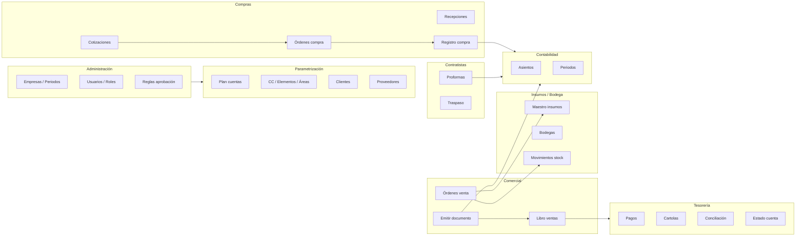

---

## 1. Autenticación y tenant

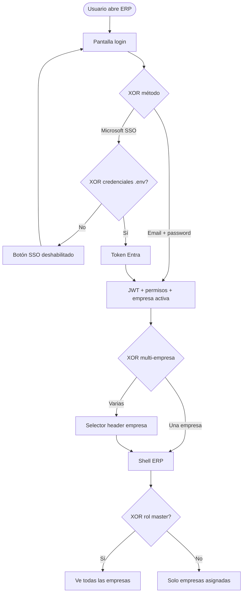

| Gateway | Ramas | AS-IS |
|---|---|---|
| XOR método auth | Password vs SSO | Parcial (SSO sin credenciales) |
| XOR multi-empresa | Una vs varias | Implementado |
| XOR master | Master vs operativo | Implementado |

---

## 2. Aprobaciones (OC, proformas; Comercial reservado)

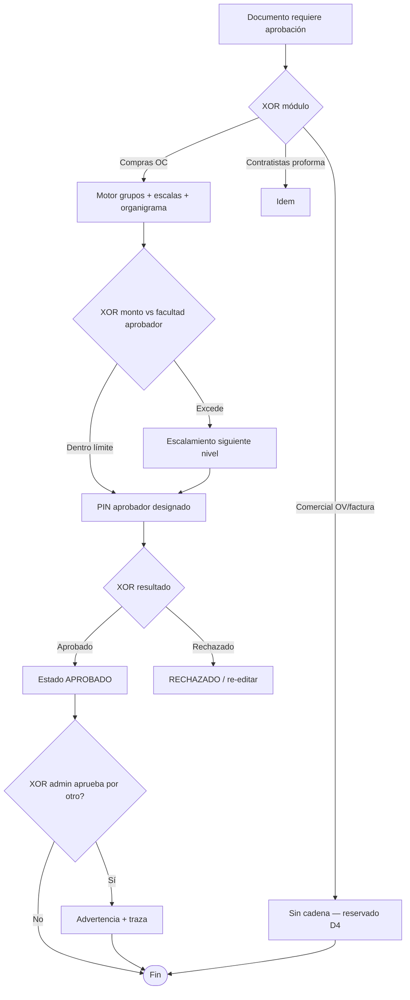

| Gateway | AS-IS |
|---|---|
| XOR módulo | Parcial (Comercial sin cadena) |
| XOR monto / escalamiento | Implementado (OC/proformas) |
| XOR admin por otro | Implementado |

> **Nota Reu5→Reu6:** ya no rige «solicitante elige aprobador de lista» como modelo final; queda sustituido por cadena automática.

---

## 3. Ventas — Orden de venta (canal con inventario)

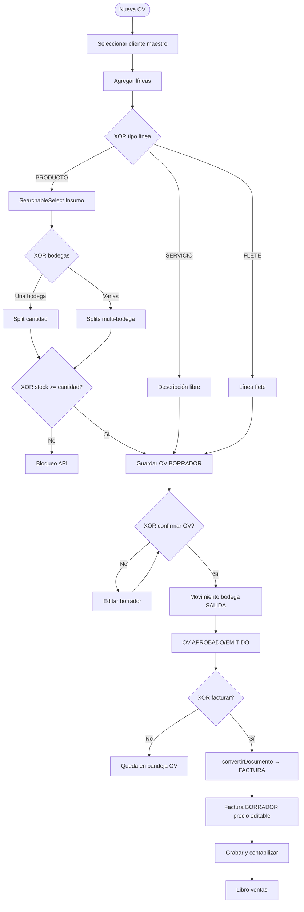

| Gateway | AS-IS |
|---|---|
| XOR tipo línea | Implementado |
| XOR stock | Implementado (solo positivo) |
| XOR confirmar | Implementado |
| XOR facturar | Implementado |
| Precio ≥ costo (D16) | Implementado en API PRODUCTO; sin UI param empresa |

---

## 4. Ventas — Emitir documento (canal directo DTE)

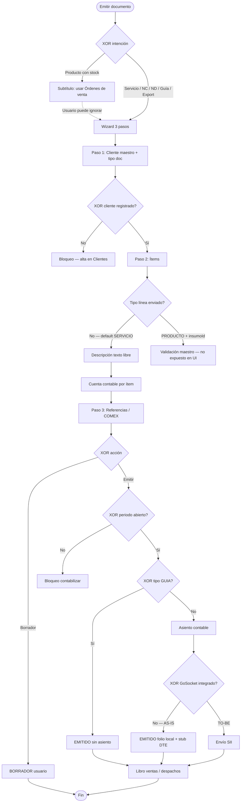

| Gateway | AS-IS | Gap |
|---|---|---|
| XOR cliente maestro | Implementado | — |
| XOR línea catálogo | **Siempre SERVICIO** en UI | **Hueco texto libre** |
| XOR GoSocket | Diferido | Stub |
| Movimiento inventario | **No** en este flujo | Por diseño Reu6 parcial |

---

## 5. Compras — Cotización → OC → recepción → factura

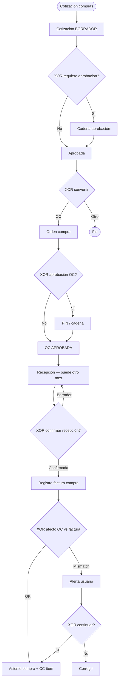

| Gateway | AS-IS |
|---|---|
| XOR aprobación cotización/OC | Implementado |
| XOR recepción vs mes OC | Implementado |
| XOR afecto/exento | Parcial (alerta) |

> **Nota Reu6:** cotización de **ventas** eliminada; redirect `/comercial/cotizaciones` → Compras.

---

## 6. Contratistas — Proforma → factura → traspaso

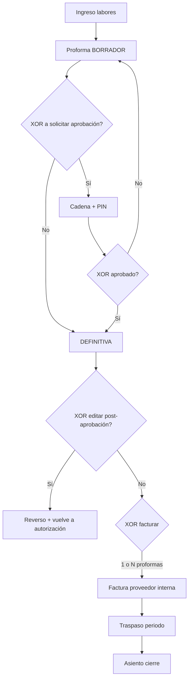

| Gateway | AS-IS |
|---|---|
| XOR PIN | Implementado |
| XOR N:1 factura | Implementado |
| GoSocket factura proveedor | Diferido |

---

## 7. Contabilidad — Periodos

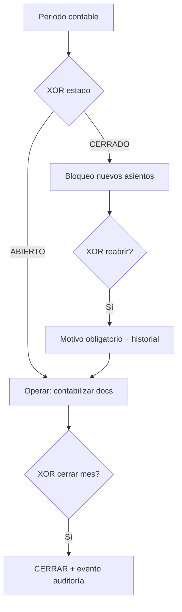

| Gateway | AS-IS |
|---|---|
| XOR periodo header único | Implementado (Reu5) |
| XOR reabrir + motivo | Implementado |

---

## 8. Tesorería — Cartola, pago, conciliación

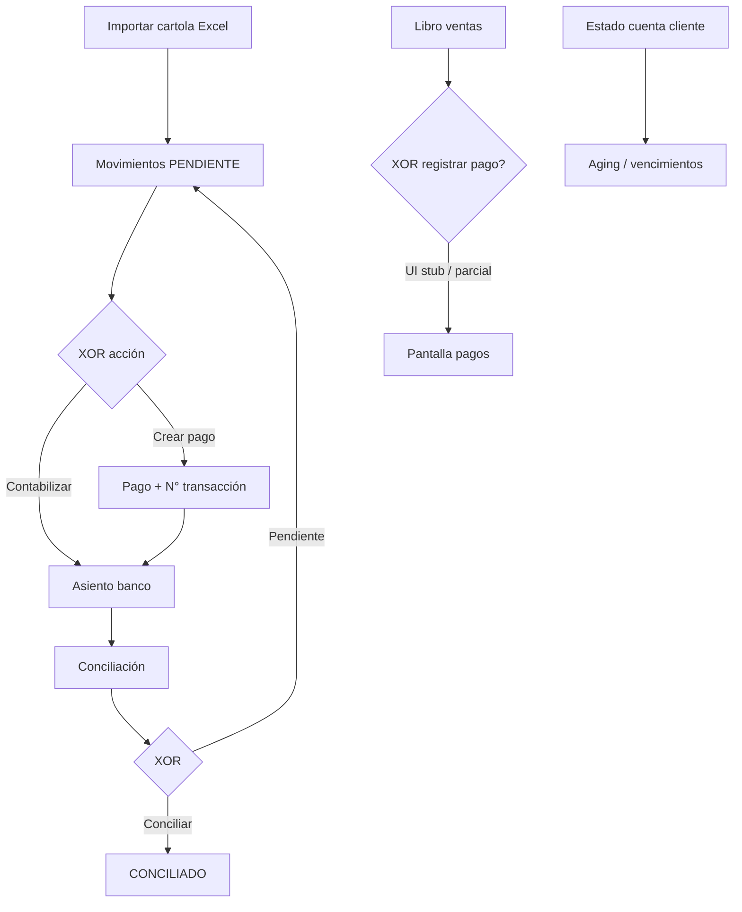

| Gateway | AS-IS |
|---|---|
| XOR cartola → pago | Parcial→mejorado |
| XOR bridge libro→pago | Parcial |
| Excel cartolas finas MJ | Diferido |

---

## 9. Corrección ventas — Reverso vs NC

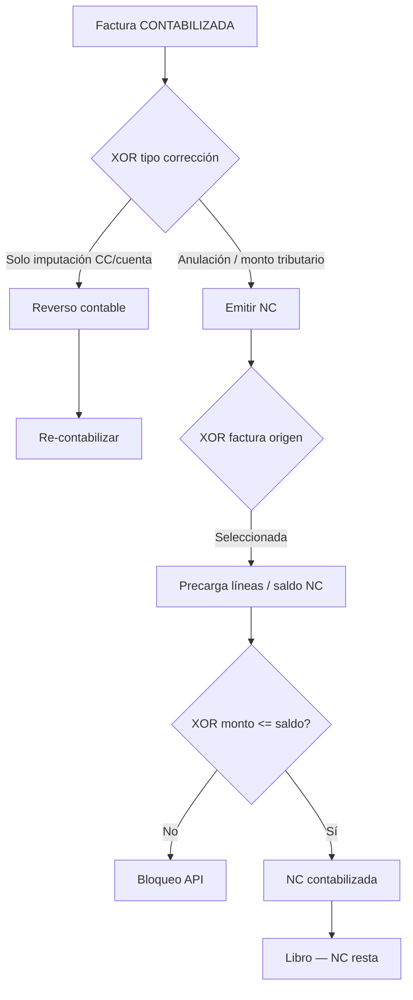

| Gateway | AS-IS |
|---|---|
| XOR reverso vs NC | Implementado |
| XOR saldo NC | Implementado (P1-9) |

---

## 10. Flujo integrado compra + venta (piloto D20)

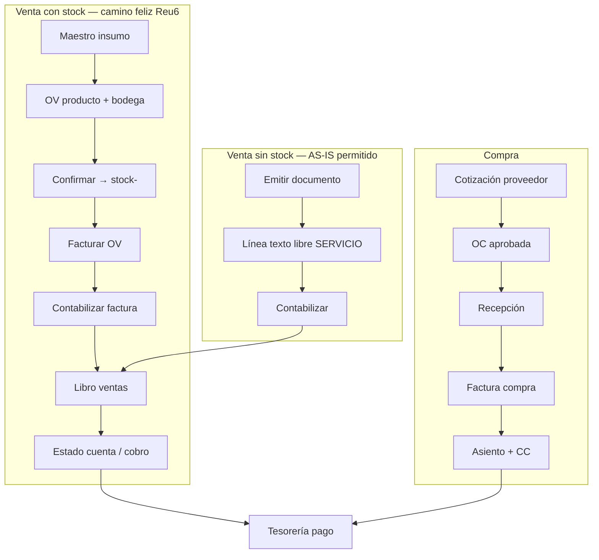

---

## 11. Resumen de gateways y huecos críticos

| Flujo | Gateways modelados | Hueco principal AS-IS |
|---|---|---|
| Login / tenant | 3 | SSO sin credenciales |
| Aprobaciones | 5 | Comercial sin cadena |
| OV + inventario | 6 | Param `ventaBajoCosto` sin UI |
| Emitir directo | 7 | **Texto libre = sin catálogo ni stock** |
| Compras | 6 | GoSocket compras diferido |
| Contratistas | 5 | DTE proveedor diferido |
| Periodos | 3 | — |
| Tesorería | 4 | Bridge pago desde libro |
| NC / reverso | 4 | — |

**Conclusión:** el BPMN AS-IS refleja la bifurcación Reu6 — **OV** para productos con trazabilidad de bodega, **Emitir** para documentos tributarios directos y servicios, con un **puente débil** (el usuario puede facturar productos ficticios por emitir). Cerrar ese puente es prioridad de alineación negocio antes de piloto con datos reales (D20).

---

## 12. Referencias

- Auditoría detallada: `2026-08-14-auditoria-reu5-reu6.md`
- BPMN histórico Reu4–Reu5: `entrega-reu4-reu5-as-is/02-BPMN-FLUJOS.md`
- Minutas: Reu5 (03/08/2026), Reu6 (06/08/2026)
