# Recorrido para exponer

La interna de Carlos y Sergio es del 23/09 por la mañana, antes de entrar con Mario y Lupe (`docs/reuniones/transcripciones/transcripcion-2026-09-23-interna-carlos-sergio.md`). Ahí Sergio cerró qué se muestra: **compras, tesorería y parte de contratistas** (`[17:33]`). La sala de esa tarde fue para resolver dudas. Esas dudas van al final de cada módulo. No se presentan como avance.

El menú va así: Parametrización, Contratistas, Ventas, Compras, Insumos, Contabilidad, Tesorería. Se recorren los tres módulos que él nombró, en ese orden del menú. Ventas, Insumos y Contabilidad se pasan de largo. Dentro de cada módulo el orden de las pantallas sigue el relato de Sergio, no el orden literal de los submenús.

Ambiente: `http://localhost:5174`, empresa **ALMAHUE EXPORT SPA**, periodo **2026-09**, modo real. En contratistas los datos del ensayo ya están cargados (labor `PACK-CER`, actividad `SEL-CER`, contratista Cuadrillas Packing Export Ltda, tarifa $12.500, tres ingresos de septiembre pendientes). No guardar una orden ni una proforma.

Las capturas son las del ensayo de esa interna. Señalan la zona que hay que mostrar. Donde la pantalla cambió después, el texto lo dice.

## Contratistas

Sergio parte este sistema en Parametrización, no en el listado. Dijo que las labores, las actividades y el tipo de contrato son datos sensibles: quien solo ve contratistas no debería poder cambiarlos (`[28:21]`–`[29:39]`). Por eso la parametrización vive en otro menú, con permiso aparte, en pestañas.

### 1. Parametrización del contratista

**Cómo llegar:** menú **Parametrización → Contratista**.

**Qué decir al pasar las pestañas:** todo parte de las labores, que son las que se podrían realizar (`[29:55]`). Las actividades son el desglose (`[30:04]`). En Asociaciones se ve la labor y, debajo, las actividades que quedaron ligadas (`[30:18]`). Después las unidades de control y, al final, el tipo de contrato, con código, nombre y las tres cuentas: debe, haber y administración (`[30:42]`–`[31:16]`).

En la demo: labor `PACK-CER` · Packing cereza export, actividad `SEL-CER` ya asociada, unidades caja, kilogramo y unidad, tipo `MANO_OBRA` con las cuentas 6-1-01-01-002, 2-1-08-02-003 y 6-2-01-02-029.

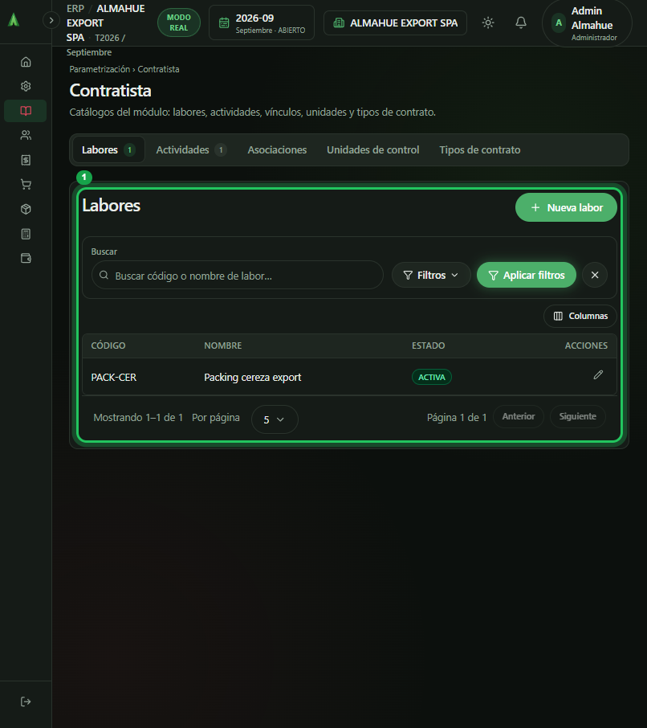

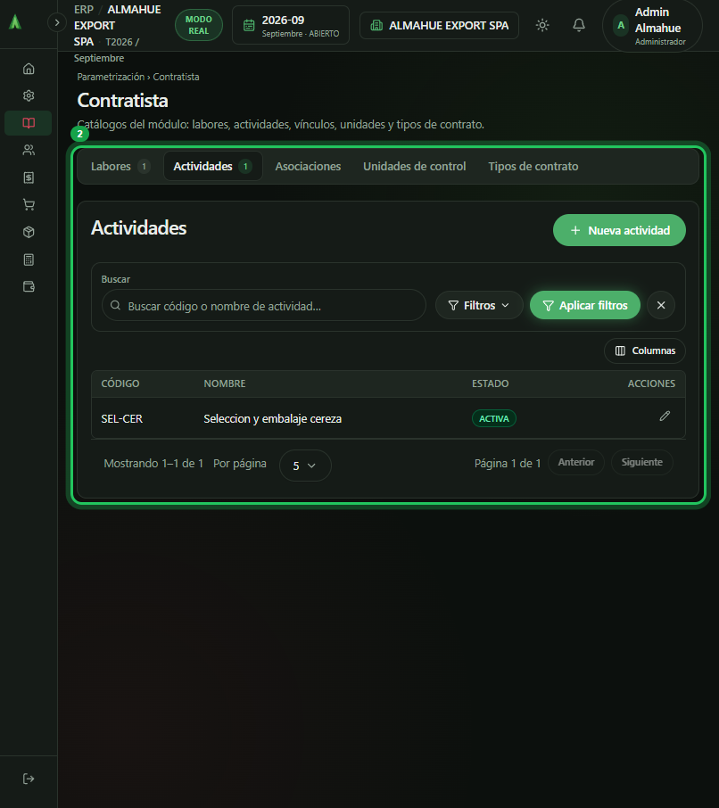

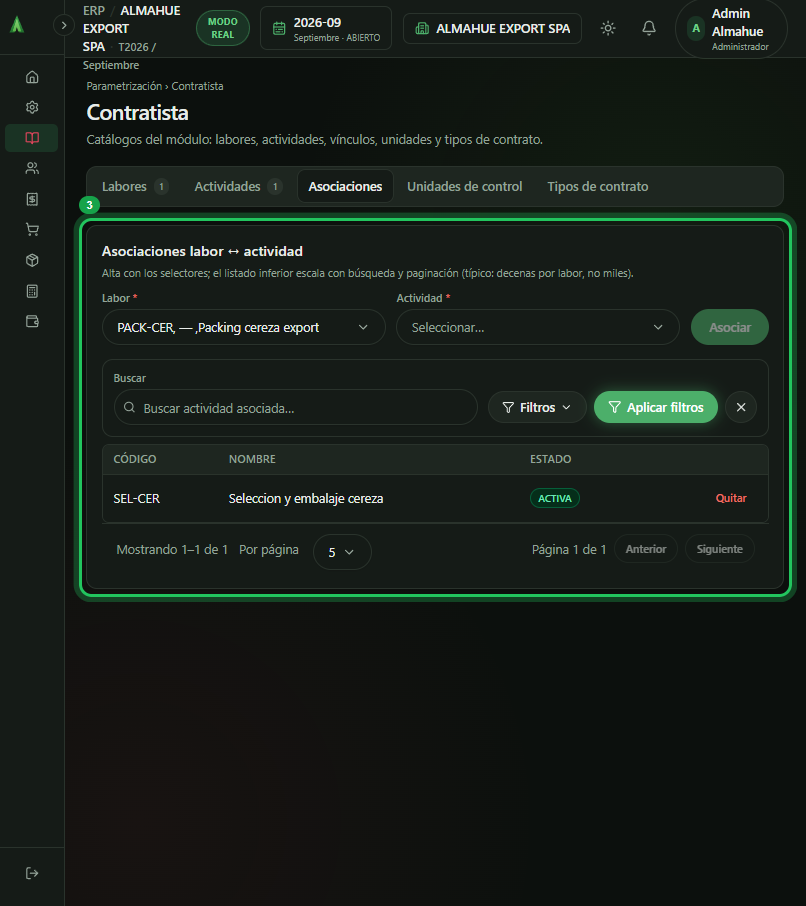

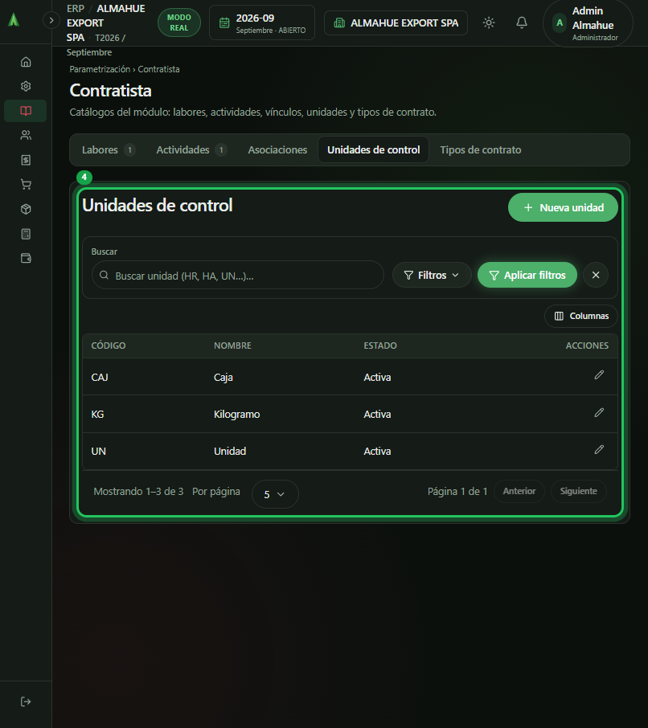

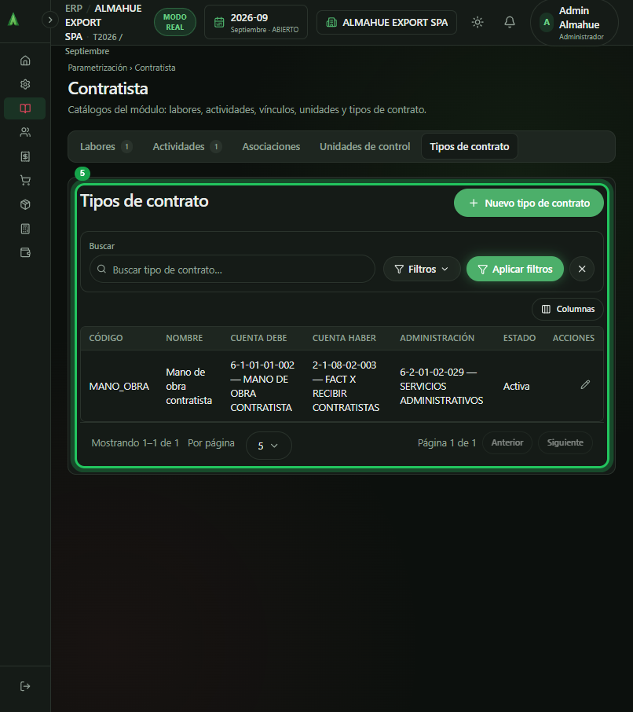

Antes de seguir hacen falta, en la misma Parametrización, cuentas imputables en el plan de cuentas y cuarteles activos en centros de costo. La tarifa y el ingreso los piden.

### 2. Listado

Con eso cargado se entra al módulo. **Contratistas → Listado.**

Sergio preguntó si al crear el contratista se hace match con un proveedor, porque la orden de compra sale del proveedor (`[31:16]`). Diego le dijo que, si se cargan los datos de un proveedor, entra la razón social y queda la asociación (`[31:54]`). En la demo el contratista es 76.210.102-8 · Cuadrillas Packing Export Ltda, vigente hasta el 23-12-2026. Mostrar el alta y, si se abre uno existente, que la razón social puede venir del proveedor.

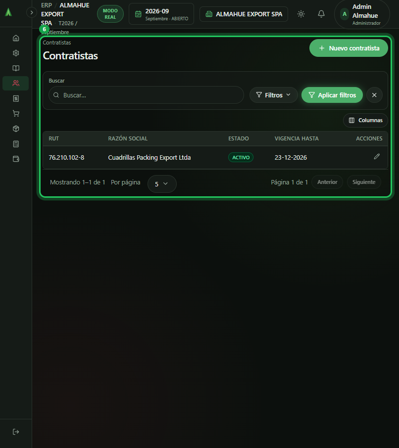

### 3. Tarifas

De ahí se pasa a **Contratistas → Tarifas → Nueva tarifa.**

El relato de Sergio: se elige contratista, tipo de contrato y labor; la actividad solo trae las que se asociaron a esa labor (`[32:32]`–`[32:55]`). El cuartel sale de centros de costo. La unidad sale del catálogo de contratistas. La tarifa y la vigencia desde–hasta se digitan (`[33:02]`). Él creía que el monto debía precargarse desde la unidad; en la pantalla se escribe a mano (`[33:11]`). Eso queda como pregunta, no como defecto a disculpar: se muestra así.

En la demo la tarifa ya cargada es $12.500, tipo Mano de obra, cuartel Packing export, vigencia abierta desde el 01-01-2026.

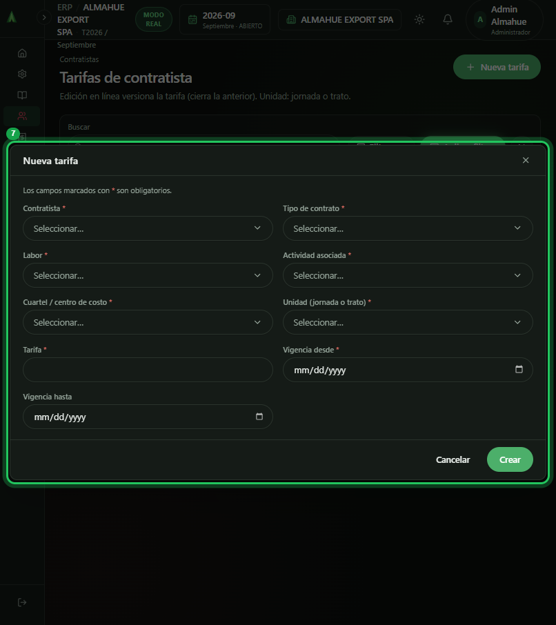

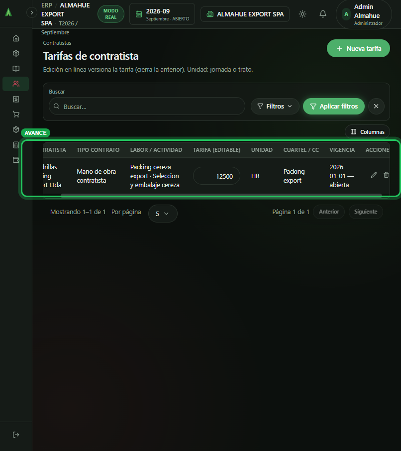

### 4. Ingreso diario

La tarifa es lo que después lee el día. **Contratistas → Ingreso diario.**

Sergio lo explicó como lo que ve una persona: tal contratista consumió tanta plata en el día, por actividad, labor y centro de costo (`[34:09]`–`[33:39]`). Al cargar uno nuevo, la actividad solo ofrece las asociadas a la labor. Si hay tarifa vigente para contratista, cuartel, labor, actividad y fecha, el precio se completa solo. En la demo los tres ingresos de septiembre ya tomaron $12.500 y siguen pendientes de proforma.

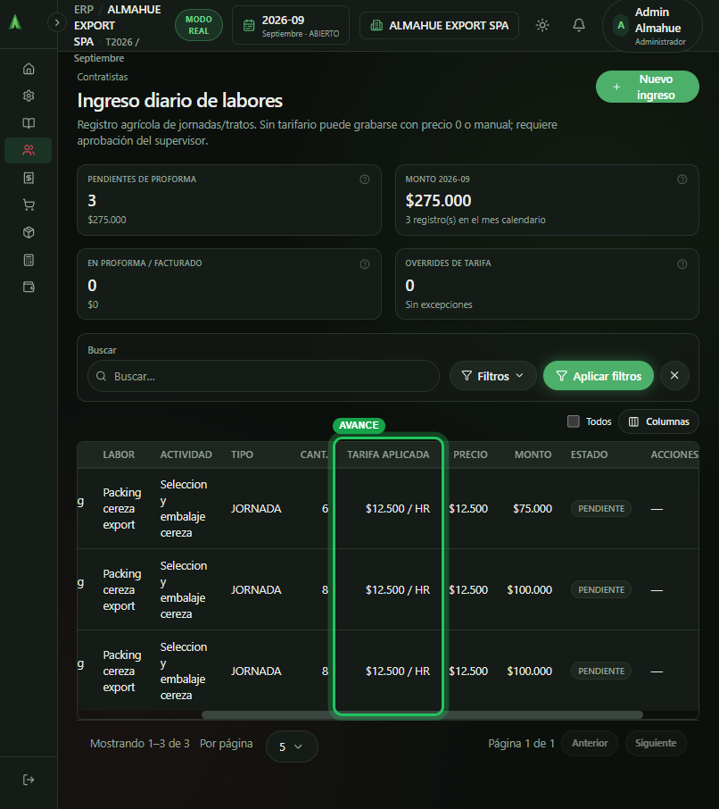

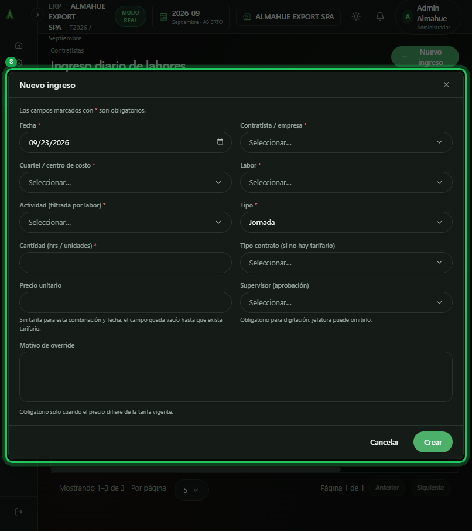

Esos pendientes son el detalle de la proforma. Sergio dijo que, antes de mostrarlos todos juntos, hay que elegir el contratista para ver solo los de ese (`[35:19]`–`[35:30]`).

### 5. Proformas y facturas

**Contratistas → Proformas y facturas → Nueva proforma.**

Aquí se juntan los ingresos pendientes. Sergio pidió tres cosas en la interna, y las tres están en la pantalla de hoy:

- El número de la proforma es secuencial y no se escribe (`[35:36]`). Sale deshabilitado, `PF-00001`, `PF-00002`, y al guardar el back asigna el siguiente de la empresa.
- Primero el contratista, y abajo solo sus ingresos de ese tipo de contrato y de ese mes (`[35:19]`).
- La previsualización es un total que se actualiza al marcar (`[36:23]`–`[36:39]`).

El periodo es año y mes, el del encabezado, y la moneda. No marcar **Facturar** ni **Generar OC**. En la interna Sergio dijo que la proforma se convierte en orden y esa orden es la que se aprueba (`[37:05]`). En la sala Mario lo corrigió: en este módulo la proforma es la orden. Eso va en las dudas, no en el relato de la pantalla.

La captura es del ensayo, cuando el número todavía se digitaba. Al abrir **Nueva proforma** hoy, mostrar el número automático y el total al marcar.

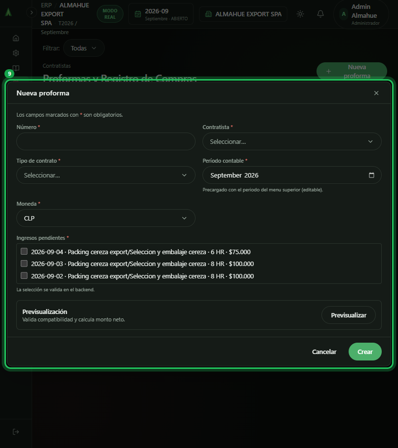

### 6. Traspaso y cierre

Si la proforma queda en definitiva, el menú siguiente del relato es **Contratistas → Traspaso y cierre.**

Sergio lo leyó así: cuando las labores del mes están registradas, **Traspasar y cerrar** pasa la información a contabilidad y ese periodo ya no recibe más proformas (`[38:10]`–`[38:39]`). Lo planteó como pregunta, no como cierre. En la captura el monto es $0 porque los ingresos siguen pendientes y no hay proforma definitiva. Mostrar el botón y el filtro del periodo. No apretarlo.

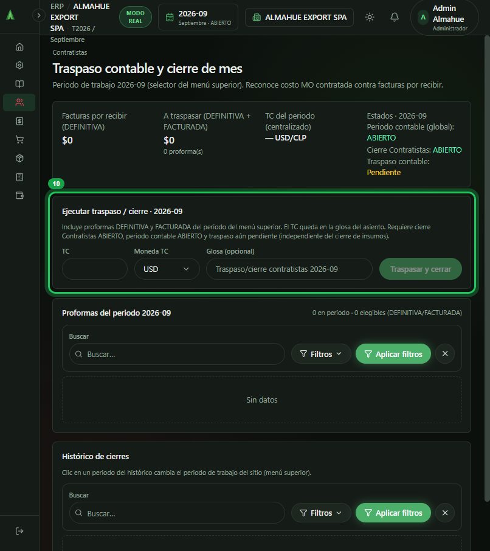

### 7. Auditoría

**Contratistas → Auditoría.** Sergio la leyó como un log de lo que se ajusta en la proforma (`[39:28]`–`[39:43]`). Se abre para que se vea la grilla (fecha, entidad, acción, usuario, resumen). No explicar de más: él mismo dijo que hay que validar con ellos qué esperan ver ahí.

### Dudas pendientes de contratistas

La sala del 23/09 dejó el módulo en espera hasta verlo con Rodrigo (`~22:48`, `~01:00:24`). No construir nada de esta lista en la demo.

- Mario corrigió el relato de la proforma: aquí la proforma es la orden de compra del módulo; no nace otra. Lupe se la entrega al contratista y él factura citándola (`~21:43`, `~22:26`). En el libro de compras habría que asociar orden o proforma según el módulo, y pidió aguardar (`~22:38`).
- Sin respuesta, y por eso no se afirman: si el supervisor de la proforma se mantiene, si el traspaso es un cierre distinto del cierre contable, qué debe mostrar la auditoría, la especialidad del contratista, los indicadores y si quieren Excel o PDF, y si el monto de la tarifa sale de la unidad de control. Don Pablo es quien da el precio del ingreso (`~20:21`); no quedó dicho que salga de la unidad.

## Compras

En el menú, entre Contratistas y Compras está Ventas. Sergio no lo puso en esta pasada. Dijo que la contabilización de compras se ve cuando esté cerrada la de ventas (`[06:35]`). Se sigue de largo.

Dentro de Compras el relato une el generador con el libro. Sergio dijo que el generador de órdenes era lo que todavía había que dejar claro, porque ahí se había perdido (`[18:10]`). El libro es lo que José dejó sincronizado con GoSocket y es por donde partió la interna (`[00:58]`).

### 1. Órdenes de compra

**Cómo llegar:** **Compras → Órdenes de compra → Nueva**, o **Editar** en una orden que nadie de la cadena haya firmado.

**Qué mostrar, en este orden:** el proveedor es el primer campo. A la derecha, solo razón social y RUT. Giro, dirección, comuna y ciudad salen de la ficha y no se editan. La condición de pago es 30, 60 o 90: toma la del proveedor y se puede cambiar en la orden. Si se está editando, el número `OC-2026-…` está en el título, arriba. En una orden nueva no aparece: se asigna al guardar.

En el paso **2. Ítems**, cada línea lleva descripción, centro de costo, cuenta contable, cantidad y precio. El neto es cantidad por precio. En el paso **3. Referencia** va la cotización opcional: tipo, folio y fecha, sin archivo. Abajo, en los tres pasos, la cadena con el tope de cada paso (`Hasta $…` o `Sin tope`). Guardar borrador no entra a la bandeja. Enviar a aprobación sí.

No hay captura nueva de este generador: la base no respondió al sacar las imágenes. Abrir la pantalla y señalar el título, el proveedor y la cadena de abajo.

### 2. Aprobaciones

**Compras → Aprobaciones.** Es el paso siguiente del menú cuando la orden ya se envió. Mostrar la bandeja y, si se abre una, que la cadena es la misma que se vio al generarla. Si la orden cambió desde que se abrió el modal, la firma se bloquea y aparece **Recargar**. Sergio no recorrió esta pantalla en la interna; se nombra para no saltar del generador al libro.

### 3. Recepciones

**Compras → Recepciones.** Cuando la orden está aprobada, desde el detalle se ofrece **Siguiente: recepcionar OC**. Sergio no la abrió en la interna. Se muestra el listado y se sigue al libro, que es donde la factura se cruza con esa orden.

### 4. Libro de compras

**Compras → Libro de compras.**

Esto es lo que Sergio quería mostrar de José (`[00:58]`–`[09:12]`). Pestañas **Aceptados**, **Pendientes**, **Rechazados** y **Todos**. En las tres primeras está **Sincronizar**: trae documentos desde GoSocket, no devuelve datos. En Todos no está el botón, y sincronizar igual trae todo. En la grilla, la columna **OC en XML**. Si el SII rechazó, el motivo está en **Aceptación**. Desde la fila se ve el XML, el PDF y se acepta o rechaza.

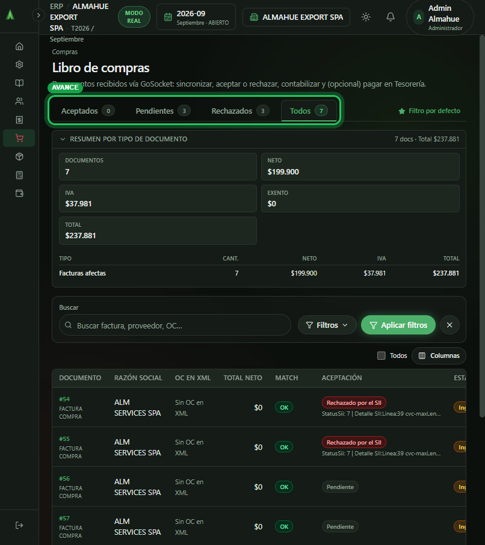

Al abrir un XML, bajar hasta las referencias. Si viene orden de compra, el tipo es 801. Sergio vio documentos sin esa referencia y sin un lugar en la pantalla para engancharlos (`[02:52]`–`[04:10]`). Se muestra la columna y el XML. Cómo se enlaza a mano quedó para la sala: está en las dudas, no se improvisa un vínculo en la demo.

### Dudas pendientes de compras

Respondidas el 23/09 en la tarde. No están armadas. No presentarlas como hechas.

- Si el XML no trae la orden, no se rechaza sola. Alerta, y se asigna a mano a una orden abierta de ese proveedor. Si no hay ninguna, Lupe elige un usuario, le manda correo y una notificación, y queda registro de a quién y cuándo (`~38:48`–`~45:25`).
- Si el proveedor no está en el maestro, la factura queda en alerta, sin movimiento, hasta registrarlo (`~13:48`).
- Factura parcial: la orden madre no se contabiliza. Si la factura es menor, nace una hija por el monto recibido, con una línea, heredando cuenta y centro. Si supera la madre, se edita la madre y puede volver a aprobación. Si eso se pasa de 7 días, se rechaza y se pide refacturar (`~27:27`–`~37:48`). Iban a mandar el diagrama.
- Con la orden aprobada, la deuda es facturas por recibir; al llegar la factura pasa a facturas por pagar (`~25:49`).
- La cotización en archivo la pidió Mario (`~16:24`). El 20/08 el cierre fue tipo, folio y fecha, sin archivo. No se muestra como cambio.
- El botón verde de registrar pago no tuvo respuesta (`~24:21`). Dejarlo como está.
- Centro de costo, elemento de costo y área de negocio: Mario no eligió si los exige la cuenta o se eligen en el documento (`~46:11`). Pega también en ventas y tesorería.

La fecha de vencimiento sí quedó resuelta y ya está en la orden: 30, 60 o 90 días del proveedor, editable en la OC, y la factura asociada hereda esa fecha (`~12:08`).

## Tesorería

Sergio la sumó cuando iban a saltársela (`[09:30]`). El hilo que pidió contar es este: en Parametrización se crean los conceptos y, en códigos financieros, cada código queda asociado a un concepto (`[41:34]`–`[41:54]`). En la cartola, al asignar ese código, se construye el flujo de caja (`[41:54]`). La nómina es la semana en que ese pago se compromete. Conciliación, Pagos y Estado de cuenta no los recorrió. No abrirlos.

### 1. Conceptos y códigos financieros

**Cómo llegar:** **Parametrización → Conceptos** y, al lado, **Códigos financieros**.

**Qué decir:** el concepto es el grupo (apertura, operaciones, egresos). El código financiero cuelga de un concepto. Ese par es lo que después se elige en la cartola. Sergio pidió seguir esa línea y no abrir, en la sala, el detalle de la cuenta contable (`[43:30]`).

### 2. Cartolas

**Tesorería → Cartolas.**

Arriba, el saldo por banco y por moneda. En el ensayo estaban Banco de Chile CLP, Banco de Chile USD, Banco China yuan y Banco Estado CLP (`[40:29]`–`[40:55]`). La carga es solo por archivo del banco. En **Trabajar**, cada movimiento se contabiliza con contracuenta, destino y código financiero. El que ya está contabilizado muestra el asiento y el código, por ejemplo **MAT-PRIMA · Materia prima**, y puede quedar enlazado a la nómina. En egresos se puede asociar la nómina de una semana, de a uno o varios.

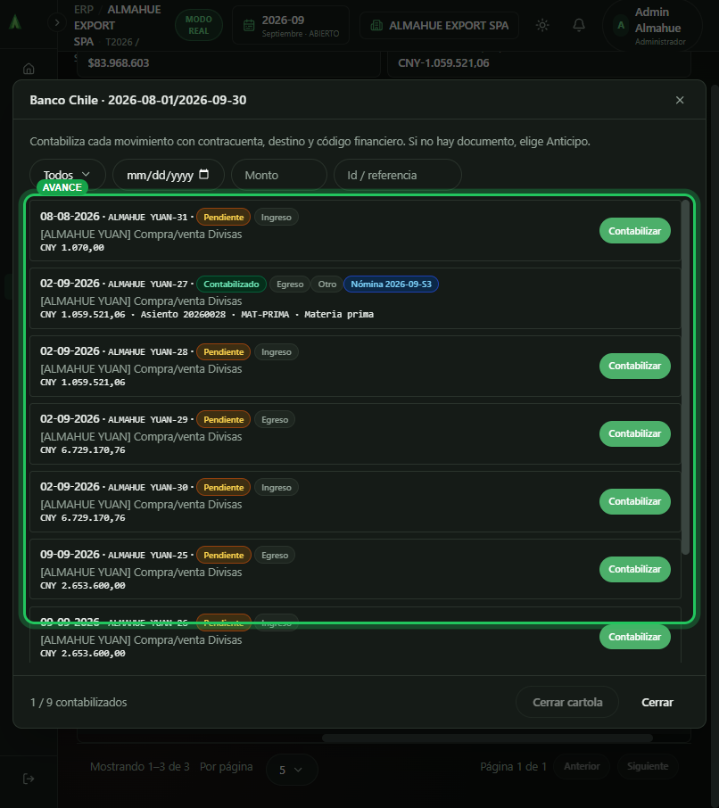

### 3. Flujo de caja

Ese código financiero es el que arma el flujo. **Tesorería → Flujo de caja.**

Sergio lo vio por periodo, concepto y código financiero (`[11:57]`). Cada concepto es el título del bloque. Adentro van los códigos y una fila de totales por moneda. El check **Ver totales por concepto** se deja activo. Arriba, el saldo de caja en CLP, USD y yuan. En moneda extranjera, el clic muestra el monto en pesos y, sin clic, el mouse deja ver el monto original (`[14:23]`).

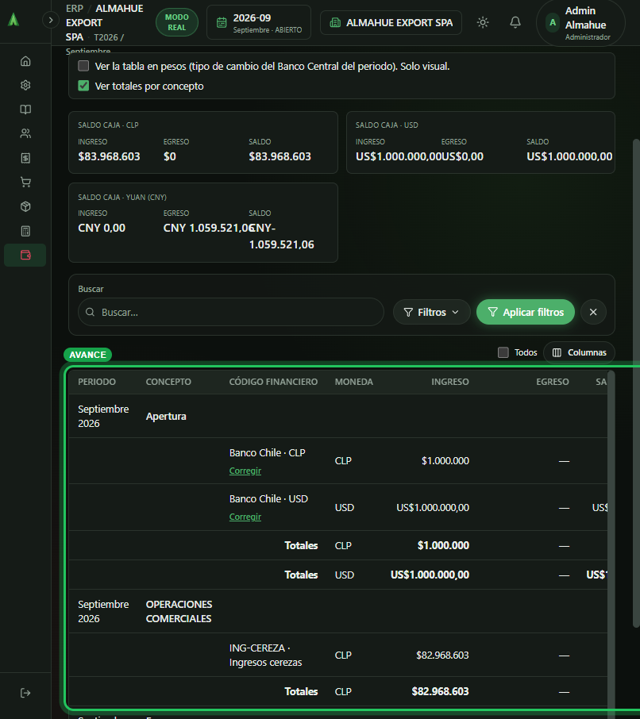

No hay exportación a Excel. Sergio dijo preguntarlo (`[14:44]`). En la sala no se preguntó. No ofrecerlo.

### 4. Nómina semanal

**Tesorería → Nómina semanal.**

Es la semana de compromiso del pago que salió de compras o de la cartola. Sergio pidió mostrar el corte de la semana (a pagar, pagados, atrasados, adelantados) y el mismo corte del mes (`[15:00]`–`[15:52]`). El monto de compras que entra acá está sin IVA en el origen y en la nómina se refleja con IVA, pendiente. **Ver** abre el detalle. **Mover** cambia la semana. Volver a la emisión devuelve la fecha original de compromiso; no cambia el folio ni el vencimiento del documento.

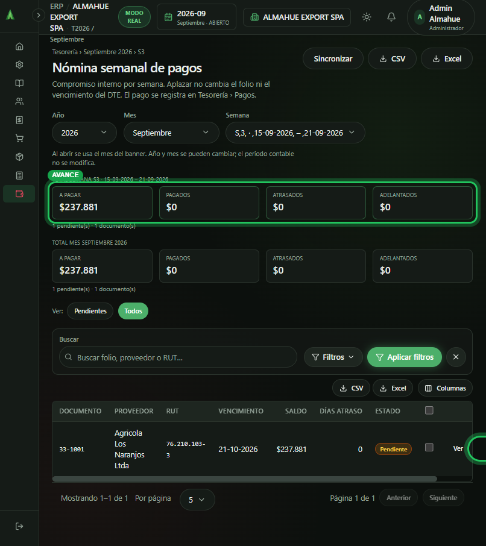

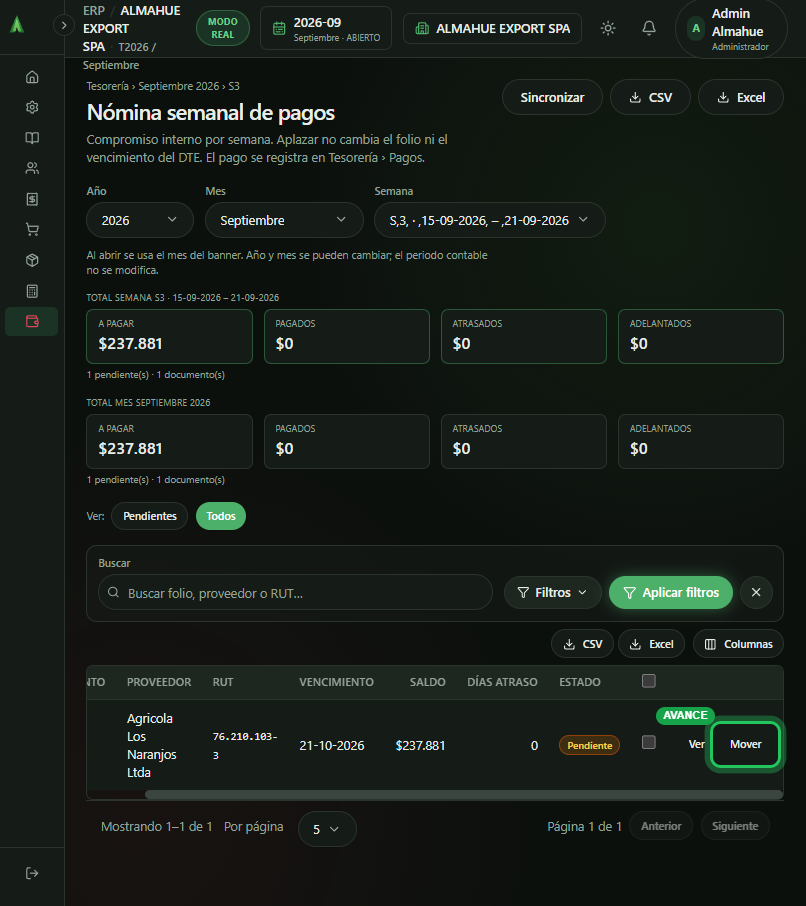

Si se usa el modo demo, Sergio lo dejó cargado para que la grilla no quede vacía cuando en modo real se movieron los registros (`[15:38]`, `[26:57]`).

### Dudas pendientes de tesorería

De la sala del 23/09. No están armadas.

- Lupe quiere ver lo pendiente hacia atrás, de esta semana y de la siguiente. Trabaja por semana y mira hacia adelante. Varias empresas a la vez no hacen falta (`~51:35`–`~56:25`). El calendario fue una idea de Sergio, no el pedido.
- El aviso Crítico les sirve, con otro color. Los días pueden cambiar según el proveedor. Pidieron un mantenedor en la nómina y filtros rápidos de 30 y 90 días (`~58:43`–`~59:54`). No dijeron que la marca se borre al pagar.
- Varias líneas de la cartola con la misma contracuenta, el mismo código y el mismo destino: Mario lo dejó para pensarlo (`~49:55`). Lupe sí confirmó que asignar la nómina desde la cartola le queda cómodo (`~50:11`).
- El choque del plan de cuentas (centro, elemento y área) sigue abierto y también pega aquí (`~50:42`).
